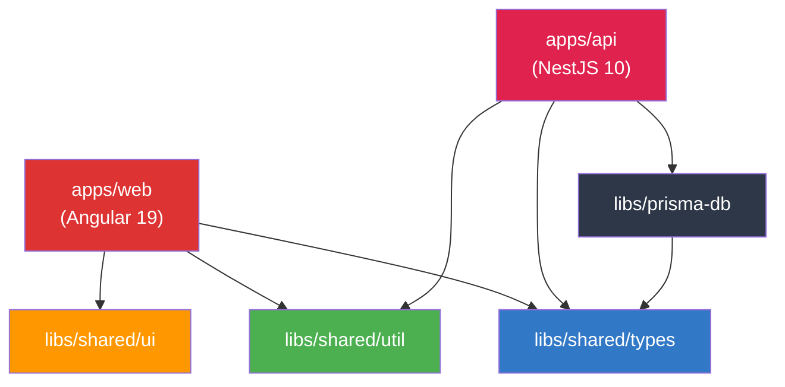
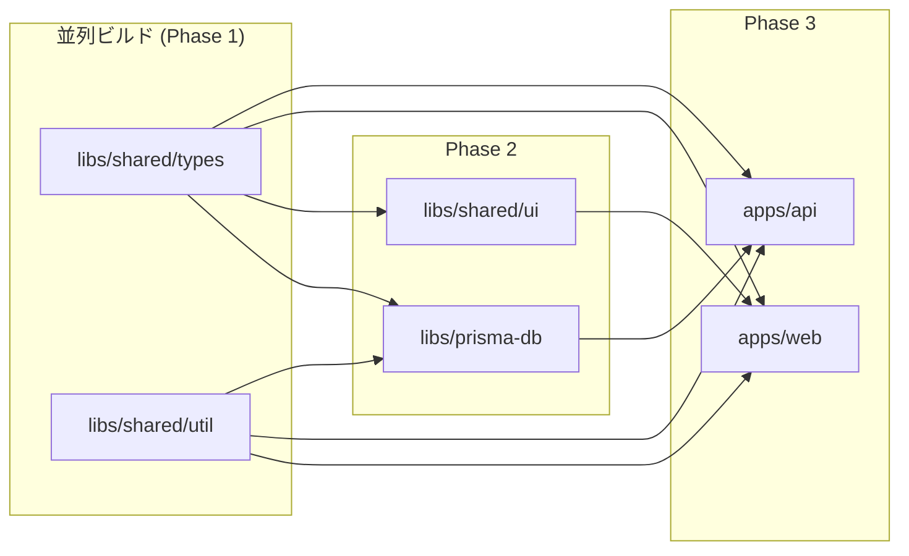

## ディレクトリ構成

```
project-root/
├── apps/
│   ├── web/                       # Angular 19 フロントエンド
│   │   ├── src/
│   │   │   ├── app/
│   │   │   │   ├── core/          # Guards, Interceptors, Services
│   │   │   │   ├── features/      # Feature modules (lazy loaded)
│   │   │   │   │   ├── dashboard/
│   │   │   │   │   ├── projects/
│   │   │   │   │   ├── expenses/
│   │   │   │   │   └── admin/
│   │   │   │   ├── shared/        # App-specific shared components
│   │   │   │   └── app.config.ts  # Application config
│   │   │   ├── assets/
│   │   │   ├── environments/
│   │   │   └── styles/
│   │   ├── project.json
│   │   └── tsconfig.app.json
│   │
│   └── api/                       # NestJS 10 バックエンド
│       ├── src/
│       │   ├── modules/
│       │   │   ├── auth/          # Authentication module
│       │   │   ├── projects/      # Projects module
│       │   │   ├── expenses/      # Expenses module
│       │   │   ├── users/         # Users module
│       │   │   └── health/        # Health check module
│       │   ├── common/
│       │   │   ├── decorators/
│       │   │   ├── filters/
│       │   │   ├── guards/
│       │   │   ├── interceptors/
│       │   │   └── pipes/
│       │   ├── app.module.ts
│       │   └── main.ts
│       ├── project.json
│       └── tsconfig.app.json
│
├── libs/
│   ├── shared/
│   │   ├── types/                 # 共有型定義 (DTO, Enums, Interfaces)
│   │   │   ├── src/
│   │   │   │   ├── lib/
│   │   │   │   │   ├── dto/       # Data Transfer Objects
│   │   │   │   │   ├── enums/     # Shared enums
│   │   │   │   │   └── interfaces/# Shared interfaces
│   │   │   │   └── index.ts       # Public API
│   │   │   └── project.json
│   │   │
│   │   ├── util/                  # 共有ユーティリティ
│   │   │   ├── src/
│   │   │   │   ├── lib/
│   │   │   │   │   ├── date.util.ts
│   │   │   │   │   ├── string.util.ts
│   │   │   │   │   └── validation.util.ts
│   │   │   │   └── index.ts
│   │   │   └── project.json
│   │   │
│   │   └── ui/                    # 共有 UI コンポーネント (Angular)
│   │       ├── src/
│   │       │   ├── lib/
│   │       │   │   ├── components/
│   │       │   │   └── directives/
│   │       │   └── index.ts
│   │       └── project.json
│   │
│   └── prisma-db/                 # Prisma クライアント
│       ├── prisma/
│       │   ├── schema.prisma      # Prisma スキーマ
│       │   ├── migrations/        # マイグレーション
│       │   └── seed.ts            # シードデータ
│       ├── src/
│       │   ├── lib/
│       │   │   └── prisma.service.ts  # NestJS PrismaService
│       │   └── index.ts
│       └── project.json
│
├── tools/                         # カスタム Nx プラグイン / スクリプト
│   └── generators/
│
├── nx.json                        # Nx ワークスペース設定
├── pnpm-workspace.yaml            # pnpm ワークスペース
├── tsconfig.base.json             # 共有 TypeScript 設定
├── eslint.config.mjs              # ESLint Flat Config (ルート)
├── .prettierrc                    # Prettier 設定
├── .editorconfig                  # EditorConfig
└── vitest.workspace.ts            # Vitest ワークスペース設定
```

## プロジェクトグラフ



## Nx ワークスペース設定 (`nx.json`)

```json
{
  "$schema": "./node_modules/nx/schemas/nx-schema.json",
  "namedInputs": {
    "default": ["{projectRoot}/**/*", "sharedGlobals"],
    "sharedGlobals": [],
    "production": [
      "default",
      "!{projectRoot}/**/?(*.)+(spec|test).[jt]s?(x)",
      "!{projectRoot}/tsconfig.spec.json",
      "!{projectRoot}/.eslintrc.json"
    ]
  },
  "targetDefaults": {
    "build": {
      "dependsOn": ["^build"],
      "inputs": ["production", "^production"],
      "cache": true
    },
    "test": {
      "inputs": ["default", "^production", "{workspaceRoot}/vitest.workspace.ts"],
      "cache": true
    },
    "lint": {
      "inputs": ["default", "{workspaceRoot}/eslint.config.mjs"],
      "cache": true
    }
  },
  "defaultBase": "main"
}
```

## タスクパイプライン

### ビルド順序



### 主要コマンド

| コマンド | 説明 |
|---|---|
| `nx serve web` | Angular 開発サーバー起動 |
| `nx serve api` | NestJS 開発サーバー起動 |
| `nx run-many -t serve -p web api` | 両方同時起動 |
| `nx build web` | Angular プロダクションビルド |
| `nx build api` | NestJS ビルド |
| `nx test` | 全テスト実行 |
| `nx affected -t test` | 変更影響のみテスト |
| `nx affected -t lint` | 変更影響のみ Lint |
| `nx graph` | プロジェクトグラフ可視化 |
| `nx reset` | キャッシュクリア |

## ライブラリ境界ルール

`@nx/enforce-module-boundaries` で不正な依存を防止：

```json
{
  "rules": [
    {
      "sourceTag": "scope:web",
      "onlyDependOnLibsWithTags": ["scope:shared", "scope:web"]
    },
    {
      "sourceTag": "scope:api",
      "onlyDependOnLibsWithTags": ["scope:shared", "scope:api"]
    },
    {
      "sourceTag": "scope:shared",
      "onlyDependOnLibsWithTags": ["scope:shared"]
    }
  ]
}
```

**効果:**
- フロントエンドから Prisma を直接 import できない
- バックエンドから Angular Material を import できない
- 共有ライブラリは他の共有ライブラリのみ参照可能
- **ビルド時に違反を自動検出** → バグの事前防止

## コードジェネレータ

```bash
# Angular コンポーネント生成
nx g @nx/angular:component feature-name --project=web --standalone

# NestJS モジュール生成
nx g @nx/nest:module module-name --project=api

# NestJS サービス生成
nx g @nx/nest:service service-name --project=api

# 共有ライブラリ生成
nx g @nx/js:library lib-name --directory=libs/shared/lib-name

# Prisma マイグレーション
nx run prisma-db:prisma-migrate --name=add_users_table
```
