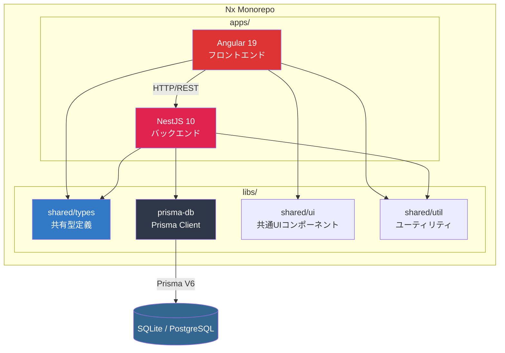
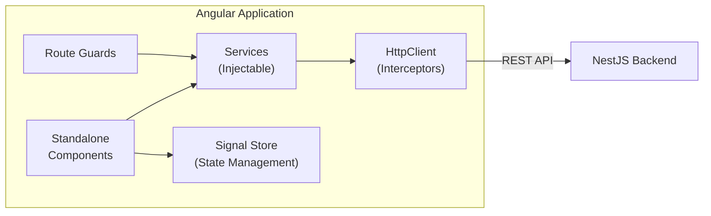
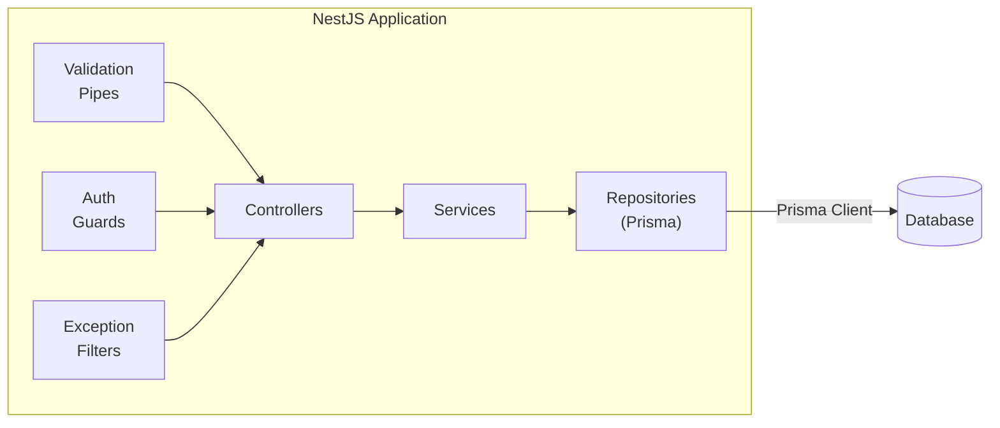

## システム全体像

本プロジェクトは **Nx モノレポ** の上に、Angular フロントエンドと NestJS バックエンドを配置するフルスタック構成です。



## レイヤードアーキテクチャ

### フロントエンド (Angular 19)



| レイヤー | 責務 | 主要技術 |
|---|---|---|
| **Component** | UI 表示・ユーザーインタラクション | Standalone Components, Angular Material 19 |
| **Service** | ビジネスロジック・API通信 | Injectable, HttpClient |
| **State** | アプリケーション状態管理 | Angular Signals / NgRx SignalStore |
| **Guard** | ルートアクセス制御 | Route Guards (functional) |
| **Interceptor** | HTTP 共通処理 | HttpInterceptorFn (functional) |

### バックエンド (NestJS 10)



| レイヤー | 責務 | 主要技術 |
|---|---|---|
| **Controller** | HTTP リクエスト受付・レスポンス整形 | @Controller, @Get/@Post 等 |
| **Service** | ビジネスロジック | @Injectable |
| **Repository** | データアクセス | Prisma Client V6 |
| **Pipe** | バリデーション・変換 | class-validator, class-transformer |
| **Guard** | 認証・認可 | @UseGuards, JWT |
| **Filter** | 例外ハンドリング | @Catch, ExceptionFilter |
| **Interceptor** | ログ・キャッシュ・変換 | @UseInterceptors |

## 通信設計

### API 設計方針

```
[Angular HttpClient]
        |
        | HTTP/REST (JSON)
        |
[NestJS Controller]
        |
        | class-validator (DTO validation)
        |
[NestJS Service]
        |
        | Prisma Client (type-safe queries)
        |
[SQLite / PostgreSQL]
```

**API 契約の保証方法:**

1. **共有 DTO ライブラリ** (`libs/shared/types`)
   - フロントエンド・バックエンドで同一の TypeScript 型を使用
   - Prisma が生成する型とマッピング
2. **class-validator** による入力バリデーション
   - リクエスト DTO に `@IsString()`, `@IsEmail()` 等のデコレータ
   - NestJS の `ValidationPipe` で自動検証
3. **Zod** によるランタイムバリデーション (フロントエンド側)
   - API レスポンスを Zod スキーマで検証
   - 型推論と実行時チェックの両立

## 環境構成

| 環境 | DB | 用途 |
|---|---|---|
| **開発 (dev)** | SQLite | ローカル開発・高速起動 |
| **テスト (test)** | SQLite (in-memory) | CI/CD・テスト実行 |
| **ステージング** | PostgreSQL | 本番と同等の検証 |
| **本番 (prod)** | PostgreSQL | 商用運用 |

> **なぜ開発に SQLite を使うのか？**
> - セットアップゼロ（サーバー不要）
> - Prisma V6 が SQLite を完全サポート
> - テスト時は in-memory で高速実行
> - 本番は PostgreSQL にスイッチするだけ（Prisma のスキーマ 1 箇所変更）
