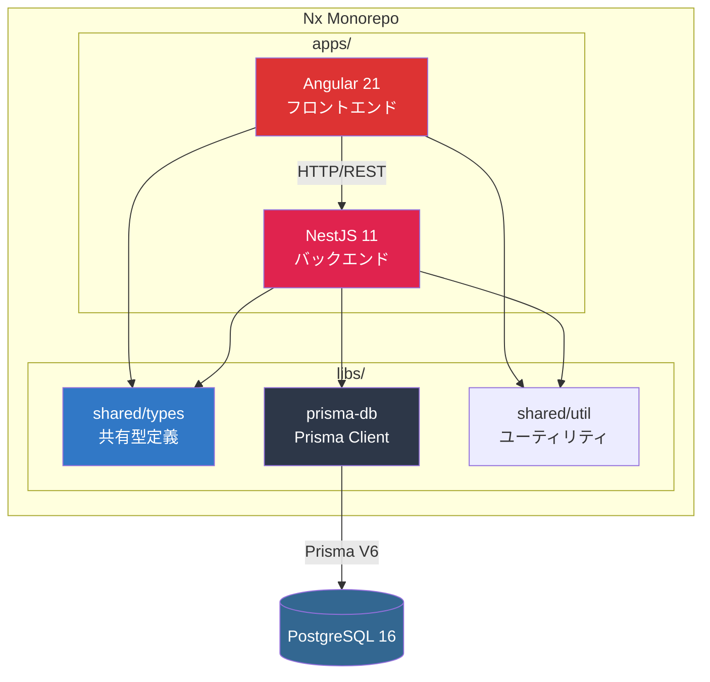
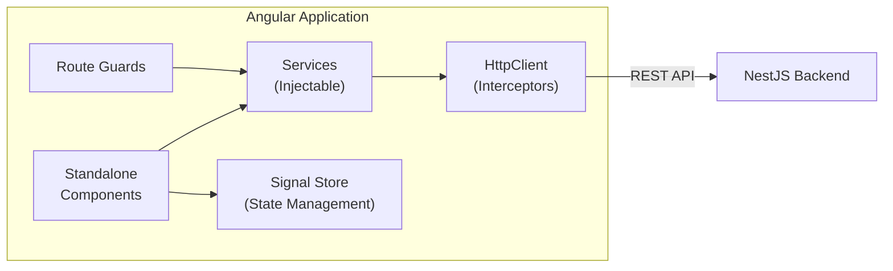
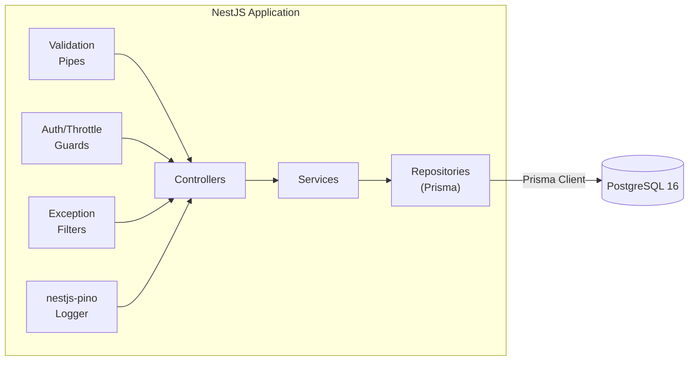

## システム全体像

本プロジェクトは **Nx モノレポ** の上に、Angular フロントエンドと NestJS バックエンドを配置するフルスタック構成です。



## レイヤードアーキテクチャ

### フロントエンド (Angular 21)



| レイヤー | 責務 | 主要技術 |
|---|---|---|
| **Component** | UI 表示・ユーザーインタラクション | Standalone Components, PrimeNG 21 (Aura テーマ) |
| **Service** | ビジネスロジック・API通信 | Injectable, HttpClient |
| **State** | アプリケーション状態管理 | Angular Signals / NgRx SignalStore |
| **Guard** | ルートアクセス制御 | Route Guards (functional) |
| **Interceptor** | HTTP 共通処理 | HttpInterceptorFn (functional) |

### バックエンド (NestJS 11)



| レイヤー | 責務 | 主要技術 |
|---|---|---|
| **Controller** | HTTP リクエスト受付・レスポンス整形 | @Controller, @Get/@Post 等 |
| **Service** | ビジネスロジック | @Injectable |
| **Repository** | データアクセス | Prisma Client V6 |
| **Pipe** | バリデーション・変換 | ValidationPipe + class-validator DTO |
| **Guard** | 認証・認可・レート制限 | JwtAuthGuard, RolesGuard, ThrottlerGuard |
| **Filter** | 例外ハンドリング | @Catch, HttpExceptionFilter |
| **Interceptor** | 監査ログ・テナント分離・レスポンス整形 | TenantInterceptor, AuditInterceptor, ResponseInterceptor |
| **Logger** | 構造化ロギング | nestjs-pino (pino-pretty 開発用) |

## 通信設計

### API 設計方針

```
[Angular HttpClient]
        |
        | HTTP/REST (JSON)
        |
[NestJS Controller]
        |
        | class-validator (DTO validation)
        |
[NestJS Service]
        |
        | Prisma Client (type-safe queries)
        |
[PostgreSQL 16]
```

**API 契約の保証方法:**

1. **共有 DTO ライブラリ** (`libs/shared/types`)
   - フロントエンド・バックエンドで同一の TypeScript 型を使用
   - Prisma が生成する型とマッピング
2. **class-validator** による入力バリデーション
   - リクエスト DTO に `@IsString()`, `@IsEmail()` 等のデコレータ
   - NestJS の `ValidationPipe` で自動検証
3. **Swagger API ドキュメント** (`@nestjs/swagger`)
   - `/api/docs` で Swagger UI を提供（開発モードのみ）
   - DTO に `@ApiProperty()` デコレータで API 仕様を自動生成

## 環境構成

| 環境 | DB | 用途 |
|---|---|---|
| **開発 (dev)** | PostgreSQL 16 (Docker) | ローカル開発 |
| **テスト (test)** | PostgreSQL 16 (Docker) | CI/CD・テスト実行 |
| **ステージング** | PostgreSQL 16 | 本番と同等の検証 |
| **本番 (prod)** | PostgreSQL 16 | 商用運用 |

> **開発環境の DB**
> - Docker Compose で PostgreSQL 16 コンテナを起動
> - `DATABASE_URL` 環境変数で接続先を指定
> - Prisma Migrate で DB スキーマを管理
> - `npx prisma db seed` でシードデータを投入
