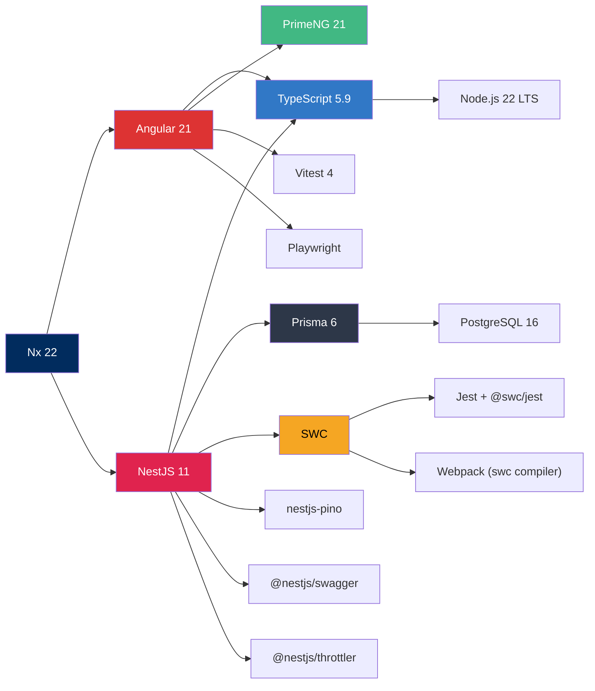

## バージョン一覧

> **方針**: 安定版を採用。LTS / GA リリースを優先する。

| カテゴリ | パッケージ | バージョン | 備考 |
|---|---|---|---|
| **モノレポ** | `nx` | `22.x` | タスクキャッシュ・Affected 対応 |
| **フロントエンド** | `@angular/core` | `21.x` | Standalone Components / Signals |
| **UI** | `primeng` | `21.x` | Aura テーマ (`@primeuix/themes`) |
| **アイコン** | `primeicons` | `7.x` | `pi pi-xxx` 形式 |
| **バックエンド** | `@nestjs/core` | `11.x` | SWC 統合 |
| **ORM** | `prisma` | `6.x` | `$extends` ベース |
| **ORM Client** | `@prisma/client` | `6.x` | Proxy 型 PrismaService |
| **テスト (API)** | `jest` + `@swc/jest` | `30.x` / `0.2.x` | SWC トランスフォーマー (6x 高速) |
| **テスト (Web)** | `vitest` | `4.x` | Angular 公式推奨 |
| **E2E** | `@playwright/test` | `1.58.x` | Chromium / Firefox / Mobile |
| **コンパイラ** | `@swc/core` | `1.x` | Jest + Webpack で使用 |
| **ロガー** | `nestjs-pino` | `4.x` | 構造化 JSON ログ (pino-pretty 開発用) |
| **API ドキュメント** | `@nestjs/swagger` | `11.x` | Swagger UI (`/api/docs` — 開発モードのみ) |
| **バリデーション** | `class-validator` | `0.14.x` | ValidationPipe + DTO デコレータ |
| **レート制限** | `@nestjs/throttler` | `6.x` | Global Guard (short/medium/long 3段構成) |
| **Lint** | `eslint` | `9.x` | Flat Config |
| **Formatter** | `prettier` | `3.x` | — |
| **言語** | `typescript` | `5.9.x` | — |
| **ランタイム** | `Node.js` | `22.x LTS` | LTS ~2027-04 |
| **パッケージ** | `pnpm` | `10.x` | ハードリンク + コンテンツアドレスストア |

## 選定理由

### Nx 22.x（モノレポ管理）

- **プロジェクトグラフ**: 依存関係を自動解析し、影響範囲のみビルド・テスト
- **タスクキャッシュ**: ローカル＋リモートキャッシュで CI 高速化
- **コードジェネレータ**: `nx generate` で Angular/NestJS のボイラープレート自動生成
- **Affected コマンド**: `nx affected:test` で変更箇所のみテスト実行

### Angular 21.x（フロントエンド）

- **Standalone Components** がデフォルト化（NgModule 不要）
- **Signals** が安定版に（Zone.js 脱却への道筋）
- **Hydration** の改善（SSR 対応強化）
- **Vite** ベースの開発サーバー（高速 HMR）
- **Vitest** 公式サポート

### NestJS 11.x（バックエンド）

- **SWC** 統合で高速コンパイル（Webpack compiler: `swc`）
- テスト実行は `@swc/jest` で ts-jest 比 **6 倍高速**
- Angular と同じ DI パターン（学習コスト低減）

### Prisma 6.x（ORM）

- **`$extends`**: ミドルウェア代替（テナントフィルタ、監査ログ保護）
- **バルク INSERT**: ネストした create が 1 ラウンドトリップに
- **型安全 Raw SQL**: `Prisma.sql` テンプレートリテラル
- **Edge 環境** 対応

### pnpm 10.x（パッケージマネージャー）

- **コンテンツアドレスストア**: ディスク使用量大幅削減
- **ハードリンク**: npm比 2〜3 倍速いインストール
- **Strict モード**: 暗黙の依存を防止
- `onlyBuiltDependencies` でビルドスクリプト承認を自動化

### SWC（トランスパイラ）

- **Rust ネイティブ**: ts-jest 比 6 倍、tsc 比 3 倍高速
- **NestJS デコレータ対応**: `legacyDecorator` + `decoratorMetadata`
- **注意**: `import { Prisma } from '@prisma/client'` の名前空間ランタイムアクセスは不可 → 直接 import が必要

## 互換性マトリクス



## package.json（ルート）

```json
{
  "engines": {
    "node": ">=22.11.0",
    "pnpm": ">=10.0.0"
  },
  "packageManager": "pnpm@10.30.1"
}
```

## .nvmrc

```
22
```

## 前提条件

- **OS**: Linux / macOS / WSL2
- **Node.js**: v22.x LTS（`nvm use` で切替推奨）
- **pnpm**: v10.x（`corepack enable` で有効化）
- **エディタ**: VS Code + 推奨拡張機能リスト（後述）

