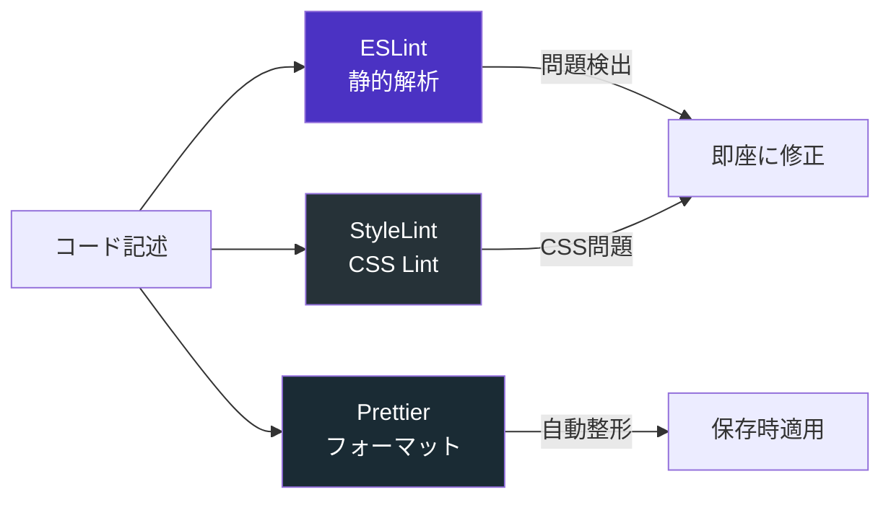
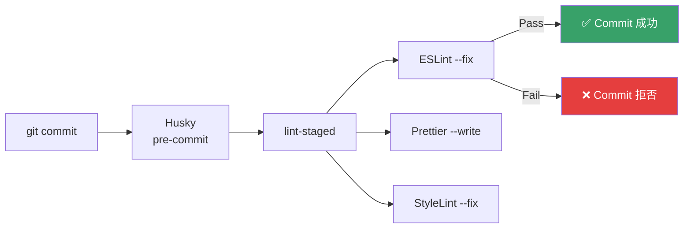

## 概要

**静的解析は最もコストの低いバグ検知手段**です。コードを書いた瞬間に問題を発見し、修正コストを最小化します。



## ESLint 9 Flat Config

### なぜ Flat Config か

- **ESLint 9** から Flat Config がデフォルト
- `.eslintrc` は非推奨（ESLint 10 で削除予定）
- 設定の可読性が大幅に向上
- 型安全な設定ファイル

### ルート設定

```javascript
// eslint.config.mjs
import nx from '@nx/eslint-plugin';
import tseslint from 'typescript-eslint';
import angular from 'angular-eslint';

export default tseslint.config(
  // ── 全体のベース設定 ──
  ...nx.configs['flat/base'],
  ...nx.configs['flat/typescript'],

  // ── Nx モジュール境界ルール ──
  {
    files: ['**/*.ts'],
    rules: {
      '@nx/enforce-module-boundaries': [
        'error',
        {
          enforceBuildableLibDependency: true,
          allow: ['^.*/eslint(\\.base)?\\.config\\.[cm]?js$'],
          depConstraints: [
            {
              sourceTag: 'scope:web',
              onlyDependOnLibsWithTags: ['scope:shared', 'scope:web'],
            },
            {
              sourceTag: 'scope:api',
              onlyDependOnLibsWithTags: ['scope:shared', 'scope:api'],
            },
            {
              sourceTag: 'scope:shared',
              onlyDependOnLibsWithTags: ['scope:shared'],
            },
          ],
        },
      ],
    },
  },

  // ── TypeScript strict ルール ──
  {
    files: ['**/*.ts'],
    extends: [
      ...tseslint.configs.strictTypeChecked,
      ...tseslint.configs.stylisticTypeChecked,
    ],
    rules: {
      '@typescript-eslint/no-unused-vars': [
        'error',
        { argsIgnorePattern: '^_', varsIgnorePattern: '^_' },
      ],
      '@typescript-eslint/no-explicit-any': 'error',
      '@typescript-eslint/no-floating-promises': 'error',
      '@typescript-eslint/no-misused-promises': 'error',
      '@typescript-eslint/strict-boolean-expressions': 'error',
      '@typescript-eslint/switch-exhaustiveness-check': 'error',
      '@typescript-eslint/prefer-nullish-coalescing': 'error',
      '@typescript-eslint/no-unnecessary-condition': 'error',
    },
  },

  // ── Angular 用 ──
  {
    files: ['apps/web/**/*.ts'],
    extends: [...angular.configs.tsRecommended],
    processor: angular.processInlineTemplates,
    rules: {
      '@angular-eslint/directive-selector': [
        'error',
        { type: 'attribute', prefix: 'app', style: 'camelCase' },
      ],
      '@angular-eslint/component-selector': [
        'error',
        { type: 'element', prefix: 'app', style: 'kebab-case' },
      ],
      '@angular-eslint/prefer-standalone': 'error',
      '@angular-eslint/prefer-on-push-component-change-detection': 'warn',
    },
  },

  // ── Angular テンプレート ──
  {
    files: ['**/*.html'],
    extends: [
      ...angular.configs.templateRecommended,
      ...angular.configs.templateAccessibility,
    ],
  },

  // ── テストファイル ──
  {
    files: ['**/*.spec.ts', '**/*.test.ts'],
    rules: {
      '@typescript-eslint/no-explicit-any': 'off',
      '@typescript-eslint/no-non-null-assertion': 'off',
    },
  }
);
```

### 検出可能なバグの例

| ルール | 検出するバグ |
|---|---|
| `no-floating-promises` | `await` 忘れ → 非同期処理のエラーが握りつぶされる |
| `no-misused-promises` | Promise を `if` 条件に渡す → 常に truthy |
| `no-explicit-any` | `any` 使用 → 型チェックが無効化 |
| `strict-boolean-expressions` | `if (str)` → 空文字列の判定漏れ |
| `switch-exhaustiveness-check` | enum の case 漏れ → 新値追加時のバグ |
| `no-unnecessary-condition` | 常に true/false な条件分岐 → ロジックミス |
| `enforce-module-boundaries` | 不正な依存関係 → アーキテクチャ崩壊 |

## Prettier

### 設定

```json
// .prettierrc
{
  "singleQuote": true,
  "trailingComma": "all",
  "printWidth": 100,
  "tabWidth": 2,
  "semi": true,
  "bracketSpacing": true,
  "arrowParens": "always",
  "endOfLine": "lf",
  "overrides": [
    {
      "files": "*.html",
      "options": { "parser": "angular" }
    }
  ]
}
```

```
// .prettierignore
dist
node_modules
coverage
.nx
*.generated.ts
```

## StyleLint (SCSS)

```json
// .stylelintrc.json
{
  "extends": [
    "stylelint-config-standard-scss",
    "stylelint-config-recess-order"
  ],
  "rules": {
    "selector-class-pattern": "^[a-z][a-z0-9]*(-[a-z0-9]+)*$",
    "color-no-invalid-hex": true,
    "declaration-no-important": true,
    "no-duplicate-selectors": true,
    "no-descending-specificity": true,
    "scss/no-unused-private-members": true
  }
}
```

## Git Hooks (自動実行)

### lint-staged + Husky

```json
// package.json
{
  "lint-staged": {
    "*.ts": [
      "eslint --fix",
      "prettier --write"
    ],
    "*.html": [
      "eslint --fix",
      "prettier --write"
    ],
    "*.scss": [
      "stylelint --fix",
      "prettier --write"
    ]
  }
}
```

```bash
# Husky セットアップ
npx husky init
echo "npx lint-staged" > .husky/pre-commit
```

### コミット時の自動チェックフロー



## Nx Affected Lint

変更のあったプロジェクトのみ Lint 実行：

```bash
# PR でのLint実行 (CI)
nx affected -t lint --base=origin/main --head=HEAD

# ローカル開発
nx affected -t lint
```

**効果**: 1000 ファイルの monorepo でも、変更影響の 10 ファイルだけ Lint → CI 時間短縮
