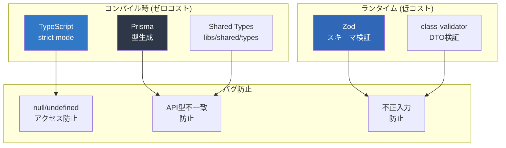

## 概要

**型安全はコンパイル時のバグ検知エンジン**です。ランタイムでクラッシュする前に、IDE とコンパイラが問題を報告します。



## TypeScript strict mode

### tsconfig.base.json

```json
{
  "compilerOptions": {
    "strict": true,
    "noUncheckedIndexedAccess": true,
    "noImplicitOverride": true,
    "noPropertyAccessFromIndexSignature": true,
    "noFallthroughCasesInSwitch": true,
    "forceConsistentCasingInFileNames": true,
    "exactOptionalPropertyTypes": true,
    "verbatimModuleSyntax": true,

    "target": "ES2022",
    "module": "ES2022",
    "moduleResolution": "bundler",
    "declaration": true,
    "declarationMap": true,
    "sourceMap": true,
    "importHelpers": true,
    "esModuleInterop": true,
    "skipLibCheck": true,

    "paths": {
      "@myapp/shared/types": ["libs/shared/types/src/index.ts"],
      "@myapp/shared/util": ["libs/shared/util/src/index.ts"],
      "@myapp/shared/ui": ["libs/shared/ui/src/index.ts"],
      "@myapp/prisma-db": ["libs/prisma-db/src/index.ts"]
    }
  }
}
```

### 各 strict オプションの効果

| オプション | 効果 | 検出するバグ例 |
|---|---|---|
| `strictNullChecks` | null/undefined を許可しない | `user.name.length` → user が null の可能性 |
| `strictFunctionTypes` | 関数の引数型を厳格チェック | コールバック引数の型不一致 |
| `strictPropertyInitialization` | プロパティ初期化を強制 | コンストラクタでの初期化漏れ |
| `noUncheckedIndexedAccess` | 配列/オブジェクトアクセスに undefined を付与 | `arr[0].name` → arr[0] が undefined の可能性 |
| `noImplicitOverride` | オーバーライドに `override` キーワードを強制 | 親クラスメソッド名変更時の検知 |
| `exactOptionalPropertyTypes` | `undefined` と「未定義」を区別 | `{ name?: string }` に `name: undefined` を代入禁止 |
| `noFallthroughCasesInSwitch` | switch の break 漏れを検知 | case フォールスルーバグ |

## Prisma V6 型生成

### 型の自動生成

Prisma スキーマから TypeScript の型が自動生成されます：

```prisma
// libs/prisma-db/prisma/schema.prisma
model User {
  id        String   @id @default(uuid())
  email     String   @unique
  name      String
  role      Role     @default(MEMBER)
  createdAt DateTime @default(now())
  updatedAt DateTime @updatedAt

  projects  ProjectMember[]
  expenses  Expense[]
}

enum Role {
  ADMIN
  MANAGER
  MEMBER
}
```

生成される型：

```typescript
// node_modules/.prisma/client/index.d.ts (自動生成)
export type User = {
  id: string;
  email: string;
  name: string;
  role: Role;
  createdAt: Date;
  updatedAt: Date;
};

export type UserCreateInput = {
  id?: string;
  email: string;
  name: string;
  role?: Role;
  // ...
};
```

### 型安全クエリ

```typescript
// ✅ 型安全 - 存在しないフィールドはコンパイルエラー
const user = await this.prisma.user.findUnique({
  where: { email: 'test@example.com' },
  select: {
    id: true,
    name: true,
    role: true,
    // nonExistentField: true, // ← コンパイルエラー！
  },
});
// user の型: { id: string; name: string; role: Role } | null

// ✅ null チェック強制 (strictNullChecks)
if (user === null) {
  throw new NotFoundException('User not found');
}
console.log(user.name); // ← null チェック後なので安全
```

## Shared Types ライブラリ

### 構成

```
libs/shared/types/src/
├── lib/
│   ├── dto/
│   │   ├── user.dto.ts
│   │   ├── project.dto.ts
│   │   └── expense.dto.ts
│   ├── enums/
│   │   ├── role.enum.ts
│   │   └── status.enum.ts
│   └── interfaces/
│       ├── api-response.interface.ts
│       └── pagination.interface.ts
└── index.ts
```

### DTO 定義例

```typescript
// libs/shared/types/src/lib/dto/user.dto.ts

/** ユーザー作成リクエスト */
export interface CreateUserDto {
  readonly email: string;
  readonly name: string;
  readonly role?: Role;
}

/** ユーザーレスポンス (パスワード等を除外) */
export interface UserResponseDto {
  readonly id: string;
  readonly email: string;
  readonly name: string;
  readonly role: Role;
  readonly createdAt: string; // ISO 8601
}

/** ページネーション付きレスポンス */
export interface PaginatedResponse<T> {
  readonly data: readonly T[];
  readonly total: number;
  readonly page: number;
  readonly limit: number;
  readonly hasNext: boolean;
}
```

### フロントエンド・バックエンド両方で利用

```typescript
// apps/api (NestJS) - バックエンド
import { CreateUserDto, UserResponseDto } from '@myapp/shared/types';

@Controller('users')
export class UsersController {
  @Post()
  async create(@Body() dto: CreateUserDto): Promise<UserResponseDto> {
    return this.usersService.create(dto);
  }
}

// apps/web (Angular) - フロントエンド
import { CreateUserDto, UserResponseDto } from '@myapp/shared/types';

@Injectable({ providedIn: 'root' })
export class UserService {
  create(dto: CreateUserDto): Observable<UserResponseDto> {
    return this.http.post<UserResponseDto>('/api/users', dto);
  }
}
```

## Zod バリデーション

### フロントエンド側のランタイム検証

```typescript
// libs/shared/types/src/lib/schemas/user.schema.ts
import { z } from 'zod';

export const CreateUserSchema = z.object({
  email: z.string().email('有効なメールアドレスを入力してください'),
  name: z.string().min(1, '名前は必須です').max(100, '名前は100文字以内'),
  role: z.enum(['ADMIN', 'MANAGER', 'MEMBER']).optional().default('MEMBER'),
});

// 型を自動推論
export type CreateUserInput = z.infer<typeof CreateUserSchema>;
// → { email: string; name: string; role?: "ADMIN" | "MANAGER" | "MEMBER" }

// API レスポンスの検証
export const UserResponseSchema = z.object({
  id: z.string().uuid(),
  email: z.string().email(),
  name: z.string(),
  role: z.enum(['ADMIN', 'MANAGER', 'MEMBER']),
  createdAt: z.string().datetime(),
});
```

### Angular フォームとの統合

```typescript
// apps/web/src/app/features/users/user-form.component.ts
import { CreateUserSchema } from '@myapp/shared/types';

@Component({
  selector: 'app-user-form',
  standalone: true,
  template: `
    <form [formGroup]="form" (ngSubmit)="onSubmit()">
      <mat-form-field>
        <input matInput formControlName="email" />
        @if (errors()?.email) {
          <mat-error>{{ errors()!.email }}</mat-error>
        }
      </mat-form-field>
    </form>
  `,
})
export class UserFormComponent {
  form = new FormGroup({
    email: new FormControl(''),
    name: new FormControl(''),
    role: new FormControl<'ADMIN' | 'MANAGER' | 'MEMBER'>('MEMBER'),
  });

  errors = signal<Record<string, string> | null>(null);

  onSubmit(): void {
    const result = CreateUserSchema.safeParse(this.form.value);
    if (!result.success) {
      const fieldErrors: Record<string, string> = {};
      for (const issue of result.error.issues) {
        fieldErrors[issue.path[0] as string] = issue.message;
      }
      this.errors.set(fieldErrors);
      return;
    }
    // result.data は型安全
    this.userService.create(result.data).subscribe();
  }
}
```

## class-validator (NestJS)

### DTO バリデーション

```typescript
// apps/api/src/modules/users/dto/create-user.dto.ts
import { IsEmail, IsEnum, IsOptional, IsString, MaxLength, MinLength } from 'class-validator';
import { Role } from '@myapp/shared/types';

export class CreateUserRequestDto {
  @IsEmail({}, { message: '有効なメールアドレスを入力してください' })
  email!: string;

  @IsString()
  @MinLength(1, { message: '名前は必須です' })
  @MaxLength(100, { message: '名前は100文字以内' })
  name!: string;

  @IsEnum(Role)
  @IsOptional()
  role?: Role;
}
```

### グローバル ValidationPipe

```typescript
// apps/api/src/main.ts
app.useGlobalPipes(
  new ValidationPipe({
    whitelist: true,           // デコレータのないプロパティを除去
    forbidNonWhitelisted: true, // 未知のプロパティでエラー
    transform: true,            // 型変換を有効化
    transformOptions: {
      enableImplicitConversion: false, // 暗黙の型変換を禁止
    },
  }),
);
```

## 型安全チェックリスト

| レベル | チェック項目 | ツール |
|---|---|---|
| **コンパイル時** | TypeScript strict mode 全有効 | `tsc --noEmit` |
| **コンパイル時** | Prisma 型と DTO の整合性 | Prisma Client |
| **コンパイル時** | フロント↔バック共有型 | `@myapp/shared/types` |
| **コンパイル時** | モジュール境界違反 | `@nx/enforce-module-boundaries` |
| **ランタイム** | API リクエストバリデーション | class-validator (NestJS) |
| **ランタイム** | フォーム入力バリデーション | Zod (Angular) |
| **ランタイム** | API レスポンス検証 | Zod (Angular) |
