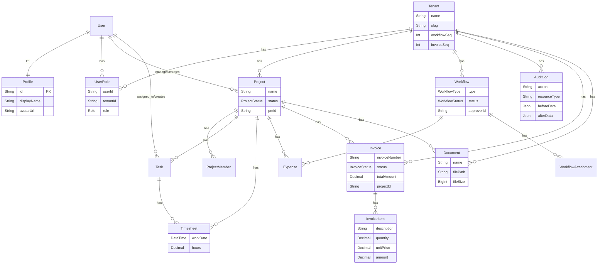

本ドキュメントでは、OpsHub の DB 設計を Prisma V6 スキーマ形式で定義し、実装レイヤーでの取り扱いについてまとめます。

## 1. 共通フィールド規約

各モデルに共通して持たせる主要なフィールドは以下の通りです。

| フィールド | Prisma の定義 | 用途 |
|---|---|---|
| `id` | `String @id @default(uuid())` | 主キー。UUID を採番 |
| `tenantId` | `String` | テナント分離用（詳細は後述） |
| `createdAt` | `DateTime @default(now())` | 作成日時 |
| `updatedAt` | `DateTime @default(now()) @updatedAt` | 更新日時（Prisma により自動更新） |

### 型マッピング規約

PostgreSQL 前提で型マッピングを定義します。

| Supabase/PostgreSQL | Prisma |
|---|---|
| `uuid` | `String @id @default(uuid())` |
| `text NOT NULL` | `String` |
| `text` | `String?` |
| `timestamptz` | `DateTime` |
| `numeric(12,2)` | `Decimal @db.Decimal(12,2)` |
| `integer` | `Int` |
| `boolean` | `Boolean` |
| `jsonb` | `Json` |
| `bigint` | `BigInt` |
| `date` | `DateTime @db.Date` (PG) |
| FK → auth.users(id) | `User` model へのリレーション |

> [!NOTE] PostgreSQL 前提
> 本プロジェクトでは全環境で PostgreSQL 16 を使用します。開発環境では Docker Compose で PostgreSQL コンテナを起動します。

### テナント分離について

テナントの分離は、Prisma の Middleware または Prisma Client Extensions を用いて実装します。データベース層での RLS（Row Level Security）に代わり、アプリケーション層（Service レイヤー等）でコンテキストから `tenantId` を取得し、クエリに暗黙的に `where: { tenantId }` を付与する仕組みを構成します。（詳細は T2-2 文書を参照）

---

## 2. Prisma enum 定義

PostgreSQL の `CHECK` 制約などで表現されていた値の制限は、Prisma の `enum` で定義します。

```prisma
enum Role {
  member
  approver
  pm
  accounting
  it_admin
  tenant_admin
}

enum ProjectStatus {
  planning
  active
  completed
  cancelled
}

enum TaskStatus {
  todo
  in_progress
  done
}

enum WorkflowType {
  expense
  leave
  purchase
  other
}

enum WorkflowStatus {
  draft
  submitted
  approved
  rejected
  withdrawn
}

enum InvoiceStatus {
  draft
  sent
  paid
  cancelled
}
```

---

## 3. 各モデル定義

テーブルの実体を Prisma Schema として定義します。既存の DB 構造と互換性を保つため、`@@map` を使用して物理テーブルおよび物理カラム名をマッピングします。

```prisma
// ----------------------------------------------------------------------------
// Users & Auth (DD-DB-000: auth.users 相当)
// ----------------------------------------------------------------------------
/// カスタムの User モデル（Supabase の auth.users に相当）
model User {
  id                  String    @id @default(uuid())
  email               String    @unique
  password            String
  resetToken          String?   @map("reset_token")
  resetTokenExpiresAt DateTime? @map("reset_token_expires_at")
  createdAt           DateTime  @default(now())
  updatedAt           DateTime  @default(now()) @updatedAt

  // Relations
  profile             Profile?
  roles               UserRole[]
  managedProjects     Project[]            @relation("ProjectManager")
  createdProjects     Project[]            @relation("ProjectCreator")
  updatedProjects     Project[]            @relation("ProjectUpdater")
  projectMembers      ProjectMember[]
  assignedTasks       Task[]               @relation("TaskAssignee")
  createdTasks        Task[]               @relation("TaskCreator")
  createdWorkflows    Workflow[]           @relation("WorkflowCreator")
  approvedWorkflows   Workflow[]           @relation("WorkflowApprover")
  timesheets          Timesheet[]
  createdExpenses     Expense[]            @relation("ExpenseCreator")
  auditLogs           AuditLog[]
  notifications       Notification[]
  workflowAttachments WorkflowAttachment[] @relation("AttachmentUploader")
  createdInvoices     Invoice[]            @relation("InvoiceCreator")
  uploadedDocuments   Document[]           @relation("DocumentUploader")

  @@map("users")
}

// ----------------------------------------------------------------------------
// DD-DB-001: tenants
// ----------------------------------------------------------------------------
/// テナント
model Tenant {
  id          String    @id @default(uuid())
  name        String    /// テナント表示名
  slug        String    @unique /// URL用の識別子
  settings    Json?     @default("{}") /// テナント固有設定
  workflowSeq Int       @default(0) @map("workflow_seq") /// WF採番カウンター
  invoiceSeq  Int       @default(0) @map("invoice_seq") /// 請求書採番カウンター
  deletedAt   DateTime? @map("deleted_at") /// 論理削除日時
  createdAt   DateTime  @default(now()) @map("created_at")
  updatedAt   DateTime  @default(now()) @updatedAt @map("updated_at")

  // Relations
  userRoles           UserRole[]
  projects            Project[]
  projectMembers      ProjectMember[]
  tasks               Task[]
  workflows           Workflow[]
  timesheets          Timesheet[]
  expenses            Expense[]
  auditLogs           AuditLog[]
  notifications       Notification[]
  workflowAttachments WorkflowAttachment[]
  invoices            Invoice[]
  invoiceItems        InvoiceItem[]
  documents           Document[]

  @@map("tenants")
}

// ----------------------------------------------------------------------------
// DD-DB-002: user_roles
// ----------------------------------------------------------------------------
/// ユーザーロール
model UserRole {
  id        String   @id @default(uuid())
  userId    String   @map("user_id")
  tenantId  String   @map("tenant_id")
  role      Role
  createdAt DateTime @default(now()) @map("created_at")

  user   User   @relation(fields: [userId], references: [id])
  tenant Tenant @relation(fields: [tenantId], references: [id])

  @@unique([userId, tenantId, role])
  @@index([tenantId, userId])
  @@index([userId])
  @@map("user_roles")
}

// ----------------------------------------------------------------------------
// DD-DB-003: projects
// ----------------------------------------------------------------------------
/// プロジェクト
model Project {
  id          String        @id @default(uuid())
  tenantId    String        @map("tenant_id")
  name        String        /// プロジェクト名
  description String?
  status      ProjectStatus
  startDate   DateTime?     @db.Date @map("start_date")
  endDate     DateTime?     @db.Date @map("end_date")
  pmId        String        @map("pm_id") /// プロジェクトマネージャー
  createdBy   String        @map("created_by")
  updatedBy   String?       @map("updated_by")
  createdAt   DateTime      @default(now()) @map("created_at")
  updatedAt   DateTime      @default(now()) @updatedAt @map("updated_at")

  tenant  Tenant @relation(fields: [tenantId], references: [id])
  pm      User   @relation("ProjectManager", fields: [pmId], references: [id])
  creator User   @relation("ProjectCreator", fields: [createdBy], references: [id])
  updater User?  @relation("ProjectUpdater", fields: [updatedBy], references: [id])

  members    ProjectMember[]
  tasks      Task[]
  timesheets Timesheet[]
  expenses   Expense[]
  invoices   Invoice[]
  documents  Document[]

  @@index([tenantId, status])
  @@index([tenantId, pmId])
  @@map("projects")
}

// ----------------------------------------------------------------------------
// DD-DB-004: project_members
// ----------------------------------------------------------------------------
/// プロジェクトメンバー
model ProjectMember {
  id        String   @id @default(uuid())
  projectId String   @map("project_id")
  userId    String   @map("user_id")
  tenantId  String   @map("tenant_id") /// 非正規化（検索高速化用）
  createdAt DateTime @default(now()) @map("created_at")

  project Project @relation(fields: [projectId], references: [id])
  user    User    @relation(fields: [userId], references: [id])
  tenant  Tenant  @relation(fields: [tenantId], references: [id])

  @@unique([projectId, userId])
  @@index([tenantId, userId])
  @@map("project_members")
}

// ----------------------------------------------------------------------------
// DD-DB-005: tasks
// ----------------------------------------------------------------------------
/// タスク
model Task {
  id          String     @id @default(uuid())
  tenantId    String     @map("tenant_id")
  projectId   String     @map("project_id")
  title       String
  description String?
  status      TaskStatus @default(todo)
  assigneeId  String?    @map("assignee_id") /// 担当者
  dueDate     DateTime?  @db.Date @map("due_date")
  createdBy   String     @map("created_by")
  createdAt   DateTime   @default(now()) @map("created_at")
  updatedAt   DateTime   @default(now()) @updatedAt @map("updated_at")

  tenant   Tenant @relation(fields: [tenantId], references: [id])
  project  Project @relation(fields: [projectId], references: [id])
  assignee User?  @relation("TaskAssignee", fields: [assigneeId], references: [id])
  creator  User   @relation("TaskCreator", fields: [createdBy], references: [id])

  timesheets Timesheet[]

  @@index([tenantId, projectId])
  @@index([tenantId, assigneeId])
  @@map("tasks")
}

// ----------------------------------------------------------------------------
// DD-DB-006: workflows
// ----------------------------------------------------------------------------
/// ワークフロー（申請）
model Workflow {
  id              String         @id @default(uuid())
  tenantId        String         @map("tenant_id")
  workflowNumber  String         @map("workflow_number") /// 表示用 WF-001 等
  type            WorkflowType
  title           String
  description     String?
  status          WorkflowStatus @default(draft)
  amount          Decimal?       @db.Decimal(12, 2) /// 金額（経費等）
  dateFrom        DateTime?      @db.Date @map("date_from")
  dateTo          DateTime?      @db.Date @map("date_to")
  approverId      String?        @map("approver_id") /// 承認者
  rejectionReason String?        @map("rejection_reason")
  createdBy       String         @map("created_by") /// 申請者
  approvedAt      DateTime?      @map("approved_at")
  createdAt       DateTime       @default(now()) @map("created_at")
  updatedAt       DateTime       @default(now()) @updatedAt @map("updated_at")

  tenant   Tenant @relation(fields: [tenantId], references: [id])
  approver User?  @relation("WorkflowApprover", fields: [approverId], references: [id])
  creator  User   @relation("WorkflowCreator", fields: [createdBy], references: [id])

  expenses    Expense[]
  attachments WorkflowAttachment[]

  @@unique([tenantId, workflowNumber])
  @@index([tenantId, status])
  @@index([tenantId, createdBy])
  @@index([tenantId, approverId, status])
  @@map("workflows")
}

// ----------------------------------------------------------------------------
// DD-DB-007: timesheets
// ----------------------------------------------------------------------------
/// 工数（タイムシート）
model Timesheet {
  id        String   @id @default(uuid())
  tenantId  String   @map("tenant_id")
  userId    String   @map("user_id")
  projectId String   @map("project_id")
  taskId    String?  @map("task_id")
  workDate  DateTime @db.Date @map("work_date") /// 作業日
  hours     Decimal  @db.Decimal(4, 2) /// 0〜24時間、0.25刻み（アプリ層でバリデーション）
  note      String?
  createdAt DateTime @default(now()) @map("created_at")
  updatedAt DateTime @default(now()) @updatedAt @map("updated_at")

  tenant  Tenant  @relation(fields: [tenantId], references: [id])
  user    User    @relation(fields: [userId], references: [id])
  project Project @relation(fields: [projectId], references: [id])
  task    Task?   @relation(fields: [taskId], references: [id])

  @@unique([userId, projectId, taskId, workDate])
  @@index([tenantId, userId, workDate])
  @@index([tenantId, projectId, workDate])
  @@map("timesheets")
}

// ----------------------------------------------------------------------------
// DD-DB-008: expenses
// ----------------------------------------------------------------------------
/// 経費
model Expense {
  id          String   @id @default(uuid())
  tenantId    String   @map("tenant_id")
  workflowId  String?  @map("workflow_id") /// 申請連動
  projectId   String?  @map("project_id") /// 紐付けPJ
  category    String   /// 科目（交通費/宿泊費/消耗品等）
  amount      Decimal  @db.Decimal(12, 2)
  expenseDate DateTime @db.Date @map("expense_date") /// 発生日
  description String?
  receiptUrl  String?  @map("receipt_url") /// Storage パス
  createdBy   String   @map("created_by")
  createdAt   DateTime @default(now()) @map("created_at")
  updatedAt   DateTime @default(now()) @updatedAt @map("updated_at")

  tenant   Tenant    @relation(fields: [tenantId], references: [id])
  workflow Workflow? @relation(fields: [workflowId], references: [id])
  project  Project?  @relation(fields: [projectId], references: [id])
  creator  User      @relation("ExpenseCreator", fields: [createdBy], references: [id])

  @@index([tenantId, createdBy])
  @@index([tenantId, projectId])
  @@map("expenses")
}

// ----------------------------------------------------------------------------
// DD-DB-009: audit_logs
// ----------------------------------------------------------------------------
/// 監査ログ
model AuditLog {
  id           String   @id @default(uuid())
  tenantId     String   @map("tenant_id")
  userId       String   @map("user_id") /// 操作者
  action       String   /// workflow.approve 等
  resourceType String   @map("resource_type") /// 対象リソースの型（workflow, project等）
  resourceId   String?  @map("resource_id")
  beforeData   Json?    @map("before_data")
  afterData    Json?    @map("after_data")
  metadata     Json?    @default("{}") /// IP, User-Agent 等
  createdAt    DateTime @default(now()) @map("created_at")

  tenant Tenant @relation(fields: [tenantId], references: [id])
  user   User   @relation(fields: [userId], references: [id])

  @@index([tenantId, createdAt(sort: Desc)])
  @@index([tenantId, resourceType, resourceId])
  @@index([tenantId, userId])
  @@map("audit_logs")
}

// ----------------------------------------------------------------------------
// DD-DB-010: notifications
// ----------------------------------------------------------------------------
/// 通知
model Notification {
  id           String   @id @default(uuid())
  tenantId     String   @map("tenant_id")
  userId       String   @map("user_id") /// 通知先
  type         String   /// 通知名
  title        String
  body         String?
  resourceType String?  @map("resource_type")
  resourceId   String?  @map("resource_id")
  isRead       Boolean  @default(false) @map("is_read")
  createdAt    DateTime @default(now()) @map("created_at")

  tenant Tenant @relation(fields: [tenantId], references: [id])
  user   User   @relation(fields: [userId], references: [id])

  @@index([tenantId, userId, isRead, createdAt(sort: Desc)])
  @@map("notifications")
}

// ----------------------------------------------------------------------------
// DD-DB-011: workflow_attachments
// ----------------------------------------------------------------------------
/// 申請添付ファイル
model WorkflowAttachment {
  id          String   @id @default(uuid())
  tenantId    String   @map("tenant_id")
  workflowId  String   @map("workflow_id")
  fileName    String   @map("file_name") /// 元のファイル名
  fileSize    Int      @map("file_size") /// バイト（最大10MB等アプリでバリデーション）
  contentType String   @map("content_type")
  storagePath String   @map("storage_path") /// Storage パス
  uploadedBy  String   @map("uploaded_by")
  createdAt   DateTime @default(now()) @map("created_at")

  tenant   Tenant   @relation(fields: [tenantId], references: [id])
  workflow Workflow @relation(fields: [workflowId], references: [id], onDelete: Cascade)
  uploader User     @relation("AttachmentUploader", fields: [uploadedBy], references: [id])

  @@index([tenantId, workflowId])
  @@map("workflow_attachments")
}

// ----------------------------------------------------------------------------
// DD-DB-012: profiles
// ----------------------------------------------------------------------------
/// ユーザープロファイル
model Profile {
  id          String   @id /// User の id をそのまま使用 (1:1 リレーション)
  displayName String   @map("display_name") /// 表示名
  avatarUrl   String?  @map("avatar_url")
  updatedAt   DateTime @default(now()) @updatedAt @map("updated_at")

  user User @relation(fields: [id], references: [id], onDelete: Cascade)

  @@map("profiles")
}

// ----------------------------------------------------------------------------
// DD-DB-013: invoices
// ----------------------------------------------------------------------------
/// 請求書
model Invoice {
  id            String        @id @default(uuid())
  tenantId      String        @map("tenant_id")
  invoiceNumber String        @map("invoice_number") /// INV-YYYY-NNNN形式
  projectId     String?       @map("project_id") /// 紐付けPJ
  clientName    String        @map("client_name") /// 請求先名
  issuedDate    DateTime      @db.Date @map("issued_date")
  dueDate       DateTime      @db.Date @map("due_date")
  subtotal      Decimal       @default(0) @db.Decimal(12, 0)
  taxRate       Decimal       @default(10.00) @db.Decimal(5, 2)
  taxAmount     Decimal       @default(0) @db.Decimal(12, 0)
  totalAmount   Decimal       @default(0) @db.Decimal(12, 0)
  status        InvoiceStatus @default(draft)
  notes         String?
  createdBy     String        @map("created_by")
  createdAt     DateTime      @default(now()) @map("created_at")
  updatedAt     DateTime      @default(now()) @updatedAt @map("updated_at")

  tenant  Tenant @relation(fields: [tenantId], references: [id])
  project Project? @relation(fields: [projectId], references: [id])
  creator User   @relation("InvoiceCreator", fields: [createdBy], references: [id])

  items InvoiceItem[]

  @@unique([tenantId, invoiceNumber])
  @@index([tenantId, status])
  @@index([tenantId, projectId])
  @@index([tenantId, createdAt(sort: Desc)])
  @@map("invoices")
}

// ----------------------------------------------------------------------------
// DD-DB-014: invoice_items
// ----------------------------------------------------------------------------
/// 請求明細
model InvoiceItem {
  id          String   @id @default(uuid())
  tenantId    String   @map("tenant_id")
  invoiceId   String   @map("invoice_id")
  description String
  quantity    Decimal  @default(1) @db.Decimal(10, 2)
  unitPrice   Decimal  @db.Decimal(12, 0)
  amount      Decimal  @db.Decimal(12, 0) /// quantity * unit_price (アプリ層算定)
  sortOrder   Int      @default(0) @map("sort_order")
  createdAt   DateTime @default(now()) @map("created_at")

  tenant  Tenant  @relation(fields: [tenantId], references: [id])
  invoice Invoice @relation(fields: [invoiceId], references: [id], onDelete: Cascade)

  @@index([tenantId, invoiceId])
  @@map("invoice_items")
}

// ----------------------------------------------------------------------------
// DD-DB-015: documents
// ----------------------------------------------------------------------------
/// ドキュメント
model Document {
  id         String   @id @default(uuid())
  tenantId   String   @map("tenant_id")
  projectId  String?  @map("project_id") /// 紐付けPJ（任意）
  name       String   /// ファイル表示名
  filePath   String   @map("file_path") /// Storage パス
  fileSize   BigInt   @default(0) @map("file_size") /// バイト
  mimeType   String   @map("mime_type")
  uploadedBy String   @map("uploaded_by")
  createdAt  DateTime @default(now()) @map("created_at")
  updatedAt  DateTime @default(now()) @updatedAt @map("updated_at")

  tenant   Tenant   @relation(fields: [tenantId], references: [id])
  project  Project? @relation(fields: [projectId], references: [id])
  uploader User     @relation("DocumentUploader", fields: [uploadedBy], references: [id])

  @@index([tenantId, projectId])
  @@map("documents")
}
```

---

## 4. ER図（主要テーブル）

Prisma リレーションを元に構成した Mermaid ER図です。



---

## 5. Service メソッド（旧RPC関数・トリガーの移行）

Prisma 移行に伴い、データベース層のロジック（RPC や トリガー）はアプリケーションの Service 層に移動します。

### 5.1 採番系（RPC → Service）

旧 `next_workflow_number` や `next_invoice_number` などの並行安全な採番処理は、Prisma のトランザクションと Raw SQL を併用した Service メソッドとして実装するか、Prisma の `update` によるアトミックカウントアップを活用します。

```typescript
// WorkflowService.generateNumber() のイメージ
const nextWorkflow = await prisma.$transaction(async (tx) => {
  const t = await tx.tenant.update({
    where: { id: tenantId },
    data: { workflowSeq: { increment: 1 } }
  });
  return `WF-${String(t.workflowSeq).padStart(3, '0')}`;
});
```

### 5.2 自動作成系（トリガー → Service / Middleware）

旧 `handle_new_user()` のような `profiles` 作成処理や `updated_at` 自動更新処理は、以下のいずれかの方法へ移行します。

- **Prisma Client Extensions**: `query.user.create` などのクエリをフックし、`profile` を同時に作成（または `updatedAt` を制御）。
- **AuthService**: `AuthService.createProfile()` などを提供し、ユーザー作成の一連のフローをトランザクション内で確実に呼び出す。
- （※ `updatedAt` に関しては、Prisma の `@updatedAt` ディレクティブによりコード記述なしで自動更新されます）

---

## 6. マイグレーション方針

`Prisma Migrate` を用いて、スキーマ定義からマイグレーションファイルを生成・適用します。

1. **基本フロー**
   ```bash
   npx prisma migrate dev --name init_schema --schema=libs/prisma-db/prisma/schema.prisma
   ```
2. **既存DBとの互換性・対応**
   全環境で PostgreSQL 16 を前提とします。開発環境では Docker Compose で PostgreSQL コンテナを起動します。

---

## 7. DB レベルの追加制約

### GIN インデックス（検索高速化）

`pg_trgm` 拡張 + GIN インデックスにより、`LIKE` / `ILIKE` 検索を高速化しています。

```sql
-- マイグレーション: 20260228133314_add_gin_search_indexes
CREATE EXTENSION IF NOT EXISTS pg_trgm;

-- Workflow: title + description
CREATE INDEX IF NOT EXISTS idx_workflows_title_search
  ON workflows USING gin (COALESCE(title, '') gin_trgm_ops);
CREATE INDEX IF NOT EXISTS idx_workflows_description_search
  ON workflows USING gin (COALESCE(description, '') gin_trgm_ops);

-- Project: name + description
CREATE INDEX IF NOT EXISTS idx_projects_name_search
  ON projects USING gin (COALESCE(name, '') gin_trgm_ops);
CREATE INDEX IF NOT EXISTS idx_projects_description_search
  ON projects USING gin (COALESCE(description, '') gin_trgm_ops);

-- Task: title
CREATE INDEX IF NOT EXISTS idx_tasks_title_search
  ON tasks USING gin (COALESCE(title, '') gin_trgm_ops);

-- Expense: description
CREATE INDEX IF NOT EXISTS idx_expenses_description_search
  ON expenses USING gin (COALESCE(description, '') gin_trgm_ops);
```

### audit_logs INSERT ONLY RULE

`audit_logs` テーブルの改ざん防止を DB レベルでも強制しています。

```sql
-- マイグレーション: 20260228133247_audit_log_insert_only
CREATE RULE audit_logs_no_update AS
  ON UPDATE TO audit_logs
  DO INSTEAD NOTHING;

CREATE RULE audit_logs_no_delete AS
  ON DELETE TO audit_logs
  DO INSTEAD NOTHING;
```

> [!IMPORTANT]
> アプリケーション層 (`enforceAuditLogAppendOnly` in `$extends`) と DB 層 (RULE) の両方で
> INSERT ONLY を強制しています。
