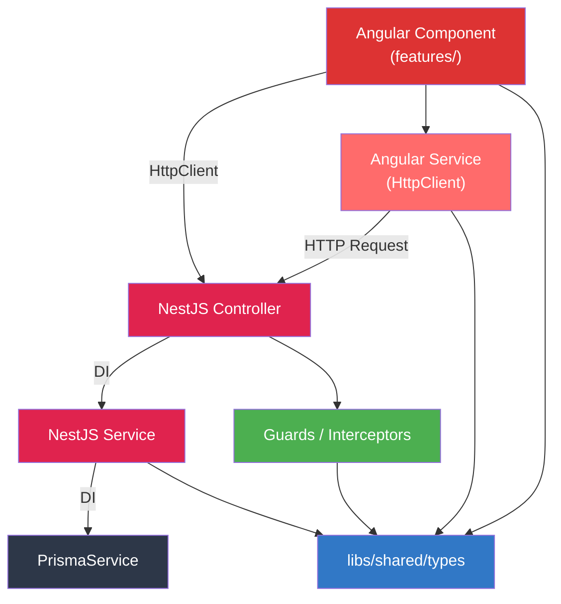
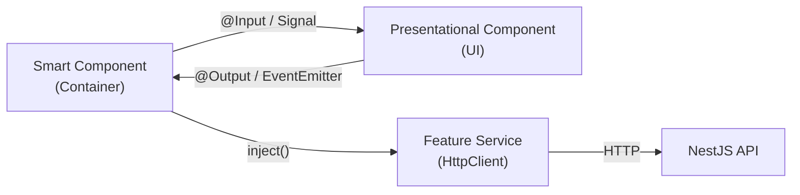

## 目的 / In-Out / Related

- **目的**: Nx モノレポ上での Angular + NestJS モジュール分割と責務を定義する
- **対象範囲（In）**: ディレクトリ構成、レイヤー分割、依存ルール、共通ユーティリティ
- **対象範囲（Out）**: 個別関数の実装詳細
- **Related**: [Nx ワークスペース設計](../../architecture/nx-workspace/) / [機能要件カタログ](../../requirements/req-catalog/)

---

## Nx Monorepo ディレクトリ構成

```
project-root/
├── apps/
│   ├── web/                                 # Angular 19 フロントエンド
│   │   └── src/app/
│   │       ├── core/                        # 横断的関心事
│   │       │   ├── guards/
│   │       │   │   └── auth.guard.ts        # canActivate（認証チェック）
│   │       │   ├── interceptors/
│   │       │   │   ├── auth.interceptor.ts  # JWT Bearer 自動付与
│   │       │   │   └── error.interceptor.ts # 共通エラーハンドリング
│   │       │   └── services/
│   │       │       ├── auth.service.ts      # AuthState Signal, login/logout
│   │       │       └── notification.service.ts # 通知ベル用 WebSocket 受信
│   │       ├── features/                    # Feature modules (lazy loaded)
│   │       │   ├── dashboard/
│   │       │   │   ├── dashboard.component.ts
│   │       │   │   ├── dashboard.service.ts
│   │       │   │   └── dashboard.routes.ts
│   │       │   ├── workflows/
│   │       │   │   ├── workflow-list.component.ts
│   │       │   │   ├── workflow-detail.component.ts
│   │       │   │   ├── workflow-form.component.ts
│   │       │   │   ├── workflow.service.ts  # HttpClient
│   │       │   │   └── workflows.routes.ts
│   │       │   ├── projects/
│   │       │   │   ├── project-list.component.ts
│   │       │   │   ├── project-detail.component.ts
│   │       │   │   ├── project-form.component.ts
│   │       │   │   ├── task-kanban.component.ts
│   │       │   │   ├── document-list.component.ts
│   │       │   │   ├── project.service.ts
│   │       │   │   ├── task.service.ts
│   │       │   │   ├── document.service.ts
│   │       │   │   └── projects.routes.ts
│   │       │   ├── timesheets/
│   │       │   │   ├── weekly-timesheet.component.ts
│   │       │   │   ├── timesheet-report.component.ts
│   │       │   │   ├── timesheet.service.ts
│   │       │   │   └── timesheets.routes.ts
│   │       │   ├── expenses/
│   │       │   │   ├── expense-list.component.ts
│   │       │   │   ├── expense-form.component.ts
│   │       │   │   ├── expense-summary.component.ts
│   │       │   │   ├── expense.service.ts
│   │       │   │   └── expenses.routes.ts
│   │       │   ├── invoices/
│   │       │   │   ├── invoice-list.component.ts
│   │       │   │   ├── invoice-form.component.ts
│   │       │   │   ├── invoice-detail.component.ts
│   │       │   │   ├── invoice-print.component.ts
│   │       │   │   ├── invoice.service.ts
│   │       │   │   └── invoices.routes.ts
│   │       │   ├── search/
│   │       │   │   ├── search-results.component.ts
│   │       │   │   ├── header-search.component.ts
│   │       │   │   ├── search.service.ts
│   │       │   │   └── search.routes.ts
│   │       │   ├── notifications/
│   │       │   │   ├── notification-bell.component.ts
│   │       │   │   └── notification.service.ts
│   │       │   └── admin/
│   │       │       ├── tenant-management.component.ts
│   │       │       ├── user-management.component.ts
│   │       │       ├── user-detail-panel.component.ts
│   │       │       ├── invite-modal.component.ts
│   │       │       ├── audit-log-viewer.component.ts
│   │       │       ├── admin.service.ts
│   │       │       └── admin.routes.ts
│   │       ├── shared/                      # App 固有の共有コンポーネント
│   │       │   ├── components/
│   │       │   │   └── app-shell.component.ts  # サイドバー + ヘッダー
│   │       │   └── pipes/
│   │       │       └── highlight.pipe.ts    # 検索キーワードハイライト
│   │       ├── app.component.ts
│   │       ├── app.config.ts
│   │       └── app.routes.ts
│   │
│   └── api/                                 # NestJS 10 バックエンド
│       └── src/
│           ├── modules/
│           │   ├── auth/                    # DD-MOD-012 認証モジュール
│           │   │   ├── auth.module.ts
│           │   │   ├── auth.controller.ts   # login, logout, callback
│           │   │   ├── auth.service.ts      # JWT 発行・検証
│           │   │   ├── strategies/
│           │   │   │   ├── jwt.strategy.ts  # Passport JWT Strategy
│           │   │   │   └── local.strategy.ts
│           │   │   ├── guards/
│           │   │   │   ├── jwt-auth.guard.ts
│           │   │   │   └── roles.guard.ts
│           │   │   ├── decorators/
│           │   │   │   ├── roles.decorator.ts     # @Roles('pm', 'tenant_admin')
│           │   │   │   └── current-user.decorator.ts  # @CurrentUser()
│           │   │   └── dto/
│           │   │       └── login.dto.ts
│           │   ├── workflows/               # DD-MOD-001
│           │   │   ├── workflows.module.ts
│           │   │   ├── workflows.controller.ts
│           │   │   ├── workflows.service.ts
│           │   │   ├── dto/
│           │   │   │   ├── create-workflow.dto.ts
│           │   │   │   └── update-workflow.dto.ts
│           │   │   └── workflows.controller.spec.ts
│           │   ├── projects/                # DD-MOD-002
│           │   │   ├── projects.module.ts
│           │   │   ├── projects.controller.ts
│           │   │   ├── projects.service.ts
│           │   │   ├── tasks.controller.ts
│           │   │   ├── tasks.service.ts
│           │   │   ├── dto/
│           │   │   │   ├── create-project.dto.ts
│           │   │   │   ├── update-project.dto.ts
│           │   │   │   ├── create-task.dto.ts
│           │   │   │   └── update-task.dto.ts
│           │   │   └── projects.controller.spec.ts
│           │   ├── timesheets/              # DD-MOD-003
│           │   │   ├── timesheets.module.ts
│           │   │   ├── timesheets.controller.ts
│           │   │   ├── timesheets.service.ts
│           │   │   ├── dto/
│           │   │   │   └── upsert-timesheet.dto.ts
│           │   │   └── timesheets.controller.spec.ts
│           │   ├── expenses/                # DD-MOD-004
│           │   │   ├── expenses.module.ts
│           │   │   ├── expenses.controller.ts
│           │   │   ├── expenses.service.ts
│           │   │   ├── expense-summary.controller.ts
│           │   │   ├── expense-summary.service.ts
│           │   │   ├── dto/
│           │   │   │   └── create-expense.dto.ts
│           │   │   └── expenses.controller.spec.ts
│           │   ├── notifications/           # DD-MOD-005
│           │   │   ├── notifications.module.ts
│           │   │   ├── notifications.controller.ts
│           │   │   ├── notifications.service.ts
│           │   │   └── notifications.gateway.ts    # WebSocket (将来)
│           │   ├── dashboard/               # DD-MOD-006
│           │   │   ├── dashboard.module.ts
│           │   │   ├── dashboard.controller.ts
│           │   │   └── dashboard.service.ts
│           │   ├── admin/                   # DD-MOD-007
│           │   │   ├── admin.module.ts
│           │   │   ├── tenants.controller.ts
│           │   │   ├── tenants.service.ts
│           │   │   ├── users.controller.ts
│           │   │   ├── users.service.ts
│           │   │   ├── audit-logs.controller.ts
│           │   │   ├── audit-logs.service.ts
│           │   │   └── dto/
│           │   │       ├── update-tenant.dto.ts
│           │   │       ├── invite-user.dto.ts
│           │   │       └── update-role.dto.ts
│           │   ├── invoices/                # DD-MOD-008
│           │   │   ├── invoices.module.ts
│           │   │   ├── invoices.controller.ts
│           │   │   ├── invoices.service.ts
│           │   │   ├── dto/
│           │   │   │   ├── create-invoice.dto.ts
│           │   │   │   └── update-invoice.dto.ts
│           │   │   └── invoices.controller.spec.ts
│           │   ├── documents/               # DD-MOD-009
│           │   │   ├── documents.module.ts
│           │   │   ├── documents.controller.ts
│           │   │   ├── documents.service.ts
│           │   │   └── dto/
│           │   │       └── upload-document.dto.ts
│           │   ├── search/                  # DD-MOD-010
│           │   │   ├── search.module.ts
│           │   │   ├── search.controller.ts
│           │   │   └── search.service.ts
│           │   └── health/                  # DD-MOD-011
│           │       ├── health.module.ts
│           │       └── health.controller.ts
│           ├── common/
│           │   ├── decorators/
│           │   │   ├── roles.decorator.ts
│           │   │   └── current-user.decorator.ts
│           │   ├── guards/
│           │   │   ├── jwt-auth.guard.ts
│           │   │   └── roles.guard.ts
│           │   ├── interceptors/
│           │   │   ├── audit.interceptor.ts      # 自動監査ログ
│           │   │   ├── response.interceptor.ts   # ApiResponse<T> 統一変換
│           │   │   └── logging.interceptor.ts    # リクエストログ
│           │   ├── filters/
│           │   │   └── http-exception.filter.ts  # 例外→ApiResponse 変換
│           │   ├── pipes/
│           │   │   └── validation.pipe.ts
│           │   └── middleware/
│           │       └── tenant.middleware.ts       # X-Tenant-Id ヘッダー検証
│           ├── prisma/
│           │   └── prisma.service.ts             # PrismaClient ラッパー
│           ├── app.module.ts
│           └── main.ts
│
├── libs/
│   ├── shared/
│   │   ├── types/                               # 共有型定義
│   │   │   └── src/lib/
│   │   │       ├── dto/
│   │   │       │   └── api-response.dto.ts      # ApiResponse<T>
│   │   │       ├── enums/
│   │   │       │   ├── role.enum.ts             # Role
│   │   │       │   ├── user-status.enum.ts      # UserStatus
│   │   │       │   ├── workflow-status.enum.ts
│   │   │       │   ├── project-status.enum.ts
│   │   │       │   ├── task-status.enum.ts
│   │   │       │   └── invoice-status.enum.ts
│   │   │       ├── interfaces/
│   │   │       │   ├── current-user.interface.ts
│   │   │       │   └── pagination.interface.ts
│   │   │       └── constants/
│   │   │           ├── role-labels.ts           # ROLE_LABELS
│   │   │           ├── status-labels.ts         # USER_STATUS_LABELS, COLORS
│   │   │           ├── transitions.ts           # TASK/PROJECT/WORKFLOW_TRANSITIONS
│   │   │           ├── invoice-constants.ts     # INVOICE_STATUS_*, TRANSITIONS
│   │   │           └── allowed-mime-types.ts    # ALLOWED_MIME_TYPES
│   │   ├── util/                                # 共有ユーティリティ
│   │   │   └── src/lib/
│   │   │       ├── csv.util.ts                  # escapeCsvField()
│   │   │       ├── string.util.ts               # escapeLikePattern()
│   │   │       ├── file.util.ts                 # formatFileSize()
│   │   │       └── notification-link.util.ts    # getNotificationLink()
│   │   └── ui/                                  # 共有 Angular コンポーネント
│   └── prisma-db/                               # Prisma クライアント
│       ├── prisma/
│       │   └── schema.prisma
│       └── src/lib/
│           └── prisma.service.ts
└── nx.json
```

---

## レイヤー別責務

### Controller 層（`apps/api/src/modules/*/`）

- **責務**: HTTP ルーティング、バリデーション（DTO + `ValidationPipe`）、認可（Guard + Decorator）、レスポンス変換
- **ルール**: ビジネスロジックを書かない。Service に委譲する
- **パターン**: `@UseGuards(JwtAuthGuard, RolesGuard)` + `@Roles()` で認可制御

```ts
@Controller('workflows')
@UseGuards(JwtAuthGuard, RolesGuard)
export class WorkflowsController {
  constructor(private readonly workflowsService: WorkflowsService) {}

  @Post()
  @Roles('member', 'pm')
  async create(
    @CurrentUser() user: CurrentUser,
    @Body() dto: CreateWorkflowDto,
  ): Promise<ApiResponse<Workflow>> {
    const data = await this.workflowsService.create(user, dto);
    return { success: true, data };
  }
}
```

### Service 層（`apps/api/src/modules/*/`）

- **責務**: ビジネスロジック、トランザクション管理、通知作成、データ変換
- **ルール**: Controller / Interceptor から呼び出される。Prisma を直接操作する

```ts
@Injectable()
export class WorkflowsService {
  constructor(
    private readonly prisma: PrismaService,
    private readonly notificationService: NotificationsService,
  ) {}

  async create(user: CurrentUser, dto: CreateWorkflowDto): Promise<Workflow> {
    return this.prisma.$transaction(async (tx) => {
      const wfNumber = await this.nextWorkflowNumber(tx, user.tenantId);
      const workflow = await tx.workflow.create({ data: { ... } });
      await this.notificationService.create({ ... });
      return workflow;
    });
  }
}
```

### Prisma 層（`libs/prisma-db/`）

- **責務**: DB スキーマ定義、マイグレーション、PrismaClient の初期化・接続管理
- **ルール**: NestJS Module としてエクスポート、`onModuleInit` / `onModuleDestroy` でライフサイクル管理

### Angular Component 層（`apps/web/src/app/features/`）

- **責務**: UI 表示、ユーザーインタラクション、状態管理（Signals）
- **ルール**: HttpClient 経由で API を呼び出す。ビジネスロジックは持たない
- **パターン**: Smart Component + Presentational Component（後述）

### Angular Service 層（`apps/web/src/app/features/*/`）

- **責務**: HttpClient による API 通信、レスポンスの Signal 変換、キャッシュ管理
- **ルール**: Feature ごとに Service を持つ。`inject()` でコンポーネントに注入

---

## 依存ルール



**Nx ライブラリ境界ルール**:
- `scope:web` → `scope:shared` のみ依存可能（Prisma 直接参照不可）
- `scope:api` → `scope:shared`, `scope:api` のみ依存可能
- `scope:shared` → `scope:shared` のみ依存可能

---

## 共通ユーティリティの NestJS 移行

### `withAuth()` → Guard + Decorator

旧パターンの `withAuth()` ラッパーは **`JwtAuthGuard` + `RolesGuard` + `@Roles()`** に分離。

| 旧 (Next.js) | 新 (NestJS) | 配置 |
|---|---|---|
| `withAuth(handler)` | `@UseGuards(JwtAuthGuard, RolesGuard)` | `common/guards/` |
| `requireRole(tenantId, roles)` | `@Roles('pm', 'tenant_admin')` | `common/decorators/` |
| ユーザー取得 | `@CurrentUser() user` | `common/decorators/` |

**JwtAuthGuard** — Passport JWT ストラテジの `AuthGuard('jwt')` ラッパー:

```ts
@Injectable()
export class JwtAuthGuard extends AuthGuard('jwt') {}
```

**RolesGuard** — `@Roles()` メタデータと `CurrentUser.roles` を比較:

```ts
@Injectable()
export class RolesGuard implements CanActivate {
  constructor(private reflector: Reflector) {}

  canActivate(context: ExecutionContext): boolean {
    const requiredRoles = this.reflector.getAllAndOverride<string[]>(
      ROLES_KEY, [context.getHandler(), context.getClass()],
    );
    if (!requiredRoles) return true;
    const { roles } = context.switchToHttp().getRequest().user;
    return requiredRoles.some((role) => roles.includes(role));
  }
}
```

**@CurrentUser() デコレータ** — `req.user` から `CurrentUser` を抽出:

```ts
export const CurrentUser = createParamDecorator(
  (data: unknown, ctx: ExecutionContext): CurrentUser => {
    return ctx.switchToHttp().getRequest().user;
  },
);
```

---

### `writeAuditLog()` → AuditInterceptor（自動）

旧パターンの `writeAuditLog()` 手動呼び出しは **`AuditInterceptor`** で自動化。

```ts
@Injectable()
export class AuditInterceptor implements NestInterceptor {
  constructor(private readonly prisma: PrismaService) {}

  intercept(context: ExecutionContext, next: CallHandler): Observable<any> {
    const request = context.switchToHttp().getRequest();
    const { method, url, body, user } = request;

    // GET は記録しない
    if (method === 'GET') return next.handle();

    return next.handle().pipe(
      tap(async (responseData) => {
        await this.prisma.auditLog.create({
          data: {
            userId:       user.id,
            tenantId:     user.tenantId,
            action:       method.toLowerCase(), // create | update | delete
            resourceType: this.extractResourceType(url),
            resourceId:   responseData?.data?.id,
            after:        body,
            metadata:     { url, method },
          },
        });
      }),
    );
  }
}
```

> [!NOTE]
> 変更前後データ（`before` / `after`）の取得が必要な場合は、Service 内で明示的に `AuditLogService.log()` を呼び出す。

---

### `requireAuth()` / `requireRole()` → Guard + Decorator

| 旧 | 新 | 説明 |
|---|---|---|
| `requireAuth()` | `JwtAuthGuard` | 未認証 → 401 Unauthorized |
| `requireRole(tenantId, roles)` | `@Roles()` + `RolesGuard` | 権限不足 → 403 Forbidden |
| `getCurrentUser()` | `JwtStrategy.validate()` | JWT payload → `CurrentUser` オブジェクト |

**JwtStrategy.validate()** — JWT ペイロードを `CurrentUser` に変換:

```ts
@Injectable()
export class JwtStrategy extends PassportStrategy(Strategy) {
  constructor(private readonly prisma: PrismaService) {
    super({ jwtFromRequest: ExtractJwt.fromAuthHeaderAsBearerToken(), secretOrKey: process.env.JWT_SECRET });
  }

  async validate(payload: JwtPayload): Promise<CurrentUser> {
    const userRoles = await this.prisma.userRole.findMany({
      where: { userId: payload.sub },
      select: { tenantId: true, role: true },
    });
    return {
      id: payload.sub,
      email: payload.email,
      tenantIds: [...new Set(userRoles.map(r => r.tenantId))],
      roles: userRoles,
    };
  }
}
```

---

### `hasRole()` → Angular `AuthService.hasRole()` Signal

旧パターンの `hasRole()` によるUI分岐は **Angular Signal** で実現:

```ts
@Injectable({ providedIn: 'root' })
export class AuthService {
  private currentUser = signal<CurrentUser | null>(null);

  /** ロール判定（UI 分岐用） */
  hasRole(roles: string[]): Signal<boolean> {
    return computed(() => {
      const user = this.currentUser();
      if (!user) return false;
      return user.roles.some(r => roles.includes(r.role));
    });
  }

  /** canEdit 等のテンプレート用 Signal */
  readonly canEdit = computed(() =>
    this.hasRole(['pm', 'tenant_admin'])()
  );
}
```

**テンプレートでの利用**:
```html
@if (authService.canEdit()) {
  <button (click)="onEdit()">編集</button>
}
```

---

### `createNotification()` → `NotificationsService.create()`

旧パターンの `createNotification()` ヘルパーは **NestJS NotificationsService** に移行:

```ts
@Injectable()
export class NotificationsService {
  constructor(private readonly prisma: PrismaService) {}

  async create(input: CreateNotificationDto): Promise<Notification> {
    return this.prisma.notification.create({
      data: {
        tenantId:     input.tenantId,
        userId:       input.userId,
        type:         input.type,       // 'workflow_submitted' | 'workflow_approved' | ...
        title:        input.title,
        body:         input.body,
        resourceType: input.resourceType,
        resourceId:   input.resourceId,
      },
    });
  }
}
```

他モジュールの Service から DI で注入して利用:

```ts
// workflows.service.ts
constructor(private readonly notificationService: NotificationsService) {}
```

---

### `getNotificationLink()` → `libs/shared/util`

通知リンク生成ロジックは共有ユーティリティとして配置:

```ts
// libs/shared/util/src/lib/notification-link.util.ts
export function getNotificationLink(
  resourceType: string | null,
  resourceId: string | null,
): string | null {
  if (!resourceType || !resourceId) return null;
  const routes: Record<string, string> = {
    workflow: `/workflows/${resourceId}`,
    project:  `/projects/${resourceId}`,
    task:     `/projects`,     // PJ 配下のため一覧へ
    expense:  `/expenses`,
  };
  return routes[resourceType] ?? null;
}
```

---

### `ActionResult<T>` → `ApiResponse<T>`

統一レスポンス型を `libs/shared/types` に配置:

```ts
// libs/shared/types/src/lib/dto/api-response.dto.ts
export type ApiResponse<T> =
  | { success: true;  data: T }
  | { success: false; error: { code: string; message: string; fields?: Record<string, string> } };
```

NestJS 側では `ResponseInterceptor` で自動ラップ:

```ts
@Injectable()
export class ResponseInterceptor<T> implements NestInterceptor<T, ApiResponse<T>> {
  intercept(context: ExecutionContext, next: CallHandler): Observable<ApiResponse<T>> {
    return next.handle().pipe(
      map(data => ({ success: true as const, data })),
    );
  }
}
```

---

### `revalidatePath()` → Angular Signal 更新

旧パターンの `revalidatePath()` によるキャッシュ無効化は **Angular Signal の再フェッチ** で代替:

```ts
// feature service
@Injectable()
export class WorkflowService {
  private refreshTrigger = signal(0);

  /** 一覧データ（自動リフレッシュ） */
  readonly workflows = toSignal(
    toObservable(this.refreshTrigger).pipe(
      switchMap(() => this.http.get<ApiResponse<Workflow[]>>('/api/workflows')),
      map(res => res.success ? res.data : []),
    ),
    { initialValue: [] },
  );

  /** データ更新後にリフレッシュ */
  refresh(): void {
    this.refreshTrigger.update(v => v + 1);
  }
}
```

---

### Supabase → Prisma クエリ変換

| 旧 (Supabase) | 新 (Prisma) |
|---|---|
| `supabase.from('workflows').select('*')` | `prisma.workflow.findMany()` |
| `supabase.from('workflows').select('*, profiles!fkey(display_name)')` | `prisma.workflow.findMany({ include: { createdBy: { select: { displayName: true } } } })` |
| `supabase.from('workflows').insert(data)` | `prisma.workflow.create({ data })` |
| `supabase.from('workflows').update(data).eq('id', id)` | `prisma.workflow.update({ where: { id }, data })` |
| `supabase.from('workflows').delete().eq('id', id)` | `prisma.workflow.delete({ where: { id } })` |
| `supabase.rpc('next_workflow_number', { tid })` | `prisma.$queryRaw` または Service メソッド |
| React `cache()` | `@nestjs/cache-manager` `@CacheTTL()` |

---

### profiles JOIN — ユーザー表示名取得パターン

Prisma ではリレーションの `include` / `select` で取得:

```ts
// NestJS Service でのパターン
const workflows = await this.prisma.workflow.findMany({
  where: { tenantId },
  include: {
    createdBy: { select: { displayName: true, avatarUrl: true } },
  },
});

// 表示時
const name = workflow.createdBy?.displayName ?? workflow.createdById;
```

---

## 共通定数の配置

### `libs/shared/types/` — 全体共通定数

#### ラベル・カラー定数

| 定数名 | 型 | 配置ファイル | 用途 |
|---|---|---|---|
| `ROLE_LABELS` | `Record<Role, string>` | `constants/role-labels.ts` | ロール表示名（`member` → `"メンバー"` 等） |
| `USER_STATUS_LABELS` | `Record<UserStatus, string>` | `constants/status-labels.ts` | ユーザーステータス表示名 |
| `USER_STATUS_COLORS` | `Record<UserStatus, string>` | `constants/status-labels.ts` | ステータスごとの PrimeNG severity / CSS カスタムプロパティ |

#### 状態遷移ルール

| 定数名 | 配置ファイル | 用途 |
|---|---|---|
| `TASK_TRANSITIONS` | `constants/transitions.ts` | タスクステータス遷移（`todo` → `in_progress` → `done`） |
| `PROJECT_TRANSITIONS` | `constants/transitions.ts` | プロジェクトステータス遷移 |
| `WORKFLOW_TRANSITIONS` | `constants/transitions.ts` | ワークフローステータス遷移 |

#### `ApiResponse<T>` 統一レスポンス型

```ts
// libs/shared/types/src/lib/dto/api-response.dto.ts
export type ApiResponse<T> =
  | { success: true;  data: T }
  | { success: false; error: { code: string; message: string; fields?: Record<string, string> } };
```

### `libs/shared/types/` — 請求書定数

| 定数名 | 型 | 配置ファイル | 用途 |
|---|---|---|---|
| `INVOICE_STATUSES` | `readonly ['draft', 'sent', 'paid', 'cancelled']` | `constants/invoice-constants.ts` | 請求書ステータス列挙 |
| `INVOICE_STATUS_LABELS` | `Record<InvoiceStatus, string>` | `constants/invoice-constants.ts` | ステータス表示名 |
| `INVOICE_STATUS_COLORS` | `Record<InvoiceStatus, string>` | `constants/invoice-constants.ts` | ステータスカラー |
| `INVOICE_STATUS_TRANSITIONS` | `Record<InvoiceStatus, InvoiceStatus[]>` | `constants/invoice-constants.ts` | 遷移ルール |

### `libs/shared/types/` — ドキュメント管理定数

| 定数名 | 配置ファイル | 用途 |
|---|---|---|
| `ALLOWED_MIME_TYPES` | `constants/allowed-mime-types.ts` | アップロード許可 MIME タイプ一覧 |

---

## Angular Component 分離パターン（Smart / Presentational）

### 基本方針



| 区分 | 使用基準 | ファイル命名 |
|---|---|---|
| **Smart Component** | データ取得、Service 注入、状態管理 | `xxx-list.component.ts`, `xxx-detail.component.ts` |
| **Presentational Component** | 純粋 UI、`@Input` / `@Output` のみ | `xxx-card.component.ts`, `xxx-form.component.ts` |

### 実装パターン

**Smart Component**:
```ts
@Component({
  selector: 'app-workflow-list',
  standalone: true,
  imports: [WorkflowCardComponent, NgFor],
  template: `
    @for (wf of workflowService.workflows(); track wf.id) {
      <app-workflow-card
        [workflow]="wf"
        [canApprove]="authService.hasRole(['approver', 'tenant_admin'])()"
        (approve)="onApprove($event)"
      />
    }
  `,
})
export class WorkflowListComponent {
  protected workflowService = inject(WorkflowService);
  protected authService = inject(AuthService);

  onApprove(workflowId: string): void {
    this.workflowService.approve(workflowId).subscribe(() => {
      this.workflowService.refresh();
    });
  }
}
```

**Presentational Component**:
```ts
@Component({
  selector: 'app-workflow-card',
  standalone: true,
  template: `
    <p-card [header]="workflow().title">
      <p>{{ workflow().status }}</p>
      @if (canApprove()) {
        <p-button (click)="approve.emit(workflow().id)">承認</p-button>
      }
    </p-card>
  `,
})
export class WorkflowCardComponent {
  workflow = input.required<Workflow>();
  canApprove = input(false);
  approve = output<string>();
}
```

### 並行データフェッチ（`forkJoin`）

ダッシュボード等、複数 API を並行取得する場合は `forkJoin` を使用:

```ts
@Injectable()
export class DashboardService {
  private http = inject(HttpClient);

  loadDashboard(roles: string[]): Observable<DashboardData> {
    return forkJoin({
      pendingApprovals: roles.includes('approver')
        ? this.http.get<ApiResponse<number>>('/api/dashboard/pending-approvals')
        : of({ success: true, data: 0 }),
      myWorkflows: this.http.get<ApiResponse<number>>('/api/dashboard/my-workflows'),
      myTasks: roles.includes('member') || roles.includes('pm')
        ? this.http.get<ApiResponse<number>>('/api/dashboard/my-tasks')
        : of({ success: true, data: 0 }),
      weeklyHours: this.http.get<ApiResponse<number>>('/api/dashboard/weekly-hours'),
    });
  }
}
```

---

## モジュール一覧

### DD-MOD-001 ワークフローモジュール

- **責務**: ワークフロー（申請/承認/差戻し/取下げ）の全操作、WF番号の並行安全な採番
- **Epic**: [Epic B: ワークフロー](../../requirements/req-catalog/#epic-b-ワークフローmust)
- **API (NestJS)**:
  - `modules/workflows/workflows.controller.ts` — REST エンドポイント
  - `modules/workflows/workflows.service.ts` — ビジネスロジック
- **UI (Angular)**:
  - `features/workflows/workflow-list.component.ts` — 申請一覧
  - `features/workflows/workflow-detail.component.ts` — 詳細・承認/差戻し/取下げ UI
  - `features/workflows/workflow-form.component.ts` — 新規申請フォーム
  - `features/workflows/workflow.service.ts` — HttpClient
- **公開 API**:
  - `POST   /api/workflows` — `createWorkflow`
  - `PATCH  /api/workflows/:id/submit` — `submitWorkflow`
  - `PATCH  /api/workflows/:id/approve` — `approveWorkflow`
  - `PATCH  /api/workflows/:id/reject` — `rejectWorkflow`
  - `PATCH  /api/workflows/:id/withdraw` — `withdrawWorkflow`
- **認可**: `@UseGuards(JwtAuthGuard, RolesGuard)` + `@Roles('member', 'pm', 'approver')`
- **依存**: `AuditInterceptor`（自動）, `NotificationsService`, `PrismaService`
- **データ境界**: `Workflow`, `WorkflowAttachment` テーブル

### DD-MOD-002 プロジェクトモジュール

- **責務**: プロジェクトとタスクの CRUD、メンバー管理、カンバンボード
- **Epic**: [Epic C: 案件/タスク](../../requirements/req-catalog/#epic-c-案件タスク工数must)
- **API (NestJS)**:
  - `modules/projects/projects.controller.ts` — プロジェクト REST
  - `modules/projects/tasks.controller.ts` — タスク REST
  - `modules/projects/projects.service.ts`, `tasks.service.ts`
- **UI (Angular)**:
  - `features/projects/project-list.component.ts` — プロジェクト一覧
  - `features/projects/project-detail.component.ts` — 詳細・メンバー管理
  - `features/projects/task-kanban.component.ts` — カンバンボード
  - `features/projects/project.service.ts`, `task.service.ts`
- **公開 API**:
  - `POST /api/projects` — `createProject`
  - `PATCH /api/projects/:id` — `updateProject`
  - `POST /api/projects/:id/members` — `assignMember`
  - `POST /api/projects/:id/tasks` — `createTask`
  - `PATCH /api/projects/:id/tasks/:taskId` — `updateTask`
- **認可**: `@Roles('pm', 'tenant_admin')` (作成/更新), `@Roles('member', 'pm')` (タスク操作)
- **データ境界**: `Project`, `ProjectMember`, `Task` テーブル

### DD-MOD-003 工数モジュール

- **責務**: 工数の週次入力・更新、レポート集計、CSV エクスポート
- **Epic**: [Epic C: 工数](../../requirements/req-catalog/#req-c03-工数入力集計)
- **API (NestJS)**:
  - `modules/timesheets/timesheets.controller.ts` — 工数 REST + CSV エクスポート
  - `modules/timesheets/timesheets.service.ts`
- **UI (Angular)**:
  - `features/timesheets/weekly-timesheet.component.ts` — 週次入力グリッド
  - `features/timesheets/timesheet-report.component.ts` — レポート UI
  - `features/timesheets/timesheet.service.ts`
- **公開 API**:
  - `PUT  /api/timesheets` — `upsertTimesheet`
  - `GET  /api/timesheets/weekly` — `getWeeklyTimesheet`
  - `GET  /api/timesheets/summary` — `getProjectSummary`
  - `GET  /api/timesheets/export` — CSV エクスポート
- **ヘルパー**: `escapeCsvField()` → `libs/shared/util/csv.util.ts`
- **認可**: `@Roles('member', 'pm')` (入力), `@Roles('pm', 'tenant_admin')` (レポート)
- **データ境界**: `Timesheet` テーブル

### DD-MOD-004 経費モジュール

- **責務**: 経費の登録・一覧表示・集計・ワークフロー連携
- **Epic**: [Epic D: 経費](../../requirements/req-catalog/#epic-d-経費should)
- **API (NestJS)**:
  - `modules/expenses/expenses.controller.ts` — 経費 REST
  - `modules/expenses/expense-summary.controller.ts` — 集計 REST
  - `modules/expenses/expenses.service.ts`, `expense-summary.service.ts`
- **UI (Angular)**:
  - `features/expenses/expense-list.component.ts` — 経費一覧
  - `features/expenses/expense-form.component.ts` — 経費登録フォーム
  - `features/expenses/expense-summary.component.ts` — 集計フィルタ・チャート
  - `features/expenses/expense.service.ts`
- **公開 API**:
  - `POST /api/expenses` — `createExpense`
  - `GET  /api/expenses` — `getExpenses`
  - `GET  /api/expenses/summary/category` — `getExpenseSummaryByCategory`
  - `GET  /api/expenses/summary/project` — `getExpenseSummaryByProject`
  - `GET  /api/expenses/summary/month` — `getExpenseSummaryByMonth`
  - `GET  /api/expenses/stats` — `getExpenseStats`
- **認可**: `@Roles('member', 'pm')` (登録), `@Roles('accounting', 'pm', 'tenant_admin')` (集計)
- **データ境界**: `Expense` テーブル

### DD-MOD-005 通知モジュール

- **責務**: 通知の表示・既読管理・一括既読・削除
- **Epic**: [Epic G: 通知](../../requirements/req-catalog/#req-g01-通知)
- **API (NestJS)**:
  - `modules/notifications/notifications.controller.ts` — 通知 REST
  - `modules/notifications/notifications.service.ts` — 通知作成・既読更新・削除
  - `modules/notifications/notifications.gateway.ts` — WebSocket（将来）
- **UI (Angular)**:
  - `shared/notification-bell/notification-bell.component.ts` — ヘッダー通知ベル
  - `features/notifications/notification-list.component.ts` — 通知一覧ページ
  - `shared/notification-bell/notification.service.ts`
- **公開 API**:
  - `GET   /api/notifications` — `getNotifications`
  - `PATCH /api/notifications/:id/read` — `markAsRead`
  - `PATCH /api/notifications/read-all` — `markAllAsRead`
  - `GET   /api/notifications/unread-count` — `getUnreadCount`
  - `DELETE /api/notifications/:id` — `removeNotification`
- **認可**: `@UseGuards(JwtAuthGuard)` のみ（RLS 相当の tenant フィルタは Service で実装）
- **データ境界**: `Notification` テーブル

### DD-MOD-006 ダッシュボードモジュール

- **責務**: KPI 集計表示、未読通知一覧、クイックアクション
- **Epic**: [Epic G: ダッシュボード](../../requirements/req-catalog/#req-g03-ダッシュボードレポート)
- **API (NestJS)**:
  - `modules/dashboard/dashboard.controller.ts` — 集計 REST
  - `modules/dashboard/dashboard.service.ts` — 各テーブル集計ロジック
- **UI (Angular)**:
  - `features/dashboard/dashboard.component.ts` — ダッシュボード画面
  - `features/dashboard/dashboard.service.ts`
- **公開 API**:
  - `GET /api/dashboard/pending-approvals` — 承認待ち件数
  - `GET /api/dashboard/my-workflows` — 自分の申請件数
  - `GET /api/dashboard/my-tasks` — 自分のタスク件数
  - `GET /api/dashboard/weekly-hours` — 今週の工数
  - `GET /api/dashboard/project-progress` — プロジェクト進捗
  - `GET /api/dashboard/unread-notifications` — 未読通知一覧
- **ロール分岐**: Angular `AuthService.hasRole()` Signal で表示カード・データ取得を制御
- **認可**: `@UseGuards(JwtAuthGuard)` + Service 内で `roles` に応じた条件分岐
- **並行取得**: NestJS Service 内で `Promise.all` / Angular Service で `forkJoin`

### DD-MOD-007 管理モジュール

- **責務**: テナント設定、ユーザー管理（招待/ロール変更/無効化）、監査ログビューア
- **Epic**: [Epic A: テナント/組織/権限](../../requirements/req-catalog/#epic-a-テナント組織権限must)
- **API (NestJS)**:
  - `modules/admin/tenants.controller.ts` — テナント REST
  - `modules/admin/users.controller.ts` — ユーザー REST（招待/ロール）
  - `modules/admin/audit-logs.controller.ts` — 監査ログ REST
  - `modules/admin/tenants.service.ts`, `users.service.ts`, `audit-logs.service.ts`
- **UI (Angular)**:
  - `features/admin/tenant-management.component.ts` — テナント設定 UI
  - `features/admin/user-management.component.ts` — ユーザー一覧
  - `features/admin/user-detail-panel.component.ts` — ユーザー詳細パネル
  - `features/admin/invite-modal.component.ts` — 招待モーダル
  - `features/admin/audit-log-viewer.component.ts` — ログ閲覧 UI
  - `features/admin/admin.service.ts`
- **共通定数利用**: `ROLE_LABELS`, `USER_STATUS_LABELS`, `USER_STATUS_COLORS`（`libs/shared/types`）
- **認可**: `@Roles('tenant_admin')` — 管理機能は Tenant Admin のみ
- **データ境界**: `Tenant`, `UserRole`, `Profile`, `AuditLog` テーブル

### DD-MOD-008 請求書モジュール

- **責務**: 請求書の CRUD、ステータス遷移（下書き → 送付済 → 入金済 / キャンセル）、印刷プレビュー、請求番号の並行安全な採番
- **Epic**: [Epic E: 請求](../../requirements/req-catalog/#epic-e-請求should)
- **API (NestJS)**:
  - `modules/invoices/invoices.controller.ts` — 請求書 REST
  - `modules/invoices/invoices.service.ts` — ビジネスロジック + 採番
- **UI (Angular)**:
  - `features/invoices/invoice-list.component.ts` — 一覧・フィルタ
  - `features/invoices/invoice-form.component.ts` — 作成/編集フォーム
  - `features/invoices/invoice-detail.component.ts` — 詳細表示
  - `features/invoices/invoice-print.component.ts` — 印刷プレビュー
  - `features/invoices/invoice.service.ts`
- **定数**: `libs/shared/types/constants/invoice-constants.ts`
- **公開 API**:
  - `GET    /api/invoices` — `getInvoices`
  - `GET    /api/invoices/:id` — `getInvoice`
  - `POST   /api/invoices` — `createInvoice`
  - `PATCH  /api/invoices/:id` — `updateInvoice`
  - `PATCH  /api/invoices/:id/status` — `updateInvoiceStatus`
  - `DELETE /api/invoices/:id` — `deleteInvoice`
- **認可**: `@Roles('accounting', 'pm', 'tenant_admin')`
- **データ境界**: `Invoice`, `InvoiceItem` テーブル

### DD-MOD-009 ドキュメント管理モジュール

- **責務**: プロジェクト配下ドキュメントのアップロード・ダウンロード・削除、ファイルストレージ連携
- **Epic**: [Epic F: ドキュメント](../../requirements/req-catalog/#epic-f-ドキュメントcould)
- **API (NestJS)**:
  - `modules/documents/documents.controller.ts` — ドキュメント REST + `@UseInterceptors(FileInterceptor('file'))`
  - `modules/documents/documents.service.ts` — ファイル保存 + メタデータ管理
- **UI (Angular)**:
  - `features/projects/document-list.component.ts` — ファイル一覧・アップロード UI
  - `features/projects/document.service.ts`
- **定数**: `ALLOWED_MIME_TYPES`（`libs/shared/types/constants/allowed-mime-types.ts`）
- **ヘルパー**: `formatFileSize()` → `libs/shared/util/file.util.ts`
- **公開 API**:
  - `GET    /api/projects/:projectId/documents` — `getDocuments`
  - `POST   /api/projects/:projectId/documents` — `uploadDocument` (multipart/form-data)
  - `DELETE /api/documents/:id` — `deleteDocument`
  - `GET    /api/documents/:id/download` — `getDownloadUrl`
- **認可**: `@Roles('member', 'pm')` + `AuthService.hasRole()` で UI 削除ボタン制御
- **データ境界**: `Document` テーブル、ファイルストレージ（ローカル / S3）

### DD-MOD-010 全文検索モジュール

- **責務**: ワークフロー・プロジェクト・タスク・経費の横断検索、ヘッダー検索バー
- **Epic**: [Epic G: 全文検索](../../requirements/req-catalog/#req-g02-全文検索)
- **API (NestJS)**:
  - `modules/search/search.controller.ts` — 検索 REST
  - `modules/search/search.service.ts` — 並行検索 + 結果統合
- **UI (Angular)**:
  - `features/search/search-results.component.ts` — 検索結果・カテゴリタブ
  - `features/search/header-search.component.ts` — ヘッダー共通検索バー
  - `features/search/search.service.ts`
- **ヘルパー**:
  - `escapeLikePattern()` → `libs/shared/util/string.util.ts`
  - `highlightText()` → `apps/web/src/app/shared/pipes/highlight.pipe.ts`（Angular Pipe）
- **公開 API**:
  - `GET /api/search?q=keyword` — `searchAll`
- **技術**: `pg_trgm` + GIN インデックスによる部分一致検索
- **認可**: `@UseGuards(JwtAuthGuard)` + Service 内で `hasRole` 相当のフィルタ
- **並行検索**: `Promise.all` で `workflows`, `projects`, `tasks`, `expenses` 同時検索
- **データ境界**: `Workflow`, `Project`, `Task`, `Expense` テーブル（横断読取）

### DD-MOD-011 運用基盤モジュール

- **責務**: 構造化ロギング、ヘルスチェック
- **API (NestJS)**:
  - `modules/health/health.controller.ts` — ヘルスチェックエンドポイント
  - `modules/health/health.module.ts` — `@nestjs/terminus` HealthModule
- **ロギング**: NestJS 組み込み `Logger` + カスタム `LoggingInterceptor`
  - JSON 形式の構造化ログ
  - `LOG_LEVEL` 環境変数でフィルタリング
- **公開 API**:
  - `GET /api/health` — DB 接続確認（NFR-04b）
- **ヘルスチェック実装**:
  ```ts
  @Controller('health')
  export class HealthController {
    constructor(
      private health: HealthCheckService,
      private db: PrismaHealthIndicator,
    ) {}

    @Get()
    check() {
      return this.health.check([
        () => this.db.pingCheck('database'),
      ]);
    }
  }
  ```
- **依存**: `@nestjs/terminus`, `PrismaService`

### DD-MOD-012 認証モジュール

- **責務**: JWT 認証、ログイン/ログアウト、パスワードリセット、セッション管理
- **API (NestJS)**:
  - `modules/auth/auth.module.ts` — PassportModule 統合
  - `modules/auth/auth.controller.ts` — ログイン / パスワードリセット
  - `modules/auth/auth.service.ts` — JWT 発行・検証・パスワードリセット
  - `modules/auth/strategies/jwt.strategy.ts` — JWT ペイロード → `CurrentUser`
  - `modules/auth/strategies/local.strategy.ts` — メールパスワード認証
  - `modules/auth/guards/jwt-auth.guard.ts` — 認証 Guard
  - `modules/auth/guards/roles.guard.ts` — ロール Guard
  - `modules/auth/decorators/roles.decorator.ts` — `@Roles()`
  - `modules/auth/decorators/current-user.decorator.ts` — `@CurrentUser()`
  - `modules/auth/dto/password-reset.dto.ts` — `ForgotPasswordDto` / `ResetPasswordDto`
- **UI (Angular)**:
  - `core/services/auth.service.ts` — AuthState Signal, `hasRole()`, `forgotPassword()`, `resetPassword()`
  - `core/guards/auth.guard.ts` — `canActivate` ルートガード
  - `core/interceptors/auth.interceptor.ts` — `Authorization: Bearer` 自動付与
  - `core/auth/forgot-password/forgot-password.component.ts` — パスワードリセット申請
  - `core/auth/reset-password/reset-password.component.ts` — 新パスワード設定
- **公開 API**:
  - `POST /api/auth/login` — ログイン（JWT 発行）
  - `POST /api/auth/logout` — ログアウト
  - `POST /api/auth/register` — ユーザー登録
  - `POST /api/auth/refresh` — トークン更新
  - `GET  /api/auth/me` — 現在のユーザー情報
  - `POST /api/auth/forgot-password` — パスワードリセットメール送信
  - `POST /api/auth/reset-password` — パスワードリセット実行
- **`CurrentUser` 型** (`libs/shared/types`):
  ```ts
  interface CurrentUser {
    id: string;
    email: string;
    tenantIds: string[];
    roles: { tenantId: string; role: Role }[];
  }
  ```
- **認可パターン**:
  - 未認証 → `401 Unauthorized`
  - 権限不足 → `403 Forbidden`（`RolesGuard`）
- **データ境界**: `User`, `UserRole`, `Profile` テーブル
- **依存**: `MailModule`（パスワードリセットメール）、`@nestjs/throttler`（レート制限）

---

## 新規ユーティリティ関数

| 関数名 | 配置 | 用途 |
|---|---|---|
| `escapeCsvField()` | `libs/shared/util/csv.util.ts` | CSV フィールドのエスケープ（ダブルクォート囲み） |
| `escapeLikePattern()` | `libs/shared/util/string.util.ts` | SQL LIKE のメタ文字（`%`, `_`, `\`）エスケープ |
| `formatFileSize()` | `libs/shared/util/file.util.ts` | ファイルサイズの人間可読変換（例: `1.5 MB`） |
| `highlightText` | `apps/web/src/app/shared/pipes/highlight.pipe.ts` | 検索キーワードハイライト（Angular Pipe） |
| `getNotificationLink()` | `libs/shared/util/notification-link.util.ts` | 通知リソースからリンク URL 生成 |

---

## 決定済み事項

| 項目 | 決定内容 |
|---|---|
| 型共有 | `libs/shared/types/` で DTO・Enum・Interface を Frontend/Backend で共有 |
| UI ライブラリ | PrimeNG に統一、共通定数は `libs/shared/types/constants/` に集約 |
| モノレポ | Nx ワークスペースで `apps/web` (Angular) + `apps/api` (NestJS) + `libs/` 構成 |
| WF 採番 | `prisma.$queryRaw` + `FOR UPDATE` ロックによる並行安全な採番（Service メソッド内） |
| 請求書採番 | 同上（`InvoicesService.nextInvoiceNumber()`） |
| ユーザー表示名 | `Profile` テーブル + Prisma `include` リレーション |
| 全文検索 | `pg_trgm` + GIN インデックスによる ILIKE 部分一致検索 |
| 構造化ログ | NestJS `Logger` + `LoggingInterceptor` で JSON 出力、`LOG_LEVEL` 環境変数制御 |
| ファイル管理 | multer + ローカル / S3 ストレージ + MIME タイプ制限 |
| 認証 | `@nestjs/passport` + JWT Strategy、旧 Supabase Auth → 自前 JWT |
| キャッシュ | `@nestjs/cache-manager` + `@CacheTTL()` デコレータ |
| API レスポンス | `ResponseInterceptor` で `ApiResponse<T>` に統一ラップ |
| 監査ログ | `AuditInterceptor` で CUD 操作を自動記録 |
