## 目的 / In-Out

- **目的**: 複雑な状態遷移とコンポーネント間のやり取りを可視化する
- **対象範囲（In）**: ワークフロー、プロジェクト、タスク、請求書、ユーザーの状態遷移、主要操作のシーケンス
- **対象範囲（Out）**: 全画面のシーケンス（過剰にしない）

---

## 状態遷移ルール

システム内で定義される主な状態遷移は以下の通りです。これらの定数はフロントエンドとバックエンドの境界をまたいで共有されるため、`libs/shared/types` ディレクトリで管理します。

### ワークフロー状態遷移

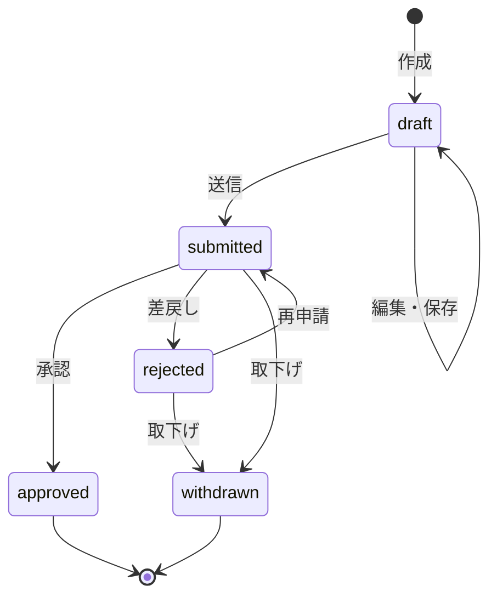

### プロジェクト状態遷移

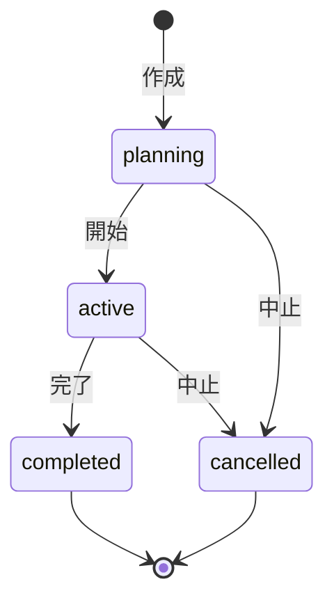

### タスク状態遷移

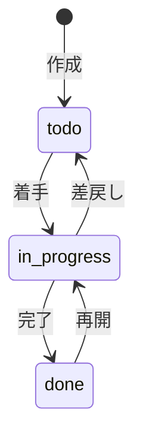

### 請求書ステータス遷移

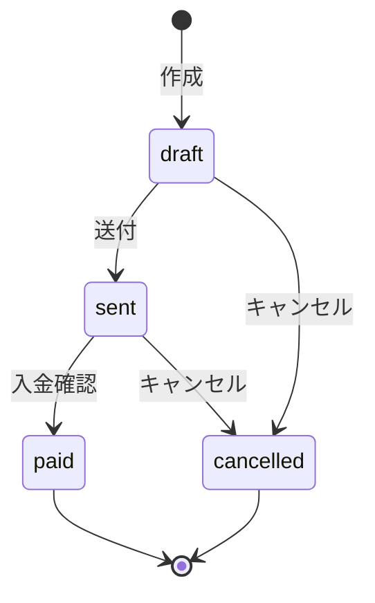

### ユーザーステータス遷移

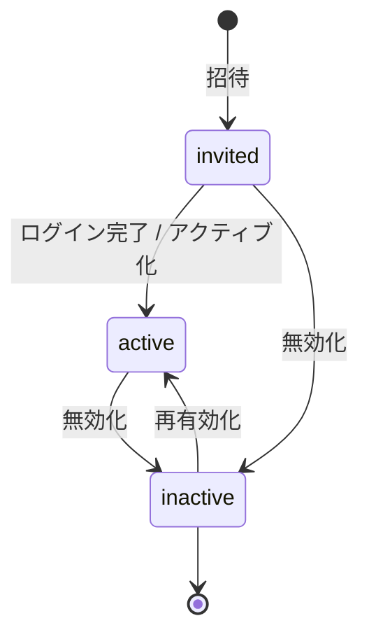

---

## 主要シーケンス図

以下では、Angular Component、Angular Service (HttpClient)、NestJS Controller、NestJS Service、PrismaService、Database 間の処理フローを示します。

> [!NOTE]
> - 監査ログの記録は NestJS の `AuditInterceptor` を用いてコントローラー・サービスを跨いで自動化されます
> - 通知の作成は NestJS Service レイヤー内で同期的に呼び出されます

### シーケンス: ワークフロー申請→承認フロー (最重要)

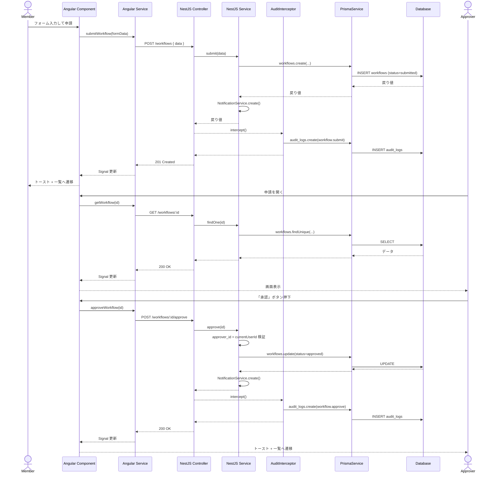

### シーケンス: プロジェクト作成→メンバーアサイン

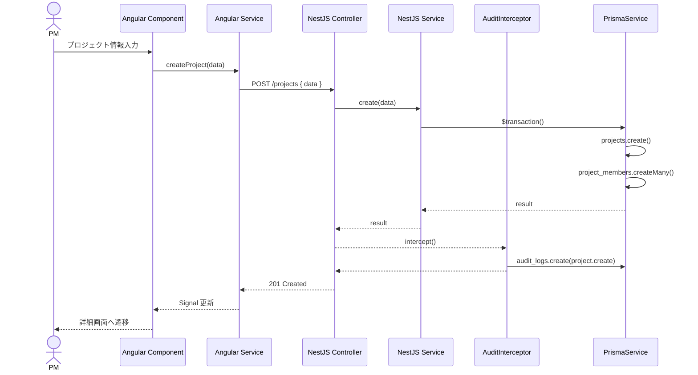

### シーケンス: 工数入力→週次保存

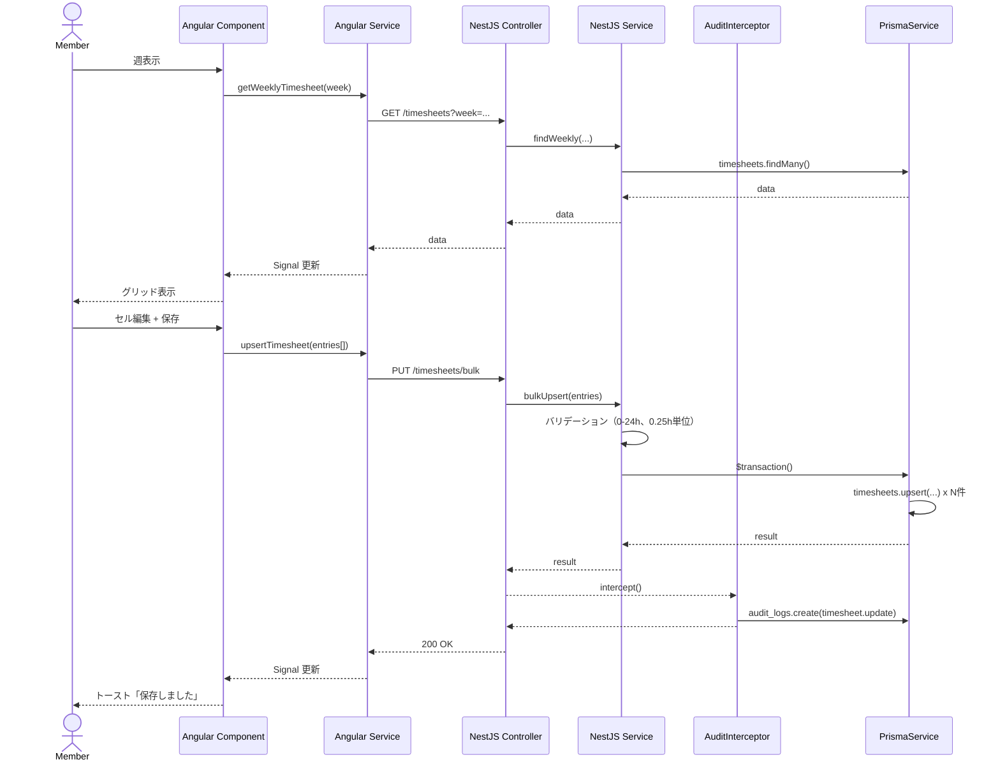

### シーケンス: 経費申請→ワークフロー連携

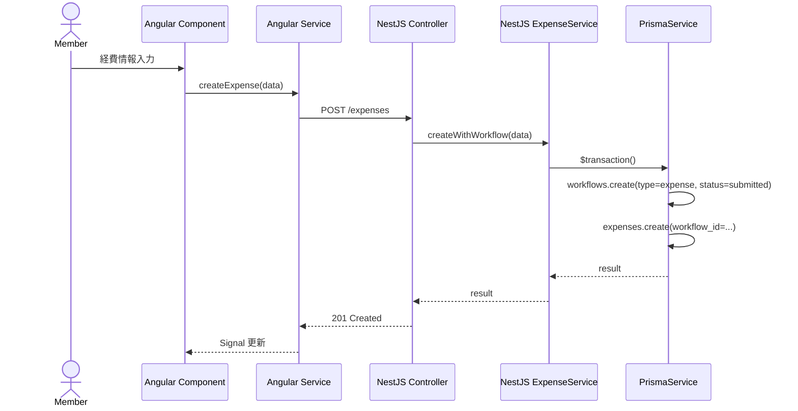

### シーケンス: 請求書作成→ステータス遷移

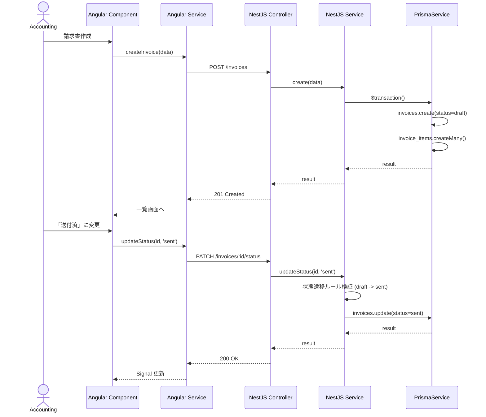

### シーケンス: ファイルアップロード

Multer を用いたファイルアップロードと Database, Object Storage への保存フローです。

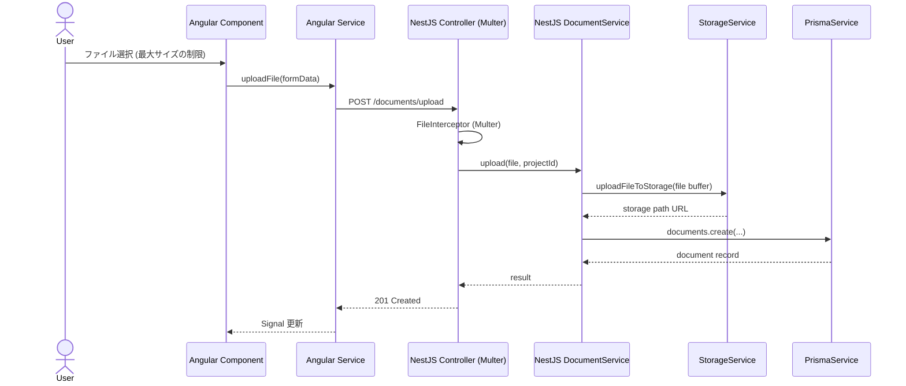

### シーケンス: 全文検索

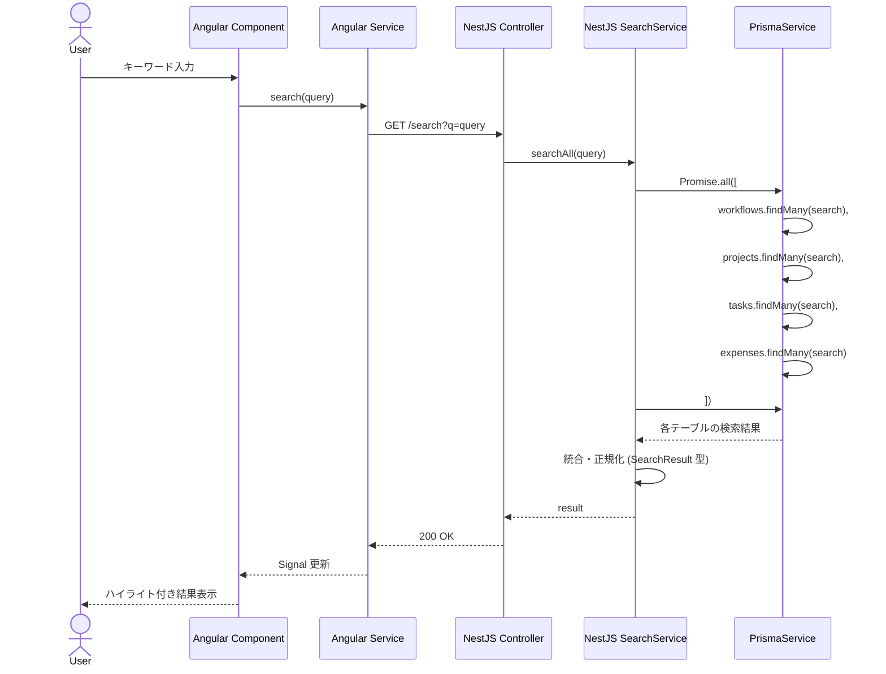

---

## 状態遷移定数の配置ルール

すべての状態遷移ルールに関する定数定義は、フロントエンド (Angular) とバックエンド (NestJS) 間で型を共有できるよう共有ライブラリ内に定義します。

**配置先**: `libs/shared/types/src/lib/constants/transitions.ts`

```typescript
// libs/shared/types/src/lib/constants/transitions.ts
export const WORKFLOW_TRANSITIONS = {
  draft: ['submitted'],
  submitted: ['approved', 'rejected', 'withdrawn'],
  rejected: ['submitted', 'withdrawn'],
  approved: [],
  withdrawn: [],
} as const;

export const TASK_TRANSITIONS = {
  todo: ['in_progress'],
  in_progress: ['todo', 'done'],
  done: ['in_progress'],
} as const;

// ...その他 PROJECT_TRANSITIONS, INVOICE_STATUS_TRANSITIONS 等
```

この定数を、Angularのバリデーション・UI表示と、NestJS Serviceのビジネスロジック内での状態遷移チェックにおいて共有して使用します。
