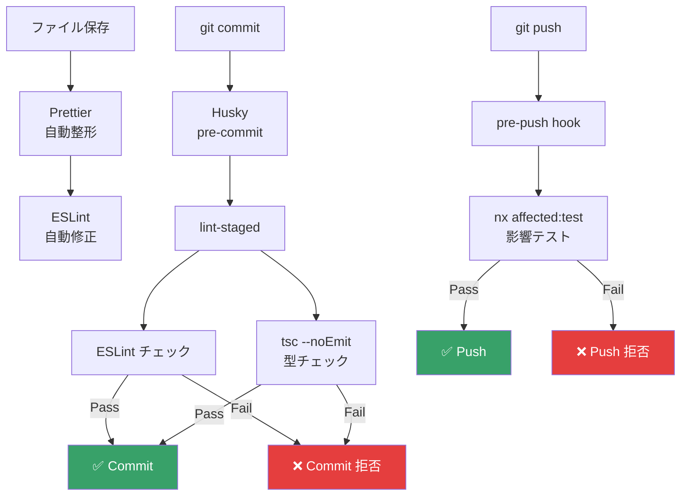
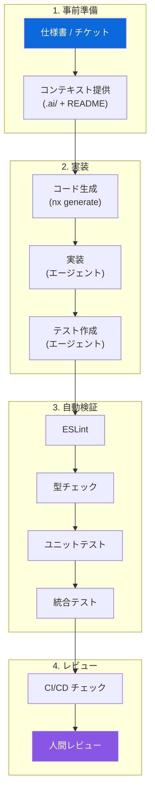

## 概要

**エージェントファースト開発**とは、AI コーディングエージェント（Claude, Gemini, GitHub Copilot 等）が**効率的かつ安全に**コードを生成・修正できるようにプロジェクトを設計する開発手法です。

### なぜエージェントファーストか

OpsHub プロジェクトで得た教訓：

| 課題 | 原因 | 対策 |
|---|---|---|
| エージェントが間違ったファイルを編集 | ディレクトリ構造が不明瞭 | 厳格な命名規約 |
| 生成コードが型エラー | コンテキスト不足 | 明示的な型定義と共有ライブラリ |
| テスト作成を省略 | テスト規約が不明確 | テストファーストの規約 |
| PR レビューの質が低下 | 変更範囲が大きすぎ | Nx affected + 小さな PR |
| 既存コードとの不整合 | パターンの一貫性不足 | コードジェネレータ |

## プロジェクト構造設計

### エージェントが理解しやすい構造

```
apps/api/src/modules/
├── projects/                    # ← 機能名がディレクトリ名
│   ├── projects.controller.ts   # ← 機能名 + レイヤー名
│   ├── projects.service.ts
│   ├── projects.module.ts
│   ├── projects.controller.spec.ts
│   ├── projects.service.spec.ts
│   ├── dto/
│   │   ├── create-project.dto.ts
│   │   └── update-project.dto.ts
│   └── README.md                # ← モジュールの説明
```

**ルール:**
1. **1ディレクトリ = 1機能**: 関連ファイルは同じディレクトリに配置
2. **ファイル名 = 内容**: `projects.service.ts` → ProjectsService
3. **テストは隣接**: `*.spec.ts` は対象ファイルと同じディレクトリ
4. **README.md**: 各モジュールに概要・API・依存関係を記載

### コンテキストウィンドウ対策

AI エージェントのコンテキストウィンドウは有限です。以下の設計で効率を最大化：

```
libs/shared/types/src/lib/dto/
├── user.dto.ts          # 50行以内
├── project.dto.ts       # 50行以内
└── expense.dto.ts       # 50行以内
```

| 設計原則 | 効果 |
|---|---|
| **1ファイル ≤ 300行** | エージェントが全体を把握可能 |
| **1関数 ≤ 30行** | 単一責任が明確 |
| **明示的な import** | バレルファイル経由で依存が明確 |
| **JSDoc コメント** | パラメータ・戻り値・例外を明記 |

## 命名規約

### ファイル命名

| レイヤー | パターン | 例 |
|---|---|---|
| Controller | `{feature}.controller.ts` | `projects.controller.ts` |
| Service | `{feature}.service.ts` | `projects.service.ts` |
| Module | `{feature}.module.ts` | `projects.module.ts` |
| DTO | `{action}-{feature}.dto.ts` | `create-project.dto.ts` |
| Guard | `{name}.guard.ts` | `auth.guard.ts` |
| Interceptor | `{name}.interceptor.ts` | `logging.interceptor.ts` |
| Pipe | `{name}.pipe.ts` | `parse-uuid.pipe.ts` |
| Component | `{feature}-{type}.component.ts` | `project-list.component.ts` |
| Directive | `{name}.directive.ts` | `auto-focus.directive.ts` |
| Spec | `{target}.spec.ts` | `projects.service.spec.ts` |
| E2E | `{feature}.e2e.ts` | `projects.e2e.ts` |

### クラス / 関数命名

```typescript
// ✅ Good: 動詞 + 名詞で意図が明確
class ProjectsService {
  async findAll(): Promise<Project[]> {}
  async findById(id: string): Promise<Project> {}
  async create(dto: CreateProjectDto): Promise<Project> {}
  async update(id: string, dto: UpdateProjectDto): Promise<Project> {}
  async remove(id: string): Promise<void> {}
}

// ❌ Bad: 曖昧な名前
class ProjectManager {
  async getProjects(): Promise<any> {}
  async doProject(data: any): Promise<any> {}
}
```

## コメント・ドキュメント規約

### JSDoc テンプレート

```typescript
/**
 * プロジェクトを新規作成する。
 *
 * @param dto - プロジェクト作成データ
 * @returns 作成されたプロジェクト
 * @throws {ConflictException} プロジェクトコードが重複する場合
 * @throws {ForbiddenException} ADMIN または MANAGER 権限がない場合
 *
 * @example
 * ```typescript
 * const project = await service.create({
 *   name: 'New Project',
 *   code: 'PRJ-001',
 * });
 * ```
 */
async create(dto: CreateProjectDto): Promise<Project> {
  // ...
}
```

### モジュール README テンプレート

```markdown
# Projects Module

## 概要
プロジェクトの CRUD 操作を提供するモジュール。

## API

| メソッド | エンドポイント | 説明 |
|---|---|---|
| GET | /api/projects | プロジェクト一覧取得 |
| GET | /api/projects/:id | プロジェクト詳細取得 |
| POST | /api/projects | プロジェクト作成 |
| PUT | /api/projects/:id | プロジェクト更新 |
| DELETE | /api/projects/:id | プロジェクト削除 |

## 依存関係
- `PrismaService` - データベースアクセス
- `@myapp/shared/types` - DTO 型定義

## テスト
- `projects.service.spec.ts` - ユニットテスト
- `projects.integration.spec.ts` - 統合テスト
```

## 自動検証パイプライン

### プリコミット検証



### エージェント向けプロンプトファイル

プロジェクトルートに `.ai/` ディレクトリを配置し、エージェントへのコンテキストを提供：

```
.ai/
├── project-context.md      # プロジェクト概要・技術スタック
├── coding-standards.md     # コーディング規約
├── architecture.md         # アーキテクチャ概要
├── testing-rules.md        # テスト作成ルール
└── prompts/
    ├── new-feature.md      # 新機能作成プロンプト
    ├── bug-fix.md          # バグ修正プロンプト
    └── add-test.md         # テスト追加プロンプト
```

### プロンプトファイル例

```markdown
<!-- .ai/testing-rules.md -->
# テスト作成ルール

## 必須チェックリスト
- [ ] 全 public メソッドにユニットテスト
- [ ] 正常系 + 最低 2 つの異常系
- [ ] モック対象は PrismaService のみ (統合テストでは実DB)
- [ ] data-testid 属性を UI 要素に付与
- [ ] テスト名は日本語で「〜すること」形式

## パターン
- Service テスト → `describe('{ServiceName}') > describe('{method}') > it('should ...')`
- Controller テスト → supertest で HTTP テスト
- Component テスト → TestBed + fixture.detectChanges()
```

## コードジェネレータ活用

```bash
# エージェントが使いやすいジェネレータ
nx g @nx/nest:resource --name=expenses --project=api
# → controller, service, module, dto, spec を一括生成

nx g @nx/angular:component --name=expense-list --project=web --standalone
# → component, spec, template, styles を一括生成
```

## エージェント開発フロー


