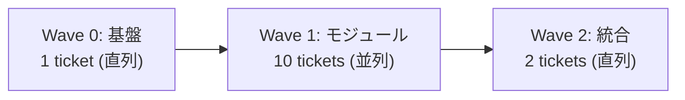

## 全体構成



---

## Wave 0: Nx ワークスペース + 共有基盤（直列・1エージェント）

**この Wave が完了するまで Wave 1 は開始不可。**

### TI-0: Nx スキャフォルド + Auth + AppShell

| 項目 | 内容 |
|---|---|
| 成果物 | 動作する Nx monorepo (Angular + NestJS + Prisma + Auth + AppShell) |
| 依存 | なし |
| 参照ドキュメント | 全 Wave 0 docs + `detail/modules/auth.md` |

#### ステップ

1. `npx create-nx-workspace opshub --preset=apps --pm=npm`
2. Angular app: `nx g @nx/angular:app web`
3. NestJS app: `nx g @nx/nest:app api`
4. 共有ライブラリ: `nx g @nx/js:lib shared/types`, `shared/util`, `prisma-db`
5. Prisma セットアップ: schema.prisma + PrismaService + Middleware
6. 共有型/定数/ユーティリティ (detail/shared-types.md の全内容)
7. NestJS common/ (Guards, Interceptors, Decorators, Filters, main.ts)
8. Auth Module (NestJS Passport + Angular AuthService + Login画面)
9. Angular AppShell (サイドバー + ヘッダー + routing)
10. seed data 投入 + 動作確認

#### 完了条件

- [ ] `nx serve api` で NestJS 起動、`POST /api/auth/login` が JWT を返す
- [ ] `nx serve web` で Angular 起動、ログイン画面 → Dashboard 遷移
- [ ] `nx test api` / `nx test web` が pass（Auth テストのみ）
- [ ] Prisma migrate + seed が成功

---

## Wave 1: ドメインモジュール（並列・最大6エージェント）

Wave 0 完了後、以下のチケットを並列で配信可能。

> [!IMPORTANT] 各チケットの共通ルール
> - NestJS Module + Angular Feature + テスト を **1チケットで全て実装**
> - テストは `testing/module-test-patterns.md` のパターンに準拠
> - エラーは `spec/error-handling.md` のコード体系に準拠
> - 監査ログは AuditInterceptor が自動記録（追加コード不要）

### TI-1: ワークフローモジュール

| 項目 | 内容 |
|---|---|
| NestJS | `modules/workflows/` — Controller, Service, DTOs |
| Angular | `features/workflows/` — list, detail, new, pending |
| Prisma | `Workflow`, `WorkflowAttachment` |
| テスト | Service (状態遷移テスト必須) + Controller + Angular |
| 参照 | `detail/modules/workflow.md`, `spec/apis.md` §API-B01~B03, `spec/screens.md` §SCR-B01~B03 |

### TI-2: プロジェクト+タスクモジュール

| 項目 | 内容 |
|---|---|
| NestJS | `modules/projects/` — ProjectController, TaskController, Services |
| Angular | `features/projects/` — list, detail, new, kanban board |
| Prisma | `Project`, `ProjectMember`, `Task` |
| テスト | Service (メンバー管理テスト) + Controller + Angular (カンバンD&D) |
| 参照 | `detail/modules/project.md`, `spec/apis.md` §API-C01~C02, `spec/screens.md` §SCR-C01~C02 |

### TI-3: 工数モジュール

| 項目 | 内容 |
|---|---|
| NestJS | `modules/timesheets/` — Controller, Service, CSV export |
| Angular | `features/timesheets/` — weekly grid, report |
| Prisma | `Timesheet` |
| テスト | Service (0.25刻みバリデーション, 24h上限) + Controller + Angular |
| 参照 | `detail/modules/timesheet.md`, `spec/apis.md` §API-C03, `spec/screens.md` §SCR-C03 |

### TI-4: 経費モジュール

| 項目 | 内容 |
|---|---|
| NestJS | `modules/expenses/` — Controller, SummaryController, Services |
| Angular | `features/expenses/` — list, form, summary |
| Prisma | `Expense` |
| テスト | Service (カテゴリ集計) + Controller + Angular |
| 参照 | `detail/modules/expense.md`, `spec/apis.md` §API-D01~D02, `spec/screens.md` §SCR-D01 |

### TI-5: 通知モジュール

| 項目 | 内容 |
|---|---|
| NestJS | `modules/notifications/` — Controller, Service |
| Angular | `shared/notification-bell/` — NotificationBellComponent |
| Prisma | `Notification` |
| テスト | Service (create, markAsRead, markAllAsRead) + Angular (ポーリング) |
| 参照 | `detail/modules/notification.md`, `spec/apis.md` §API-E01 |
| 備考 | 他モジュールから `NotificationService.create()` が呼ばれる（interface だけ先に確定） |

### TI-6: 管理モジュール

| 項目 | 内容 |
|---|---|
| NestJS | `modules/admin/` — TenantsController, UsersController, AuditLogsController |
| Angular | `features/admin/` — tenant, users, audit-logs |
| Prisma | `Tenant`, `UserRole`, `Profile`, `AuditLog` |
| テスト | Service (招待, ロール変更, ステータス変更) + Controller + Angular |
| 参照 | `detail/modules/admin.md`, `spec/apis.md` §API-A01~A02, `spec/screens.md` §SCR-A01~A03 |

### TI-7: 請求書モジュール

| 項目 | 内容 |
|---|---|
| NestJS | `modules/invoices/` — Controller, Service |
| Angular | `features/invoices/` — list, form, detail, print |
| Prisma | `Invoice`, `InvoiceItem` |
| テスト | Service (状態遷移, 採番) + Controller + Angular |
| 参照 | `detail/modules/invoice.md`, `spec/apis.md` §API-H01, `spec/screens.md` §SCR-H01~H02 |

### TI-8: ドキュメント管理モジュール

| 項目 | 内容 |
|---|---|
| NestJS | `modules/documents/` — Controller (multer), Service |
| Angular | `features/projects/documents/` — document-list |
| Prisma | `Document` |
| テスト | Service (MIME検証, ファイルサイズ上限) + Controller + Angular |
| 参照 | `detail/modules/document.md`, `spec/apis.md` §API-F01, `spec/screens.md` §SCR-F01 |

### TI-9: 検索モジュール

| 項目 | 内容 |
|---|---|
| NestJS | `modules/search/` — Controller, Service |
| Angular | `features/search/` — results, header-search |
| Prisma | 横断読取 (Workflow, Project, Task, Expense) |
| テスト | Service (並行検索, エスケープ) + Angular (highlight pipe) |
| 参照 | `detail/modules/search.md`, `spec/apis.md` §API-G01, `spec/screens.md` §SCR-G02 |
| 備考 | ⚠️ 他モジュールのテーブルに依存。TI-1,2,4 と同時 or 後に開始推奨 |

### TI-10: 運用基盤モジュール

| 項目 | 内容 |
|---|---|
| NestJS | `modules/health/` — HealthController (@nestjs/terminus) |
| テスト | Controller (DB接続確認) |
| 参照 | `detail/modules/operations.md` |
| 備考 | 最小チケット。他と並列で実行可能 |

---

## Wave 2: 統合（直列・1-2エージェント）

### TI-11: ダッシュボードモジュール

| 項目 | 内容 |
|---|---|
| NestJS | `modules/dashboard/` — Controller, Service (集約) |
| Angular | `features/dashboard/` — dashboard, kpi-card |
| 依存 | **Wave 1 の全モジュール Service** を inject |
| テスト | Service (Promise.all 並行取得) + Angular (ロール別 KPI 表示) |
| 参照 | `detail/modules/dashboard.md` |

### TI-12: E2E テスト + 最終統合

| 項目 | 内容 |
|---|---|
| E2E | Playwright で全画面 Smoke テスト (ログイン → CRUD → ログアウト) |
| ルーティング | `app.routes.ts` の lazy loading 最終確認 |
| ビルド | `nx build api` + `nx build web` で本番ビルド成功確認 |

---

## 並列実行マップ

```
Wave 0 (直列):  TI-0
                  │
Wave 1 (並列):  TI-1  TI-2  TI-3  TI-4  TI-5  TI-6  TI-7  TI-8  TI-10
                  │                  │
                  │     TI-9 (検索: TI-1,2,4 に軽依存)
                  │
Wave 2 (直列):  TI-11 (ダッシュボード) → TI-12 (E2E)
```

## 各エージェントへの参照ドキュメント一覧

| # | ドキュメント | 全チケット共通 |
|---|---|---|
| 1 | `detail/shared-types.md` | ✅ |
| 2 | `detail/common-infrastructure.md` | ✅ |
| 3 | `detail/angular-core.md` | ✅ |
| 4 | `detail/prisma-setup.md` | ✅ |
| 5 | `spec/error-handling.md` | ✅ |
| 6 | `spec/audit-logging.md` | ✅ |
| 7 | `testing/module-test-patterns.md` | ✅ |
| 8 | `detail/modules/{module}.md` | チケット固有 |
| 9 | `spec/apis.md` 該当セクション | チケット固有 |
| 10 | `spec/screens.md` 該当セクション | チケット固有 |
| 11 | `detail/db.md` 該当モデル | チケット固有 |
| 12 | `detail/guard-design.md` 該当行 | チケット固有 |
