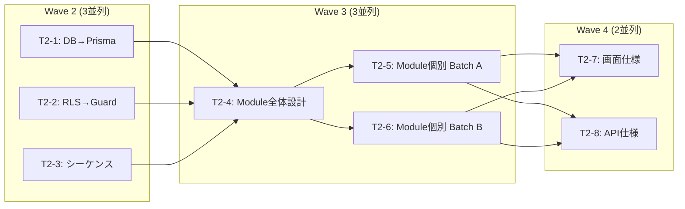

# Phase 2: ドメインモジュール設計移行

> PM: Antigravity (Gemini 3.1 Pro)  
> 更新: 2026-02-25 23:00 JST

## 背景

Phase 1 (要件・アーキテクチャ移行) が完了。
Phase 2 では OpsHub の詳細設計ドキュメント（DB設計、RLS設計、モジュール設計、画面仕様、API仕様）を
Nx + Angular + NestJS アーキテクチャ向けに移行する。

## Wave 構成と依存関係



---

## チケット統合表

元の29チケットを **8チケット** に統合（エージェントの効率的なバッチ処理向け）:

| ID | チケット | 元チケット | 並列可 | 参照元 |
|---|---|---|---|---|
| **T2-1** | DB設計 → Prisma Schema | T2-1 | ✅ W2 | `detail/db/` |
| **T2-2** | RLS → Guard + Middleware | T2-2 | ✅ W2 | `detail/rls/` |
| **T2-3** | 状態遷移 / シーケンス | T2-3 | ✅ W2 | `detail/sequences/` |
| **T2-4** | モジュール全体設計 | T2-4 | W3 (W2完了後) | `detail/modules/` |
| **T2-5** | Module個別 Batch A (6件) | T2-5~10 | ✅ W3 | — |
| **T2-6** | Module個別 Batch B (6件) | T2-11~15 + Auth | ✅ W3 | — |
| **T2-7** | 画面仕様一括 | T2-16~23 | W4 (W3完了後) | `spec/screens/` |
| **T2-8** | API仕様一括 | T2-24~29 | ✅ W4 | `spec/apis/` |

---

## Wave 2: データ設計（3並列）

> **前提**: Phase 1 完了済み。Wave 2 は全チケット並列実行可能。

### T2-1: DB設計 → Prisma Schema
- **入力**: `opsHub-doc/src/content/docs/detail/db/index.md`（15テーブル）
- **出力**: `nx-angular-nestjs-doc/src/content/docs/detail/db.md`
- **作業**:
  - 15テーブルを Prisma model 記法に変換
  - `auth.users` → `User` model（自前管理）
  - `gen_random_uuid()` → `@default(uuid())`
  - `timestamptz` → `DateTime`
  - RPC関数 → NestJS Service メソッド
  - ER図を Prisma リレーションで再構成

### T2-2: RLS → Guard + Middleware
- **入力**: `opsHub-doc/src/content/docs/detail/rls/index.md`
- **出力**: `nx-angular-nestjs-doc/src/content/docs/detail/guard-design.md`
- **作業**:
  - RLSポリシー → NestJS Guard + Prisma Middleware マッピング
  - テナント分離のMiddleware設計
  - 監査ログ INSERT ONLY → Prisma Middleware

### T2-3: 状態遷移 / シーケンス
- **入力**: `opsHub-doc/src/content/docs/detail/sequences/index.md`
- **出力**: `nx-angular-nestjs-doc/src/content/docs/detail/sequences.md`
- **作業**:
  - Server Actions フロー → Controller → Service → Prisma シーケンスに変換
  - WF/Task/Project/Invoice の状態遷移図を維持
  - Mermaid sequenceDiagram を NestJS レイヤーに更新

## Wave 3: モジュール設計（3並列、W2完了後）

### T2-4: モジュール全体設計
- **入力**: `opsHub-doc/src/content/docs/detail/modules/index.md`（576行）
- **出力**: `nx-angular-nestjs-doc/src/content/docs/detail/modules.md`
- **作業**:
  - Next.js App Router構造 → Nx apps/libs 構造
  - SC/CC パターン → Angular Component + NestJS Controller/Service
  - 共通ユーティリティ (withAuth, writeAuditLog 等) → NestJS 相当物

### T2-5: Module 個別 Batch A (MOD-001~006)
- **出力**: `detail/modules/` 配下に個別ファイル
- 対象: Workflow, Project, Timesheet, Expense, Notification, Dashboard
- **作業**: 各モジュールの NestJS 構成（Controller, Service, DTO, Guard）と Angular Feature 構成

### T2-6: Module 個別 Batch B (MOD-007~011 + Auth)
- **出力**: `detail/modules/` 配下に個別ファイル
- 対象: Admin, Invoice, Document, Search, Operations, Auth（新規）
- **作業**: 同上

## Wave 4: 画面仕様・API仕様（2並列、W3完了後）

### T2-7: 画面仕様一括
- **入力**: `spec/screens/SCR-*.md`（22ファイル）
- **出力**: `spec/screens/` 配下に移行版
- **作業**: SC/CC → Angular Component、Ant Design → Angular Material

### T2-8: API仕様一括
- **入力**: `spec/apis/API-*.md`（16ファイル）
- **出力**: `spec/apis/` 配下に移行版
- **作業**: Server Actions → REST Controller、withAuth → Guards

---

## プロンプト配信順序

```
時刻    プロンプト配信         エージェント
─────────────────────────────────────────
t+0     T2-1, T2-2, T2-3      Agent A, B, C (並列)
t+done  T2-4, T2-5, T2-6      Agent A, B, C (並列 ※)
t+done  T2-7, T2-8             Agent A, B (並列)
```

> **※ Wave 3 の並列実行について**: 理想的には T2-4 → T2-5/T2-6 の順序だが、
> 各プロンプトに元ドキュメント (`opsHub-doc`) への直接参照を記載済みのため並列可。
> 出力後に PM が用語・構成の整合性を最終レビューする。

## 成功基準

- [ ] `npx astro build` で全ページビルド成功
- [ ] 全 Mermaid 図が正常にレンダリング
- [ ] サイドバーリンクが全て有効
