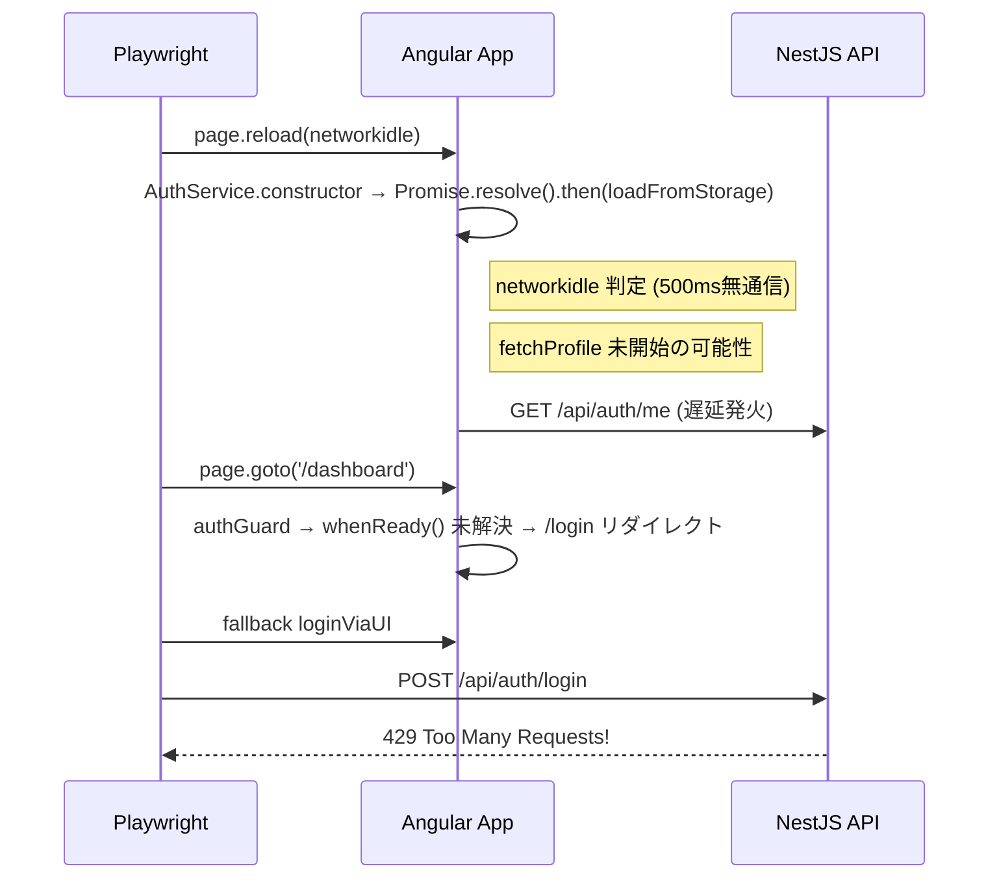

## セッション概要

2026-03-01 に 7 つの調査・改善チケットを並列で実行し、テスト基盤の安定化・ドキュメント整合性監査・インフラ改善を実施した。

## タイムライン

| 時刻 | アクション |
|------|-----------|
| 15:17 | ポート 3000 EADDRINUSE 解消、Redis / MailHog 起動 |
| 15:26 | テスト結果: 22 passed / 6 flaky → 調査チケット発行依頼 |
| 15:30 | 7 チケット作成・`.agent/prompts/` に配置 |
| ~18:55 | 7 エージェント並列作業完了 |
| 19:26 | 統合テスト: API 269, Web 195, E2E 28/28 **PASS (29.9s)** |

---

## チケット結果サマリ

| チケット | タイトル | 結果 | 主な成果物 |
|---------|---------|------|-----------|
| TI-E2E-01 | Flaky 根本原因調査 | ✅ | 2段階障害チェーン特定: ① `_readyPromise` 競合 → ② ThrottlerException 429 |
| TI-E2E-02 | restoreSession 改修 | ✅ | `authenticatedPage` fixture, `addInitScript`, 28/28 × 3回連続 PASS |
| TI-E2E-03 | AuthService レビュー | ✅ | `fetchProfile` timeout 追加, `APP_INITIALIZER` 登録, +4 テスト |
| TI-DOC-01 | API 整合性監査 | ✅ | 4件修正 (DTO新規, ロール拡大, Swagger desc, admin/users) |
| TI-DOC-02 | ルーティング整合性 | ✅ | 8件修正 (roleGuard UX, timesheets ガード, 18子ルート title) |
| TI-INFRA-01 | BullMQ レジリエンス | ✅ | `maxRetriesPerRequest`, forgotPassword try/catch, Redis healthcheck |
| TI-INFRA-02 | Playwright 基盤改善 | ✅ | 3.2分→29.9秒, workers: 2, `THROTTLE_SKIP` env、CI 更新 |

---

## TI-E2E-01: Flaky テスト根本原因

### 2段階障害チェーン



- **トリガー**: `loadFromStorage()` の `Promise.resolve().then()` 遅延で `networkidle` が `fetchProfile` 前に判定
- **直接原因**: 1秒あたり 4+ 回の API リクエスト → `ThrottlerException: 429`
- **Retry 成功理由**: レートリミットウィンドウ (1秒) が経過

## TI-E2E-02: fixture ベースの改修

```typescript
// e2e/fixtures.ts — addInitScript で全ナビゲーションに自動適用
export const test = base.extend<{ authenticatedPage: Page }>({
    authenticatedPage: async ({ page }, use) => {
        await page.addInitScript(RESTORE_SESSION_SCRIPT);
        await page.goto('/dashboard', { waitUntil: 'domcontentloaded' });
        await page.waitForSelector('[data-testid="app-sidebar"]', { timeout: 15_000 });
        await use(page);
    },
});
```

## TI-E2E-03: AuthService 堅牢化

- `fetchProfile()` に `timeout(10_000)` — HTTP ハング防止
- `APP_INITIALIZER` に `whenReady()` — Angular ブート = 認証完了保証
- テスト +4: whenReady 即 resolve、fetchProfile 成功/失敗、initializing 中 logout 抑制

## TI-DOC-01: API 整合性監査

15 コントローラ・33 DTO をスキャン:

| 修正 | 内容 |
|------|------|
| `UpdateUserStatusDto` | バリデーション欠如を修正 |
| Timesheets サイドバー | `accounting`, `tenant_admin` ロール追加 |
| Swagger Description | `main.ts` に API 説明追記 |
| `admin/users` + `it_admin` | API は `tenant_admin` のみ（意図的） |

## TI-DOC-02: ルーティング・ロール整合性

8 件修正:
- `roleGuard` に Toast 通知 + `/dashboard` リダイレクト
- `/timesheets` に `roleGuard` 追加 (`member`, `pm`, `accounting`, `tenant_admin`)
- 18 子ルートに `data.title` 追加

## TI-INFRA-01: BullMQ レジリエンス

- `BullModule.forRoot()` に `maxRetriesPerRequest`, `enableReadyCheck`, `retryStrategy`
- `forgotPassword` の try/catch — Redis ダウン時にサイレント成功
- Redis healthcheck + `RedisHealthIndicator`

## TI-INFRA-02: テスト基盤改善

| 指標 | Before | After |
|------|--------|-------|
| 実行時間 | 3.2 分 | **29.9 秒** |
| Workers | 1 | 2 |
| Retries | 1 | 0 |
| Flaky | 6 | 0 |
| `restoreSession()` 呼び出し | 16 | 0 (fixture) |
| `networkidle` 待機 | 22 | 0 |

---

## 意思決定

- Flaky 対策として `authenticatedPage` fixture + `addInitScript` を採用（候補 C）
- `APP_INITIALIZER` で `whenReady()` を待機 → アプリ側の根本修正
- テスト環境で `THROTTLE_SKIP=true` → レート制限無効化
- `admin/users` API は `tenant_admin` のみ、`it_admin` には開放しない方針
- Redis ダウン時は `forgotPassword` がサイレント成功（セキュリティ考慮）
