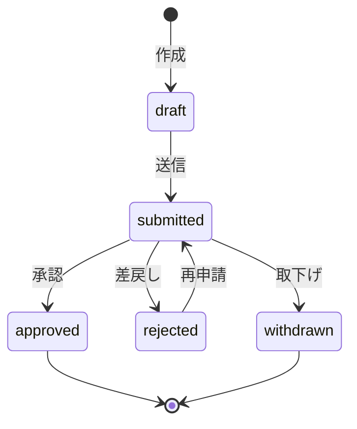

## 概要

本ドキュメントは OpsHub の全 REST API を NestJS Controller ベースで定義する。

### 共通仕様

#### 認証・認可

```typescript
// 全 Controller 共通
@Controller('api/xxx')
@UseGuards(JwtAuthGuard, RolesGuard)
export class XxxController { ... }
```

| 旧 (Server Actions) | 新 (NestJS REST) |
|---|---|
| `withAuth()` ラッパー | `@UseGuards(JwtAuthGuard, RolesGuard)` |
| `requireRole(tenantId, roles)` | `@Roles('pm', 'tenant_admin')` |
| `ActionResult<T>` | HTTP Status + JSON Body |

#### レスポンス形式

```typescript
// 成功: 200/201 + JSON Body
{ "id": "uuid", "name": "...", "createdAt": "2026-..." }

// エラー: 400/401/403/404/409/500
{ "statusCode": 400, "message": "バリデーションエラー", "error": "Bad Request" }
```

#### ページネーション（GET 共通）

```
?page=1&limit=20
```

レスポンスヘッダ:
```
X-Total-Count: 150
X-Total-Pages: 8
```

#### エラーコード体系

```
ERR-{カテゴリ}-{番号}
```

| プレフィックス | カテゴリ |
|---|---|
| `ERR-AUTH` | 認証/認可 |
| `ERR-VAL` | バリデーション |
| `ERR-WF` | ワークフロー |
| `ERR-PJ` | プロジェクト/タスク |
| `ERR-EXP` | 経費 |
| `ERR-INV` | 請求 |
| `ERR-DOC` | ドキュメント |
| `ERR-SYS` | システム |

#### 共通エラーレスポンス

| HTTP | コード | 条件 |
|---|---|---|
| 400 | `ERR-VAL-xxx` | バリデーション失敗 |
| 401 | `ERR-AUTH-001` | 未認証 / トークン期限切れ |
| 403 | `ERR-AUTH-002` | ロール不足 |
| 404 | — | リソース不存在 |
| 409 | — | 楽観的ロック競合 |
| 500 | `ERR-SYS-001` | サーバーエラー |

---

## API-A01: テナント管理

**NestJS Controller**: `TenantsController`
**Module**: `TenantsModule`

### エンドポイント一覧

| Method | Path | 説明 | ロール | レスポンス |
|---|---|---|---|---|
| GET | `/api/tenants/me` | 自テナント情報取得 | tenant_admin, it_admin | 200: TenantDetail |
| PUT | `/api/tenants/me` | テナント情報更新 | tenant_admin, it_admin | 200: TenantDetail |
| PATCH | `/api/tenants/me/settings` | テナント設定変更 | tenant_admin, it_admin | 200: TenantSettings |
| POST | `/api/tenants/me/export` | データエクスポート | tenant_admin, it_admin | 202: ExportJob |
| DELETE | `/api/tenants/:id` | テナント削除 | it_admin | 204 |

### リクエスト DTO

```typescript
class UpdateTenantDto {
  @IsOptional()
  @IsString()
  @MaxLength(100)
  name?: string;

  @IsOptional()
  @IsString()
  logoUrl?: string;

  @IsOptional()
  @IsEmail()
  contactEmail?: string;

  @IsOptional()
  @IsString()
  address?: string;
}

class UpdateTenantSettingsDto {
  @IsOptional()
  @IsString()
  defaultApprovalRoute?: string;

  @IsOptional()
  @IsBoolean()
  notificationEmail?: boolean;

  @IsOptional()
  @IsBoolean()
  notificationInApp?: boolean;

  @IsOptional()
  @IsString()
  timezone?: string;

  @IsOptional()
  @IsInt()
  @Min(1)
  @Max(12)
  fiscalYearStart?: number;
}

class ExportTenantDto {
  @IsIn(['json', 'csv'])
  format: 'json' | 'csv';

  @IsArray()
  @IsIn(['users', 'projects', 'workflows', 'timesheets', 'expenses'], { each: true })
  include: string[];
}

class DeleteTenantDto {
  @IsNotEmpty()
  @IsString()
  confirmation: string;
}
```

### レスポンス例

```json
{
  "id": "uuid",
  "name": "株式会社サンプル",
  "slug": "sample-corp",
  "settings": {
    "defaultApprovalRoute": null,
    "notificationEmail": true,
    "notificationInApp": true,
    "timezone": "Asia/Tokyo",
    "fiscalYearStart": 4
  },
  "stats": {
    "activeUsers": 15,
    "maxUsers": 50,
    "projectCount": 8,
    "monthlyWorkflows": 42,
    "storageUsedBytes": 1073741824,
    "storageMaxBytes": 10737418240
  },
  "createdAt": "2026-01-01T00:00:00Z",
  "updatedAt": "2026-02-20T10:30:00Z"
}
```

### エラーコード

| HTTP | コード | 条件 |
|---|---|---|
| 400 | `ERR-VAL-001` | name が空 / 100文字超過 |
| 400 | `ERR-VAL-002` | contact_email 形式不正 |
| 400 | `ERR-VAL-003` | timezone 不正 / fiscal_year_start 範囲外 |
| 400 | `ERR-VAL-004` | confirmation 不一致 |
| 403 | `ERR-AUTH-002` | 権限不足 |
| 409 | `ERR-INV-010` | 未決済の請求がある（削除時） |

### 監査ログ

| 操作 | action | resourceType |
|---|---|---|
| テナント情報更新 | `tenant.update` | `tenant` |
| テナント設定変更 | `tenant.settings_change` | `tenant` |
| データエクスポート | `tenant.export` | `tenant` |
| テナント削除 | `tenant.delete` | `tenant` |

---

## API-A02: ユーザー招待/管理

**NestJS Controller**: `UsersController`
**Module**: `UsersModule`

### エンドポイント一覧

| Method | Path | 説明 | ロール | レスポンス |
|---|---|---|---|---|
| GET | `/api/users` | ユーザー一覧取得 | tenant_admin, it_admin | 200: User[] |
| POST | `/api/users/invite` | ユーザー招待 | tenant_admin, it_admin | 201: User |
| PUT | `/api/users/:id/roles` | ロール変更 | tenant_admin, it_admin | 200: User |
| PATCH | `/api/users/:id/status` | 無効化/再有効化 | tenant_admin, it_admin | 200: User |
| POST | `/api/users/:id/reset-password` | パスワードリセット | tenant_admin, it_admin | 204 |

### リクエスト DTO

```typescript
class GetUsersQueryDto {
  @IsOptional()
  @IsArray()
  role?: string[];

  @IsOptional()
  @IsIn(['active', 'invited', 'disabled'])
  status?: string;

  @IsOptional()
  @IsString()
  search?: string;

  @IsOptional()
  @IsIn(['name', 'last_sign_in_at'])
  sort?: string;

  @IsOptional()
  @Type(() => Number)
  @IsInt()
  @Min(1)
  page?: number = 1;

  @IsOptional()
  @Type(() => Number)
  @IsInt()
  @Min(1)
  @Max(100)
  limit?: number = 25;
}

class InviteUserDto {
  @IsNotEmpty()
  @IsEmail()
  email: string;

  @IsArray()
  @ArrayMinSize(1)
  @IsString({ each: true })
  roles: string[];
}

class ChangeRoleDto {
  @IsArray()
  @ArrayMinSize(1)
  @IsString({ each: true })
  roles: string[];
}

class ChangeUserStatusDto {
  @IsIn(['disable', 'enable'])
  action: 'disable' | 'enable';
}
```

### レスポンス例

```json
{
  "id": "uuid",
  "email": "user@example.com",
  "name": "田中太郎",
  "roles": ["pm", "approver"],
  "status": "active",
  "lastSignInAt": "2026-02-25T08:30:00Z",
  "createdAt": "2026-01-15T00:00:00Z"
}
```

### エラーコード

| HTTP | コード | 条件 |
|---|---|---|
| 400 | `ERR-VAL-001` | email 形式不正 |
| 400 | `ERR-VAL-002` | roles が空配列 |
| 400 | `ERR-VAL-003` | it_admin ロール付与不可（tenant_admin が実行） |
| 403 | `ERR-AUTH-002` | 権限不足 |
| 409 | `ERR-AUTH-003` | メールがテナント内で既存 |
| 409 | `ERR-AUTH-004` | 最後の Tenant Admin 削除/無効化 |
| 409 | `ERR-AUTH-005` | 自分自身のロール変更/無効化 |
| 409 | `ERR-AUTH-006` | メンバー上限到達 |

### 監査ログ

| 操作 | action | resourceType |
|---|---|---|
| ユーザー招待 | `user.invite` | `user` |
| ロール変更 | `user.role_change` | `user` |
| 無効化 | `user.deactivate` | `user` |
| 再有効化 | `user.reactivate` | `user` |
| パスワードリセット | `user.password_reset` | `user` |

---

## API-B01〜B03: ワークフロー（申請）管理

**NestJS Controller**: `WorkflowsController`
**Module**: `WorkflowsModule`

### エンドポイント一覧

| Method | Path | 説明 | ロール | レスポンス |
|---|---|---|---|---|
| GET | `/api/workflows` | 申請一覧取得 | 全ロール | 200: Workflow[] |
| GET | `/api/workflows/:id` | 申請詳細取得 | 全ロール | 200: Workflow |
| POST | `/api/workflows` | 申請作成 | member, pm, accounting | 201: Workflow |
| PUT | `/api/workflows/:id` | 申請更新 | 作成者のみ | 200: Workflow |
| POST | `/api/workflows/:id/approve` | 承認 | approver, tenant_admin | 200: Workflow |
| POST | `/api/workflows/:id/reject` | 差戻し | approver, tenant_admin | 200: Workflow |
| POST | `/api/workflows/:id/withdraw` | 取下げ | 作成者のみ | 200: Workflow |

### リクエスト DTO

```typescript
class GetWorkflowsQueryDto {
  @IsOptional()
  @IsIn(['draft', 'submitted', 'approved', 'rejected', 'withdrawn'])
  status?: string;

  @IsOptional()
  @IsIn(['expense', 'leave', 'purchase', 'other'])
  type?: string;

  @IsOptional()
  @IsIn(['mine', 'pending'])
  mode?: string;

  @IsOptional()
  @IsDateString()
  dateFrom?: string;

  @IsOptional()
  @IsDateString()
  dateTo?: string;

  @IsOptional()
  @Type(() => Number)
  @IsInt()
  @Min(1)
  page?: number = 1;

  @IsOptional()
  @Type(() => Number)
  @IsInt()
  @Min(1)
  @Max(100)
  limit?: number = 20;
}

class CreateWorkflowDto {
  @IsIn(['expense', 'leave', 'purchase', 'other'])
  type: string;

  @IsNotEmpty()
  @IsString()
  @MaxLength(100)
  title: string;

  @IsOptional()
  @IsString()
  @MaxLength(2000)
  description?: string;

  @IsOptional()
  @IsNumber()
  amount?: number;

  @IsOptional()
  @IsDateString()
  dateFrom?: string;

  @IsOptional()
  @IsDateString()
  dateTo?: string;

  @IsNotEmpty()
  @IsUUID()
  approverId: string;

  @IsIn(['draft', 'submit'])
  action: 'draft' | 'submit';
}

class RejectWorkflowDto {
  @IsNotEmpty()
  @IsString()
  reason: string;
}
```

### レスポンス例

```json
{
  "id": "uuid",
  "workflowNumber": "WF-2026-0042",
  "type": "expense",
  "title": "出張旅費申請",
  "status": "submitted",
  "createdBy": { "id": "uuid", "name": "田中太郎" },
  "approver": { "id": "uuid", "name": "鈴木花子" },
  "createdAt": "2026-02-20T09:00:00Z",
  "updatedAt": "2026-02-20T09:00:00Z"
}
```

### 状態遷移



### エラーコード

| HTTP | コード | 条件 |
|---|---|---|
| 400 | `ERR-VAL-001` | タイトル未入力 |
| 400 | `ERR-VAL-002` | 承認者未選択 |
| 400 | `ERR-VAL-003` | ファイルサイズ超過 |
| 400 | `ERR-WF-001` | 不正な状態遷移 |
| 400 | `ERR-WF-002` | 差戻し理由未入力 |
| 404 | `ERR-WF-003` | 申請が見つからない |

### 監査ログ

| 操作 | action | resourceType |
|---|---|---|
| 申請作成 | `workflow.create` | `workflow` |
| 申請送信 | `workflow.submit` | `workflow` |
| 承認 | `workflow.approve` | `workflow` |
| 差戻し | `workflow.reject` | `workflow` |
| 取下げ | `workflow.withdraw` | `workflow` |

---

## API-C01: プロジェクト CRUD

**NestJS Controller**: `ProjectsController`
**Module**: `ProjectsModule`

### エンドポイント一覧

| Method | Path | 説明 | ロール | レスポンス |
|---|---|---|---|---|
| GET | `/api/projects` | PJ一覧取得 | member, pm, tenant_admin | 200: Project[] |
| GET | `/api/projects/:id` | PJ詳細取得 | PJメンバー | 200: ProjectDetail |
| POST | `/api/projects` | PJ作成 | pm, tenant_admin | 201: ProjectDetail |
| PUT | `/api/projects/:id` | PJ更新 | PM(対象PJ), tenant_admin | 200: ProjectDetail |
| POST | `/api/projects/:id/members` | メンバー追加 | PM(対象PJ), tenant_admin | 201: Member |
| DELETE | `/api/projects/:id/members/:userId` | メンバー削除 | PM(対象PJ), tenant_admin | 204 |

### リクエスト DTO

```typescript
class GetProjectsQueryDto {
  @IsOptional()
  @IsIn(['planning', 'active', 'completed', 'cancelled'])
  status?: string;

  @IsOptional()
  @IsString()
  search?: string;

  @IsOptional()
  @Type(() => Number)
  @IsInt()
  @Min(1)
  page?: number = 1;

  @IsOptional()
  @Type(() => Number)
  @IsInt()
  @Min(1)
  @Max(100)
  limit?: number = 20;
}

class CreateProjectDto {
  @IsNotEmpty()
  @IsString()
  @MaxLength(100)
  name: string;

  @IsOptional()
  @IsString()
  description?: string;

  @IsOptional()
  @IsIn(['planning', 'active', 'completed', 'cancelled'])
  status?: string = 'planning';

  @IsOptional()
  @IsDateString()
  startDate?: string;

  @IsOptional()
  @IsDateString()
  endDate?: string;

  @IsNotEmpty()
  @IsUUID()
  pmId: string;
}

class UpdateProjectDto {
  @IsOptional()
  @IsString()
  @MaxLength(100)
  name?: string;

  @IsOptional()
  @IsString()
  description?: string;

  @IsOptional()
  @IsIn(['planning', 'active', 'completed', 'cancelled'])
  status?: string;

  @IsOptional()
  @IsDateString()
  startDate?: string;

  @IsOptional()
  @IsDateString()
  endDate?: string;

  @IsOptional()
  @IsUUID()
  pmId?: string;
}

class AddMemberDto {
  @IsNotEmpty()
  @IsUUID()
  userId: string;
}
```

### レスポンス例

```json
{
  "id": "uuid",
  "name": "ECサイトリニューアル",
  "description": "既存ECサイトの全面リニューアル",
  "status": "active",
  "pm": { "id": "uuid", "name": "田中太郎", "email": "tanaka@example.com" },
  "startDate": "2026-01-01",
  "endDate": "2026-06-30",
  "members": [
    { "id": "uuid", "name": "鈴木花子", "email": "suzuki@example.com", "joinedAt": "2026-01-01T00:00:00Z" }
  ],
  "taskStats": { "total": 24, "todo": 5, "inProgress": 8, "done": 11 },
  "timesheetStats": { "totalHours": 320.5, "thisMonthHours": 80.0 },
  "createdAt": "2026-01-01T00:00:00Z",
  "updatedAt": "2026-02-20T10:00:00Z"
}
```

### エラーコード

| HTTP | コード | 条件 |
|---|---|---|
| 400 | `ERR-PJ-001` | プロジェクト名が空 / 100文字超過 |
| 400 | `ERR-PJ-002` | 終了日が開始日より前 |
| 400 | `ERR-PJ-003` | PMがテナント内に不存在 |
| 404 | `ERR-PJ-004` | プロジェクト不存在 |
| 409 | `ERR-PJ-005` | ユーザーが既にメンバー |
| 409 | `ERR-PJ-006` | PMは直接削除不可 |

### 監査ログ

| 操作 | action | resourceType |
|---|---|---|
| PJ作成 | `project.create` | `project` |
| PJ更新 | `project.update` | `project` |
| ステータス変更 | `project.status_change` | `project` |
| メンバー追加 | `project.add_member` | `project` |
| メンバー削除 | `project.remove_member` | `project` |

---

## API-C02: タスク CRUD

**NestJS Controller**: `TasksController`
**Module**: `TasksModule`（ProjectsModule 内にネスト）

### エンドポイント一覧

| Method | Path | 説明 | ロール | レスポンス |
|---|---|---|---|---|
| GET | `/api/projects/:projectId/tasks` | タスク一覧取得 | PJメンバー | 200: Task[] |
| POST | `/api/projects/:projectId/tasks` | タスク作成 | PJメンバー(member, pm) | 201: Task |
| PUT | `/api/tasks/:id` | タスク更新 | PM(全タスク), 担当者(自タスク) | 200: Task |
| PATCH | `/api/tasks/:id/status` | ステータス変更 | PM(全タスク), 担当者(自タスク) | 200: Task |
| DELETE | `/api/tasks/:id` | タスク削除 | pm | 204 |

### リクエスト DTO

```typescript
class GetTasksQueryDto {
  @IsOptional()
  @IsIn(['todo', 'in_progress', 'done'])
  status?: string;

  @IsOptional()
  @IsUUID()
  assigneeId?: string;

  @IsOptional()
  @IsIn(['high', 'medium', 'low'])
  priority?: string;

  @IsOptional()
  @Type(() => Number)
  @IsInt()
  @Min(1)
  page?: number = 1;

  @IsOptional()
  @Type(() => Number)
  @IsInt()
  @Min(1)
  @Max(100)
  limit?: number = 20;
}

class CreateTaskDto {
  @IsNotEmpty()
  @IsString()
  @MaxLength(200)
  title: string;

  @IsOptional()
  @IsString()
  description?: string;

  @IsOptional()
  @IsUUID()
  assigneeId?: string;

  @IsOptional()
  @IsIn(['high', 'medium', 'low'])
  priority?: string = 'medium';

  @IsOptional()
  @IsDateString()
  dueDate?: string;

  @IsOptional()
  @IsNumber()
  @Min(0)
  @Max(999)
  estimatedHours?: number;
}

class UpdateTaskDto {
  @IsOptional()
  @IsString()
  @MaxLength(200)
  title?: string;

  @IsOptional()
  @IsString()
  description?: string;

  @IsOptional()
  @IsUUID()
  assigneeId?: string | null;

  @IsOptional()
  @IsIn(['high', 'medium', 'low'])
  priority?: string;

  @IsOptional()
  @IsDateString()
  dueDate?: string | null;

  @IsOptional()
  @IsNumber()
  @Min(0)
  @Max(999)
  estimatedHours?: number | null;
}

class ChangeTaskStatusDto {
  @IsIn(['todo', 'in_progress', 'done'])
  status: string;
}
```

### ステータス遷移ルール

| 元 → 先 | 許可 |
|---|---|
| todo → in_progress | ✅ |
| in_progress → todo | ✅（差戻し） |
| in_progress → done | ✅ |
| done → in_progress | ✅（再開） |
| todo → done | ❌（直接完了不可） |
| done → todo | ❌ |

### レスポンス例

```json
{
  "id": "uuid",
  "title": "API設計書作成",
  "description": "認証APIの設計書を作成する",
  "status": "in_progress",
  "assignee": { "id": "uuid", "name": "田中太郎" },
  "priority": "high",
  "dueDate": "2026-03-01",
  "estimatedHours": 16,
  "createdAt": "2026-02-20T09:00:00Z",
  "updatedAt": "2026-02-22T14:30:00Z"
}
```

### エラーコード

| HTTP | コード | 条件 |
|---|---|---|
| 400 | `ERR-PJ-010` | タスク名が空 / 200文字超過 |
| 400 | `ERR-PJ-011` | 担当者がPJメンバーに不存在 |
| 400 | `ERR-PJ-012` | 不正なステータス遷移 |
| 400 | `ERR-PJ-013` | 期限が過去日 |
| 409 | `ERR-PJ-014` | 工数記録が紐づいている（削除時） |

### 監査ログ

| 操作 | action | resourceType |
|---|---|---|
| タスク作成 | `task.create` | `task` |
| タスク更新 | `task.update` | `task` |
| ステータス変更 | `task.status_change` | `task` |
| タスク削除 | `task.delete` | `task` |

---

## API-C03: 工数管理

**NestJS Controller**: `TimesheetsController`
**Module**: `TimesheetsModule`

### エンドポイント一覧

| Method | Path | 説明 | ロール | レスポンス |
|---|---|---|---|---|
| GET | `/api/timesheets/daily` | 日次工数取得 | 全ロール(自分), pm/tenant_admin(他者) | 200: DailyTimesheets |
| GET | `/api/timesheets/weekly` | 週次工数取得 | 全ロール(自分), pm/tenant_admin(他者) | 200: WeeklyTimesheets |
| POST | `/api/timesheets` | 工数登録 | 全ロール(自分のみ) | 201: TimesheetEntry |
| PUT | `/api/timesheets/bulk` | バルク更新 | 全ロール(自分のみ) | 200: TimesheetEntry[] |
| DELETE | `/api/timesheets/:id` | 工数削除 | 全ロール(自分のみ, 未締め) | 204 |
| GET | `/api/timesheets/summary/by-project` | PJ別集計 | pm, accounting, tenant_admin | 200: ProjectAggregation |
| GET | `/api/timesheets/summary/by-member` | メンバー別集計 | pm, accounting, tenant_admin | 200: MemberAggregation |
| GET | `/api/timesheets/export` | CSVエクスポート | 全ロール(範囲制限あり) | 200: CSV file |

### リクエスト DTO

```typescript
class GetDailyTimesheetsQueryDto {
  @IsDateString()
  workDate: string;

  @IsOptional()
  @IsUUID()
  userId?: string;
}

class GetWeeklyTimesheetsQueryDto {
  @IsDateString()
  weekStart: string;

  @IsOptional()
  @IsUUID()
  userId?: string;
}

class CreateTimesheetDto {
  @IsNotEmpty()
  @IsUUID()
  projectId: string;

  @IsOptional()
  @IsUUID()
  taskId?: string;

  @IsNotEmpty()
  @IsDateString()
  workDate: string;

  @IsNumber()
  @Min(0.25)
  @Max(24)
  hours: number;

  @IsOptional()
  @IsString()
  note?: string;
}

class BulkTimesheetDto {
  @IsArray()
  @ValidateNested({ each: true })
  @Type(() => BulkTimesheetEntryDto)
  entries: BulkTimesheetEntryDto[];

  @IsOptional()
  @IsArray()
  @IsUUID(undefined, { each: true })
  deletedIds?: string[];
}

class BulkTimesheetEntryDto {
  @IsOptional()
  @IsUUID()
  id?: string;

  @IsNotEmpty()
  @IsUUID()
  projectId: string;

  @IsOptional()
  @IsUUID()
  taskId?: string;

  @IsNotEmpty()
  @IsDateString()
  workDate: string;

  @IsNumber()
  @Min(0.25)
  @Max(24)
  hours: number;

  @IsOptional()
  @IsString()
  note?: string;
}

class GetTimesheetSummaryQueryDto {
  @IsDateString()
  dateFrom: string;

  @IsDateString()
  dateTo: string;

  @IsOptional()
  @IsArray()
  @IsUUID(undefined, { each: true })
  projectIds?: string[];

  @IsOptional()
  @IsIn(['month', 'week', 'day'])
  unit?: string = 'month';

  @IsOptional()
  @Type(() => Number)
  @IsInt()
  @Min(1)
  page?: number = 1;

  @IsOptional()
  @Type(() => Number)
  @IsInt()
  @Min(1)
  @Max(100)
  limit?: number = 20;
}

class ExportTimesheetsQueryDto {
  @IsDateString()
  dateFrom: string;

  @IsDateString()
  dateTo: string;

  @IsOptional()
  @IsUUID()
  projectId?: string;
}
```

### レスポンス例

```json
{
  "workDate": "2026-02-25",
  "totalHours": 8.0,
  "entries": [
    {
      "id": "uuid",
      "project": { "id": "uuid", "name": "ECサイトリニューアル" },
      "task": { "id": "uuid", "title": "API設計" },
      "hours": 4.0,
      "note": "認証API設計完了",
      "createdAt": "2026-02-25T09:00:00Z",
      "updatedAt": "2026-02-25T17:00:00Z"
    }
  ]
}
```

### エラーコード

| HTTP | コード | 条件 |
|---|---|---|
| 400 | `ERR-PJ-020` | 工数が0.25未満 or 24超過 / 0.25刻みでない |
| 400 | `ERR-PJ-021` | プロジェクト未所属 |
| 400 | `ERR-PJ-022` | タスクがプロジェクトに不属 |
| 400 | `ERR-PJ-023` | 未来日への登録 |
| 400 | `ERR-PJ-024` | 1日合計24h超過 |
| 409 | `ERR-PJ-025` | 同一PJ/タスク/日に重複 |
| 409 | `ERR-PJ-026` | 月次締め済み期間 |
| 403 | `ERR-AUTH-002` | 他ユーザーの工数操作 |

### 監査ログ

| 操作 | action | resourceType |
|---|---|---|
| 工数登録 | `timesheet.create` | `timesheet` |
| 工数削除 | `timesheet.delete` | `timesheet` |
| CSVエクスポート | `timesheet.export` | `timesheet` |

---

## API-D01: 経費管理

**NestJS Controller**: `ExpensesController`
**Module**: `ExpensesModule`

### エンドポイント一覧

| Method | Path | 説明 | ロール | レスポンス |
|---|---|---|---|---|
| GET | `/api/expenses` | 経費一覧取得 | 全ロール(自分), accounting/tenant_admin(全件) | 200: Expense[] |
| GET | `/api/expenses/:id` | 経費詳細取得 | 作成者, accounting, tenant_admin | 200: Expense |
| POST | `/api/expenses` | 経費申請作成 | 全ロール | 201: Expense |
| GET | `/api/expenses/projects` | PJ一覧取得（補助） | 全ロール | 200: Project[] |
| GET | `/api/expenses/approvers` | 承認者一覧取得（補助） | 全ロール | 200: Approver[] |

### リクエスト DTO

```typescript
class GetExpensesQueryDto {
  @IsOptional()
  @IsString()
  category?: string;

  @IsOptional()
  @IsIn(['draft', 'submitted', 'approved', 'rejected'])
  status?: string;

  @IsOptional()
  @Type(() => Number)
  @IsInt()
  @Min(1)
  page?: number = 1;

  @IsOptional()
  @Type(() => Number)
  @IsInt()
  @Min(1)
  @Max(100)
  limit?: number = 20;
}

class CreateExpenseDto {
  @IsNotEmpty()
  @IsIn(['交通費', '宿泊費', '会議費', '消耗品費', '通信費', 'その他'])
  category: string;

  @IsNumber()
  @Min(1)
  @Max(10000000)
  amount: number;

  @IsNotEmpty()
  @IsDateString()
  expenseDate: string;

  @IsOptional()
  @IsString()
  description?: string;

  @IsNotEmpty()
  @IsUUID()
  projectId: string;

  @IsNotEmpty()
  @IsUUID()
  approverId: string;

  @IsOptional()
  @IsIn(['draft', 'submitted'])
  status?: string = 'draft';
}
```

### レスポンス例

```json
{
  "id": "uuid",
  "category": "交通費",
  "amount": 15000,
  "expenseDate": "2026-02-20",
  "description": "クライアント訪問交通費",
  "project": { "id": "uuid", "name": "ECサイトリニューアル" },
  "workflow": { "id": "uuid", "status": "submitted", "workflowNumber": "WF-2026-0042" },
  "createdBy": { "displayName": "田中太郎" },
  "createdAt": "2026-02-20T09:00:00Z"
}
```

### エラーコード

| HTTP | コード | 条件 |
|---|---|---|
| 400 | `ERR-VAL-001` | カテゴリ不正 |
| 400 | `ERR-VAL-002` | 金額が範囲外（1〜10,000,000） |
| 400 | `ERR-VAL-003` | 日付未入力 |
| 400 | `ERR-VAL-004` | プロジェクト未選択 / 不存在 |
| 400 | `ERR-VAL-005` | 承認者未選択 / 不存在 |
| 404 | `ERR-EXP-001` | 経費不存在 |
| 403 | `ERR-AUTH-003` | 権限不足 |

### 監査ログ

| 操作 | action | resourceType |
|---|---|---|
| 経費作成（下書き） | `expense.create` | `expense` |
| 経費送信 | `expense.submit` | `expense` |

---

## API-D02: 経費集計

**NestJS Controller**: `ExpensesController`（集計エンドポイントを同一コントローラに追加）
**Module**: `ExpensesModule`

### エンドポイント一覧

| Method | Path | 説明 | ロール | レスポンス |
|---|---|---|---|---|
| GET | `/api/expenses/summary/by-category` | カテゴリ別集計 | accounting, pm, tenant_admin | 200: CategorySummary[] |
| GET | `/api/expenses/summary/by-project` | PJ別集計 | accounting, pm, tenant_admin | 200: ProjectSummary[] |
| GET | `/api/expenses/summary/by-month` | 月別推移 | accounting, pm, tenant_admin | 200: MonthlySummary[] |
| GET | `/api/expenses/summary/stats` | サマリー統計 | accounting, pm, tenant_admin | 200: ExpenseStats |

### リクエスト DTO

```typescript
class ExpenseSummaryQueryDto {
  @IsDateString()
  dateFrom: string;

  @IsDateString()
  dateTo: string;

  @IsOptional()
  @IsString()
  category?: string;

  @IsOptional()
  @IsUUID()
  projectId?: string;

  @IsOptional()
  @IsBoolean()
  approvedOnly?: boolean;

  @IsOptional()
  @Type(() => Number)
  @IsInt()
  @Min(1)
  page?: number = 1;

  @IsOptional()
  @Type(() => Number)
  @IsInt()
  @Min(1)
  @Max(100)
  limit?: number = 20;
}
```

### レスポンス例

```json
{
  "byCategory": [
    { "category": "交通費", "count": 25, "totalAmount": 375000, "percentage": 45.2 }
  ],
  "stats": {
    "totalAmount": 830000,
    "totalCount": 55,
    "avgAmount": 15090,
    "maxAmount": 120000
  }
}
```

### エラーコード

| HTTP | コード | 条件 |
|---|---|---|
| 400 | `ERR-VAL-010` | 期間不正（dateFrom > dateTo） |
| 400 | `ERR-VAL-011` | カテゴリフィルタ値不正 |
| 403 | `ERR-AUTH-003` | 権限不足 |

### 監査ログ

- 集計データの参照のみのため、監査ログは記録しない

---

## API-E01: 通知

**NestJS Controller**: `NotificationsController`
**Module**: `NotificationsModule`

### エンドポイント一覧

| Method | Path | 説明 | ロール | レスポンス |
|---|---|---|---|---|
| GET | `/api/notifications` | 通知一覧取得（最新20件） | 全ロール(自分のみ) | 200: Notification[] |
| GET | `/api/notifications/unread-count` | 未読件数取得 | 全ロール(自分のみ) | 200: { count: number } |
| PATCH | `/api/notifications/:id/read` | 個別既読 | 全ロール(自分のみ) | 204 |
| PATCH | `/api/notifications/read-all` | 一括既読 | 全ロール(自分のみ) | 204 |

### リクエスト DTO

```typescript
class GetNotificationsQueryDto {
  @IsOptional()
  @Type(() => Number)
  @IsInt()
  @Min(1)
  page?: number = 1;

  @IsOptional()
  @Type(() => Number)
  @IsInt()
  @Min(1)
  @Max(100)
  limit?: number = 20;
}
```

### レスポンス例

```json
{
  "id": "uuid",
  "type": "workflow_submitted",
  "title": "新しい申請が届きました",
  "body": "出張旅費申請 が送信されました",
  "resourceType": "workflow",
  "resourceId": "uuid",
  "isRead": false,
  "createdAt": "2026-02-25T09:00:00Z"
}
```

### 通知タイプ一覧

| type | タイトル例 | resourceType | 通知先 |
|---|---|---|---|
| `workflow_submitted` | 新しい申請が届きました | `workflow` | 承認者 |
| `workflow_approved` | 申請が承認されました | `workflow` | 申請者 |
| `workflow_rejected` | 申請が差戻しされました | `workflow` | 申請者 |
| `task_assigned` | タスクにアサインされました | `task` | 担当者 |
| `project_member_added` | プロジェクトに追加されました | `project` | 追加メンバー |

### 内部ヘルパー（NotificationsService）

```typescript
// 他の Service から呼び出す通知作成メソッド
async createNotification(input: {
  tenantId: string;
  userId: string;
  type: string;
  title: string;
  body?: string;
  resourceType?: string;
  resourceId?: string;
}): Promise<void>
```

### エラー設計

- 通知は補助機能のため、エラーが本体処理を阻害しないよう非致命的（non-fatal）エラーとして処理
- 取得エラー時は空配列 / 0 を返却

### 監査ログ

- 通知 API 自体は監査ログを記録しない（トリガー操作側で記録）

---

## API-F01: ドキュメント管理

**NestJS Controller**: `DocumentsController`
**Module**: `DocumentsModule`

### エンドポイント一覧

| Method | Path | 説明 | ロール | レスポンス |
|---|---|---|---|---|
| GET | `/api/projects/:projectId/documents` | ドキュメント一覧取得 | PJメンバー | 200: Document[] |
| POST | `/api/projects/:projectId/documents` | ファイルアップロード | pm, tenant_admin | 201: Document |
| DELETE | `/api/documents/:id` | ファイル削除 | pm, tenant_admin | 204 |
| GET | `/api/documents/:id/download` | ダウンロードURL取得 | PJメンバー | 200: { url, filename } |

### リクエスト DTO

```typescript
class GetDocumentsQueryDto {
  @IsOptional()
  @Type(() => Number)
  @IsInt()
  @Min(1)
  page?: number = 1;

  @IsOptional()
  @Type(() => Number)
  @IsInt()
  @Min(1)
  @Max(100)
  limit?: number = 20;
}

// アップロードは multipart/form-data
// file: File（10MB以下、許可MIMEタイプのみ）
// ※ NestJS の @UseInterceptors(FileInterceptor('file')) で処理
```

### 許可 MIME タイプ

```typescript
const ALLOWED_MIME_TYPES = [
  'application/pdf',
  'image/png',
  'image/jpeg',
  'image/gif',
  'application/vnd.openxmlformats-officedocument.wordprocessingml.document',
  'application/vnd.openxmlformats-officedocument.spreadsheetml.sheet',
  'application/vnd.openxmlformats-officedocument.presentationml.presentation',
  'text/plain',
];
```

### ストレージパス

```
Bucket: project-documents
Path:   {tenant_id}/{project_id}/{uuid}_{original_filename}
```

### レスポンス例

```json
{
  "id": "uuid",
  "name": "設計書_v2.pdf",
  "filePath": "tenant-uuid/project-uuid/abc123_設計書_v2.pdf",
  "fileSize": 2048576,
  "mimeType": "application/pdf",
  "uploadedBy": { "displayName": "田中太郎" },
  "createdAt": "2026-02-20T09:00:00Z",
  "updatedAt": "2026-02-20T09:00:00Z"
}
```

### エラーコード

| HTTP | コード | 条件 |
|---|---|---|
| 400 | `ERR-VAL-F02` | ファイルサイズ超過（10MB） |
| 400 | `ERR-VAL-F03` | MIME タイプ不許可 |
| 403 | `ERR-AUTH-F01` | プロジェクトアクセス権なし |
| 403 | `ERR-AUTH-F02` | アップロード/削除権限なし |
| 404 | `ERR-DOC-001` | ドキュメント不存在 |
| 500 | `ERR-SYS-F01` | Storage アップロード失敗 |
| 500 | `ERR-SYS-F02` | Storage 削除失敗 |

### 監査ログ

| 操作 | action | resourceType |
|---|---|---|
| アップロード | `document.upload` | `document` |
| 削除 | `document.delete` | `document` |
| ダウンロード | `document.download` | `document` |

---

## API-G01: 全文検索

**NestJS Controller**: `SearchController`
**Module**: `SearchModule`

### エンドポイント一覧

| Method | Path | 説明 | ロール | レスポンス |
|---|---|---|---|---|
| GET | `/api/search` | 横断検索 | 全ロール（RLSフィルタ） | 200: SearchResponse |

### リクエスト DTO

```typescript
class SearchQueryDto {
  @IsNotEmpty()
  @IsString()
  @MaxLength(100)
  query: string;

  @IsOptional()
  @IsIn(['all', 'workflows', 'projects', 'tasks', 'expenses'])
  category?: string = 'all';

  @IsOptional()
  @Type(() => Number)
  @IsInt()
  @Min(1)
  page?: number = 1;

  @IsOptional()
  @Type(() => Number)
  @IsInt()
  @Min(1)
  @Max(100)
  limit?: number = 20;
}
```

### 検索処理

| カテゴリ | テーブル | 検索対象カラム |
|---|---|---|
| workflows | `workflows` | `title`, `description` |
| projects | `projects` | `name`, `description` |
| tasks | `tasks` | `title` |
| expenses | `expenses` | `description` |

- `category = 'all'` の場合、4カテゴリを並列実行（各10件）
- 個別カテゴリの場合、20件/ページ
- ソート: `created_at DESC`
- 検索方式: ILIKE (`%query%`)

### レスポンス例

```json
{
  "results": [
    {
      "id": "uuid",
      "category": "workflow",
      "title": "出張旅費申請",
      "description": "大阪出張の交通費",
      "status": "submitted",
      "createdAt": "2026-02-20T09:00:00Z",
      "link": "/workflows/uuid",
      "metadata": { "amount": 15000 }
    }
  ],
  "counts": {
    "all": 42,
    "workflows": 10,
    "projects": 8,
    "tasks": 15,
    "expenses": 9
  },
  "page": 1,
  "hasMore": true
}
```

### パフォーマンス要件

| 項目 | 基準 |
|---|---|
| レスポンスタイム | 1秒以内（95パーセンタイル） |
| 対象データ量 | テナントあたり 10万レコード/テーブル |
| インデックス | `pg_trgm` + `GIN` インデックス |

### エラーコード

| HTTP | コード | 条件 |
|---|---|---|
| 400 | `ERR-VAL-001` | 検索キーワード未入力 |
| 400 | `ERR-VAL-002` | 検索キーワード100文字超過 |
| 400 | `ERR-VAL-003` | 無効なカテゴリ |

### 監査ログ

- 検索操作は監査ログ不要（閲覧のみ）

---

## API-H01: 請求管理

**NestJS Controller**: `InvoicesController`
**Module**: `InvoicesModule`

### エンドポイント一覧

| Method | Path | 説明 | ロール | レスポンス |
|---|---|---|---|---|
| GET | `/api/invoices` | 請求書一覧取得 | accounting, tenant_admin, pm(自PJ) | 200: Invoice[] |
| GET | `/api/invoices/:id` | 請求書詳細取得 | accounting, tenant_admin, pm(自PJ) | 200: InvoiceDetail |
| POST | `/api/invoices` | 請求書作成 | accounting, tenant_admin | 201: InvoiceDetail |
| PUT | `/api/invoices/:id` | 請求書更新（draft のみ） | accounting, tenant_admin | 200: InvoiceDetail |
| PATCH | `/api/invoices/:id/status` | ステータス変更 | accounting, tenant_admin | 200: Invoice |
| DELETE | `/api/invoices/:id` | 請求書削除（draft のみ） | accounting, tenant_admin | 204 |

### リクエスト DTO

```typescript
class GetInvoicesQueryDto {
  @IsOptional()
  @IsIn(['draft', 'sent', 'paid', 'cancelled'])
  status?: string;

  @IsOptional()
  @IsUUID()
  projectId?: string;

  @IsOptional()
  @IsDateString()
  from?: string;

  @IsOptional()
  @IsDateString()
  to?: string;

  @IsOptional()
  @Type(() => Number)
  @IsInt()
  @Min(1)
  page?: number = 1;

  @IsOptional()
  @Type(() => Number)
  @IsInt()
  @Min(1)
  @Max(100)
  limit?: number = 20;
}

class CreateInvoiceDto {
  @IsNotEmpty()
  @IsString()
  @MaxLength(200)
  clientName: string;

  @IsOptional()
  @IsUUID()
  projectId?: string;

  @IsNotEmpty()
  @IsDateString()
  issuedDate: string;

  @IsNotEmpty()
  @IsDateString()
  dueDate: string;

  @IsOptional()
  @IsNumber()
  @Min(0)
  @Max(100)
  taxRate?: number = 10.00;

  @IsOptional()
  @IsString()
  notes?: string;

  @IsArray()
  @ArrayMinSize(1)
  @ValidateNested({ each: true })
  @Type(() => CreateInvoiceItemDto)
  items: CreateInvoiceItemDto[];
}

class CreateInvoiceItemDto {
  @IsNotEmpty()
  @IsString()
  description: string;

  @IsNumber()
  @Min(0.01)
  quantity: number;

  @IsNumber()
  @Min(0)
  unitPrice: number;
}

class UpdateInvoiceDto extends CreateInvoiceDto {}

class UpdateInvoiceStatusDto {
  @IsIn(['sent', 'paid', 'cancelled'])
  status: 'sent' | 'paid' | 'cancelled';
}
```

### 請求番号採番ルール

- フォーマット: `INV-{YYYY}-{NNNN}`
- テナント内年次連番（例: `INV-2026-0001`）

### 金額計算ロジック

| 項目 | 計算式 |
|---|---|
| 明細金額 | `quantity × unitPrice` |
| 小計（subtotal） | `Σ 明細金額` |
| 消費税額（taxAmount） | `FLOOR(subtotal × taxRate / 100)` |
| 合計金額（totalAmount） | `subtotal + taxAmount` |

### ステータス遷移

| 現在 → 遷移先 | 許可 |
|---|---|
| `draft` → `sent` | ✅ |
| `draft` → `cancelled` | ✅ |
| `sent` → `paid` | ✅ |
| `sent` → `cancelled` | ✅ |
| その他 | ❌ |

### レスポンス例

```json
{
  "id": "uuid",
  "invoiceNumber": "INV-2026-0001",
  "clientName": "株式会社クライアント",
  "project": { "id": "uuid", "name": "ECサイトリニューアル" },
  "issuedDate": "2026-02-01",
  "dueDate": "2026-03-31",
  "status": "draft",
  "subtotal": 500000,
  "taxRate": 10.00,
  "taxAmount": 50000,
  "totalAmount": 550000,
  "items": [
    {
      "id": "uuid",
      "description": "Web開発（2月分）",
      "quantity": 100,
      "unitPrice": 5000,
      "amount": 500000,
      "sortOrder": 1
    }
  ],
  "notes": null,
  "createdBy": { "displayName": "経理太郎" },
  "createdAt": "2026-02-01T00:00:00Z",
  "updatedAt": "2026-02-01T00:00:00Z"
}
```

### エラーコード

| HTTP | コード | 条件 |
|---|---|---|
| 400 | `ERR-VAL-H01` | 取引先名不正（空 / 200文字超過） |
| 400 | `ERR-VAL-H02` | 発行日未入力 |
| 400 | `ERR-VAL-H03` | 支払期日不正（未入力 / 発行日より前） |
| 400 | `ERR-VAL-H04` | プロジェクト不存在 |
| 400 | `ERR-VAL-H05` | 明細行なし |
| 400 | `ERR-VAL-H06` | 品目名未入力 |
| 400 | `ERR-VAL-H07` | 数量不正（0以下） |
| 400 | `ERR-VAL-H08` | 単価不正（負数） |
| 403 | `ERR-AUTH-004` | 操作権限不足 |
| 404 | `ERR-INV-001` | 請求書不存在 |
| 409 | `ERR-INV-002` | 下書き以外の編集不可 |
| 409 | `ERR-INV-003` | 無効なステータス遷移 |
| 409 | `ERR-INV-004` | 下書き以外の削除不可 |

### 監査ログ

| 操作 | action | resourceType |
|---|---|---|
| 請求書作成 | `invoice.create` | `invoice` |
| 請求書更新 | `invoice.update` | `invoice` |
| ステータス変更 | `invoice.status_change` | `invoice` |
| 請求書削除 | `invoice.delete` | `invoice` |

