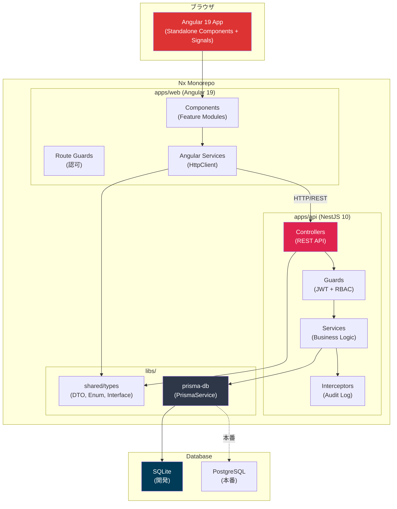
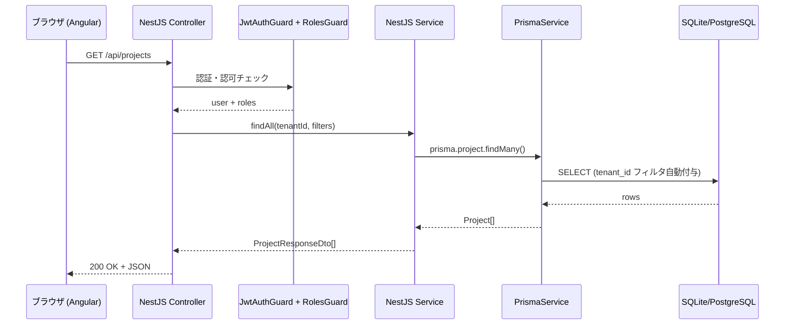
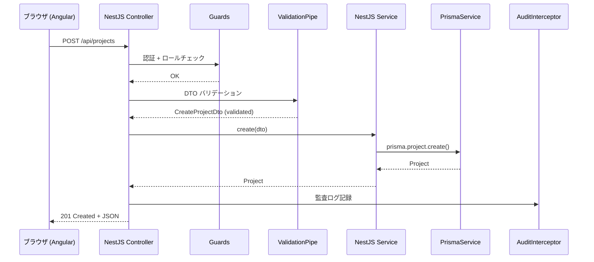

## 目的 / In-Out / Related
- **目的**: システムの全体像と技術選定の根拠を示す
- **対象範囲（In）**: レイヤー構成、データフロー、技術スタック、デプロイ構成
- **対象範囲（Out）**: 各コンポーネントの実装詳細（→ Dev Guide）
- **Related**: [NFR](../../requirements/nfr/) / [Nx ワークスペース](../../architecture/nx-workspace/)

---

## システム構成図

## レイヤー構成

| レイヤー | 技術 | 責務 |
|---|---|---|
| **プレゼンテーション** | Angular 19 (Standalone Components, Angular Material) | UI表示、フォーム、ルーティング |
| **API** | NestJS 10 (Controllers, Decorators) | RESTエンドポイント、バリデーション |
| **認証/認可** | Passport.js (JWT) + NestJS Guards | トークン管理、ロールベースアクセス制御 |
| **ビジネスロジック** | NestJS Services | ドメインロジック、状態遷移、通知作成 |
| **横断的関心事** | NestJS Interceptors, Middleware | 監査ログ、構造化ロギング、テナントフィルタ |
| **データアクセス** | Prisma V6 (PrismaService) | 型安全なクエリ、リレーション、トランザクション |
| **永続化** | SQLite (dev) / PostgreSQL (prod) | データ保管、Index、制約 |
| **ファイル** | NestJS FileModule (multer) | アップロードファイル管理 |

## データフロー

### 読み取り

### 書き込み

## 技術方針

### Nx Monorepo ファースト
- **原則**: apps/ と libs/ を明確に分離。共有コードは libs/ に配置
- **理由**: モジュール境界の強制 + affected テストで CI 高速化
- **Related**: [Nx ワークスペース設計](../../architecture/nx-workspace/)

### Angular Signal ベースの状態管理
- **原則**: コンポーネント状態は Signal で管理。RxJS は HTTP 通信のみ
- **理由**: Zone.js 不要で軽量、変更検知の最適化
- **例外**: リアルタイム更新（WebSocket）は Observable

### NestJS DI 中心の設計
- **原則**: 全ビジネスロジックは Service に配置。Controller は薄く保つ
- **理由**: テスタビリティ確保（TestingModule でモック注入容易）

### Prisma Schema First
- **原則**: DB設計は `schema.prisma` が Single Source of Truth
- **理由**: 型生成 + マイグレーション + シード を一元管理
