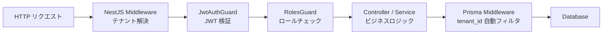
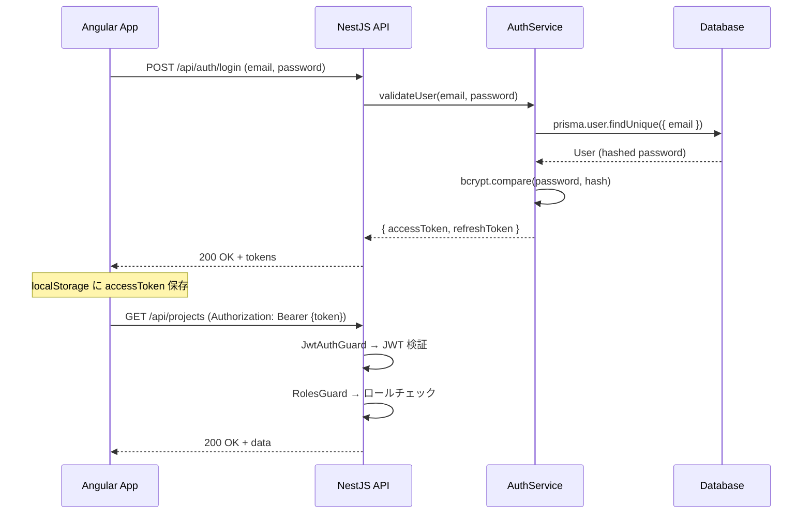

## 目的 / In-Out / Related
- **目的**: 認証済みユーザーに対する認可（何ができるか）の仕様を確定する
- **対象範囲（In）**: 認可チェックの実施層、Guards/Middleware の役割分担、エンドポイントごとの権限
- **対象範囲（Out）**: Guard の具体的実装コード
- **Related**: [ロール定義](../../requirements/roles/) / [アーキテクチャ概要](../architecture/)

---

## 認可アーキテクチャ



### 3層認可モデル

| 層 | 技術 | 責務 |
|---|---|---|
| **認証層** | `JwtAuthGuard` (Passport.js) | JWT トークン検証、ユーザー情報の `request.user` への設定 |
| **認可層** | `RolesGuard` + `@Roles()` デコレータ | ユーザーのロールがエンドポイントに必要なロールを含むかチェック |
| **データ保護層** | Prisma Middleware + `TenantContext` | 全クエリに `tenant_id` フィルタを自動付与。テナント間アクセス防止 |

**設計原則**: 認証層は「誰か」、認可層は「できるか」、データ保護層は「触れるか」を制御する。

---

## 認証フロー



## NestJS Guard 実装

### JwtAuthGuard

```typescript
// libs/shared/auth/src/lib/guards/jwt-auth.guard.ts
@Injectable()
export class JwtAuthGuard extends AuthGuard('jwt') {
  canActivate(context: ExecutionContext) {
    return super.canActivate(context);
  }

  handleRequest(err: Error, user: JwtPayload) {
    if (err || !user) {
      throw new UnauthorizedException('認証が必要です');
    }
    return user;
  }
}
```

### RolesGuard + @Roles() デコレータ

```typescript
// libs/shared/auth/src/lib/decorators/roles.decorator.ts
export const ROLES_KEY = 'roles';
export const Roles = (...roles: Role[]) => SetMetadata(ROLES_KEY, roles);

// libs/shared/auth/src/lib/guards/roles.guard.ts
@Injectable()
export class RolesGuard implements CanActivate {
  constructor(private reflector: Reflector) {}

  canActivate(context: ExecutionContext): boolean {
    const requiredRoles = this.reflector.getAllAndOverride<Role[]>(
      ROLES_KEY,
      [context.getHandler(), context.getClass()],
    );
    if (!requiredRoles) return true; // @Roles() なし → 認証のみ

    const { user } = context.switchToHttp().getRequest();
    return requiredRoles.some((role) => user.roles?.includes(role));
  }
}
```

### 使用例

```typescript
// apps/api/src/modules/projects/projects.controller.ts
@Controller('projects')
@UseGuards(JwtAuthGuard, RolesGuard)
export class ProjectsController {
  @Get()
  @Roles('member', 'pm', 'tenant_admin')  // 閲覧は幅広く
  findAll(@Req() req: RequestWithUser) { ... }

  @Post()
  @Roles('pm', 'tenant_admin')  // 作成は PM 以上
  create(@Body() dto: CreateProjectDto) { ... }

  @Delete(':id')
  @Roles('tenant_admin')  // 削除は管理者のみ
  remove(@Param('id') id: string) { ... }
}
```

## エンドポイント別必要ロール

| エンドポイント | メソッド | 必要ロール |
|---|---|---|
| `/api/auth/login` | POST | (認証不要) |
| `/api/auth/forgot-password` | POST | (認証不要) |
| `/api/auth/reset-password` | POST | (認証不要) |
| `/api/dashboard` | GET | 全ロール |
| `/api/projects` | GET | member, pm, tenant_admin |
| `/api/projects` | POST | pm, tenant_admin |
| `/api/workflows` | GET | 全ロール |
| `/api/workflows/:id/approve` | POST | approver, tenant_admin |
| `/api/expenses` | GET | member, accounting, tenant_admin |
| `/api/expenses/summary` | GET | accounting, tenant_admin |
| `/api/invoices` | GET/POST | accounting, pm, tenant_admin |
| `/api/admin/users` | GET/POST | tenant_admin |
| `/api/admin/audit-logs` | GET | it_admin, tenant_admin |
| `/api/admin/tenants` | GET/POST | it_admin |

## Prisma Middleware によるテナント分離

```typescript
// libs/prisma-db/src/lib/tenant.middleware.ts
import { Prisma } from '@prisma/client';

const TENANT_MODELS = [
  'Project', 'Task', 'Workflow', 'Timesheet',
  'Expense', 'Notification', 'AuditLog', 'Invoice',
  'InvoiceItem', 'Document', 'WorkflowAttachment',
];

export function tenantMiddleware(
  tenantId: string,
): Prisma.Middleware {
  return async (params, next) => {
    if (!TENANT_MODELS.includes(params.model ?? '')) {
      return next(params);
    }

    // SELECT / UPDATE / DELETE に tenant_id フィルタを自動追加
    if (['findMany', 'findFirst', 'findUnique', 'count',
         'update', 'updateMany', 'delete', 'deleteMany'].includes(params.action)) {
      params.args.where = {
        ...params.args.where,
        tenant_id: tenantId,
      };
    }

    // CREATE に tenant_id を自動付与
    if (['create', 'createMany'].includes(params.action)) {
      if (params.action === 'create') {
        params.args.data.tenant_id = tenantId;
      }
    }

    return next(params);
  };
}
```

## Angular Route Guard

```typescript
// apps/web/src/app/core/guards/auth.guard.ts
export const authGuard: CanActivateFn = () => {
  const authService = inject(AuthService);
  const router = inject(Router);

  if (authService.isAuthenticated()) {
    return true;
  }
  return router.createUrlTree(['/login']);
};

// apps/web/src/app/core/guards/roles.guard.ts
export function rolesGuard(allowedRoles: Role[]): CanActivateFn {
  return () => {
    const authService = inject(AuthService);
    const userRoles = authService.currentUser()?.roles ?? [];
    return allowedRoles.some((role) => userRoles.includes(role));
  };
}
```

## 権限エラー時の振る舞い

| 場面 | NestJS 側 | Angular 側 |
|---|---|---|
| 未ログイン | 401 Unauthorized | `/login` にリダイレクト |
| ロール不足 | 403 Forbidden | スナックバーでエラー表示 |
| テナント不一致 | Prisma Middleware が空結果を返す | 「データなし」表示 |
| トークン期限切れ | 401 → refreshToken で再取得 | HttpInterceptor でリトライ |

## 決定済み事項

### ロールのキャッシュ戦略

**決定**: JWT payload にロール情報を含める。トークン有効期限 15分の間はDB参照不要。

```typescript
// JWT Payload
interface JwtPayload {
  sub: string;        // user_id
  email: string;
  tenantId: string;
  roles: Role[];
  iat: number;
  exp: number;
}
```

**理由**:
- リクエスト毎の DB 参照が不要でパフォーマンス向上
- ロール変更時は次回ログイン/リフレッシュで反映（15分以内）
- 前バージョンの React `cache()` アプローチより確実

### IT Admin のテナント横断範囲

**決定**: Phase 1 では IT Admin は **自テナントの管理操作のみ**。テナント横断はPhase 2で検討。

---

## レート制限（`@nestjs/throttler`）

API 保護のために `@nestjs/throttler` でグローバルレート制限を適用。

### グローバル設定（3段階）

```typescript
// app.module.ts
ThrottlerModule.forRoot([
  { name: 'short',  ttl: 1000,   limit: 3  },   // 1秒に3回
  { name: 'medium', ttl: 10000,  limit: 20 },   // 10秒に20回
  { name: 'long',   ttl: 60000,  limit: 100 },  // 1分に100回
])
```

### エンドポイント個別設定

| エンドポイント | レート制限 | 理由 |
|---|---|---|
| `POST /api/auth/login` | 5回/分 (`@Throttle({ short: { limit: 5, ttl: 60000 } })`) | ブルートフォース攻撃防止 |
| `POST /api/auth/forgot-password` | 3回/分 (`@Throttle({ short: { limit: 3, ttl: 60000 } })`) | メールスパム防止 |
| `GET /api/health` | 制限なし (`@SkipThrottle()`) | ヘルスチェックは常時応答 |
| その他全エンドポイント | グローバル設定に準拠 | — |

### エラーレスポンス

レート制限超過時は `429 Too Many Requests` を返却。
Angular 側では「しばらくお待ちください」メッセージを表示。
