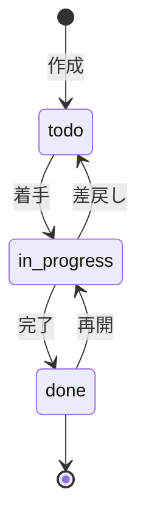
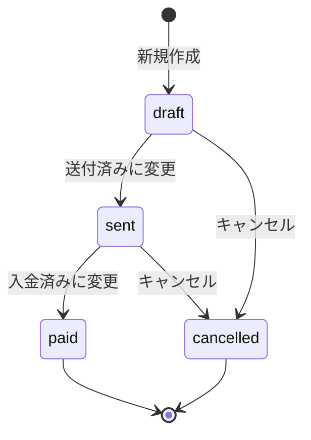

> 本ドキュメントは OpsHub 全画面（SCR-001 ~ SCR-H02）の Angular + Angular Material 版 UI 仕様を統合したものである。

## 共通事項

### UI 技術マッピング

| 旧 (Next.js + Ant Design) | 新 (Angular + Material) |
|---|---|
| `<Table>` | `<mat-table>` + `MatPaginator` |
| `<Form>` + `Form.useForm()` | Angular Reactive Forms (`FormGroup`) |
| `<Modal>` | `MatDialog` |
| `<Button type="primary">` | `<button mat-raised-button color="primary">` |
| `<Select>` | `<mat-select>` |
| `<DatePicker>` | `<mat-datepicker>` |
| `<Card>` | `<mat-card>` |
| `<Tabs>` | `<mat-tab-group>` |
| `<Menu>` / `<Dropdown>` | `<mat-menu>` |
| `<Tag>` / `<Badge>` | `<mat-chip>` / `matBadge` |
| `<Drawer>` | `<mat-sidenav>` |
| `message.success()` / `notification.info()` | `MatSnackBar` |
| `useTransition` | Angular Signal + `async` pipe |
| `revalidatePath()` | Component の `loadData()` 再呼出 |
| Server Component | Angular Component + Service (`HttpClient`) |

### 共通設計方針

- **SC/CC 区分不要**: Angular は全て単一コンポーネントモデル
- **`data-testid` 属性**: Playwright E2E テスト向けに維持
- **レスポンシブ**: Angular Material Breakpoints (`BreakpointObserver`) を使用
- **トースト通知**: `MatSnackBar.open()` に統一
- **確認ダイアログ**: `MatDialog` で実装
- **ページネーション**: `MatPaginator` でサーバーサイドページネーション

---

## SCR-001: ログイン

- **Angular Route**: `/login`
- **Component**: `LoginComponent` (Standalone)
- **Service**: `AuthService`
- **必要ロール**: なし（未認証ユーザー専用）
- **対応API**: `POST /api/auth/login`

### 画面構成

| 要素 | Angular Material 部品 | 必須 | 説明 |
|---|---|---|---|
| メールアドレス | `<mat-form-field>` + `<input matInput type="email">` | ✅ | メール形式バリデーション |
| パスワード | `<mat-form-field>` + `<input matInput type="password">` | ✅ | 最低8文字、`matSuffix` で表示/非表示トグル |
| ログインボタン | `<button mat-raised-button color="primary">` | — | `AuthService.login()` 呼び出し |
| パスワードリセット | `<a mat-button>` | — | パスワードリセットフローへ遷移 |

### 操作フロー

1. ユーザーがメール・パスワードを入力
2. `LoginComponent` が `AuthService.login()` を呼び出し
3. 成功 → `/dashboard` へ `Router.navigate()`
4. 失敗 → `MatSnackBar` でエラーメッセージ表示

### エラーパターン

| 条件 | メッセージ | 動作 |
|---|---|---|
| メール未入力 | 「メールアドレスを入力してください」 | `<mat-error>` 表示 |
| パスワード未入力 | 「パスワードを入力してください」 | `<mat-error>` 表示 |
| 認証失敗 | 「メールアドレスまたはパスワードが正しくありません」 | `MatSnackBar` 表示 |
| アカウントロック | 「アカウントがロックされています」 | `MatSnackBar` 表示 |

### 監査ログポイント

| イベント | action |
|---|---|
| ログイン成功 | `auth.login` |
| ログイン失敗 | `auth.login_failed` |

---

## SCR-002: ダッシュボード

- **Angular Route**: `/dashboard`
- **Component**: `DashboardComponent` (Standalone)
- **Service**: `DashboardService`
- **必要ロール**: `@Roles('*')` （全ロール、表示内容はロール別）
- **対応API**: `GET /api/dashboard/kpi`, `GET /api/dashboard/notifications`

### 画面構成

#### KPI カード（上部 最大4枚・ロール別）

各カードは `<mat-card>` で実装。レスポンシブ: `BreakpointObserver` で `xs=1列, sm=2列, lg=4列`。

| # | カード名 | mat-icon | データソース | 表示ロール |
|---|---|---|---|---|
| 1 | 自分の申請 | `description` | `workflows` | 全ロール |
| 2 | 未処理の申請 | `check_circle` | `workflows` | Approver / Tenant Admin |
| 3 | 担当タスク | `assignment` | `tasks` | Member / PM |
| 4 | 今週の工数 | `schedule` | `timesheets` | Member / PM |

#### プロジェクト進捗セクション（PM のみ）

- `<mat-progress-bar>` で進捗率を表示
- ヘッダー右に「一覧 →」リンク → `/projects`

#### 通知セクション

- `<mat-list>` で未読通知を最新5件表示
- 空状態: 「未読の通知はありません」
- `resource_type` → URL マッピング: `workflow`→`/workflows/{id}`, `project`→`/projects/{id}`, `task`→`/projects`, `expense`→`/expenses`

#### クイックアクション

| ボタン | mat-icon | 遷移先 |
|---|---|---|
| 新規申請 | `add` | `/workflows/new` |
| 工数を入力 | `schedule` | `/timesheets` |
| プロジェクト一覧 | `folder` | `/projects` |

各ボタンは `<button mat-raised-button>` で実装。

### データ取得パターン

`DashboardService` で `forkJoin()` を使用し並列データ取得:

```typescript
forkJoin({
  pendingApprovals: isApprover ? this.getPendingApprovalsCount() : of(0),
  myWorkflows: this.getMyWorkflowsCount(),
  myTasks: isMemberOrPm ? this.getMyTasksCount() : of(0),
  weeklyHours: isMemberOrPm ? this.getWeeklyHours() : of(0),
  projectProgress: isPm ? this.getProjectProgress() : of([]),
  unreadNotifications: this.getUnreadNotifications(),
})
```

### 権限別表示ルール

| ロール | KPI カード | プロジェクト進捗 |
|---|---|---|
| Member | 自分の申請 / 担当タスク / 今週の工数 | ✗ |
| PM | 自分の申請 / 担当タスク / 今週の工数 | ✔ |
| Approver | 自分の申請 / 未処理の申請 | ✗ |
| Tenant Admin | 自分の申請 / 未処理の申請 | ✗ |

---

## SCR-A01: テナント管理

- **Angular Route**: `/admin/tenants`
- **Component**: `TenantManagementComponent` (Standalone)
- **Service**: `TenantService`
- **必要ロール**: `@Roles('tenant_admin', 'it_admin')`
- **対応API**: `GET /api/tenants/:id`, `PUT /api/tenants/:id`, `DELETE /api/tenants/:id`

### 画面構成

`<mat-tab-group>` で3タブ構成:

| タブ | 内容 |
|---|---|
| 基本情報 | 組織名、ロゴ、連絡先、プラン情報 — `<mat-card>` 内に Reactive Forms |
| 設定 | ワークフロー設定、デフォルト承認経路、通知設定 — `<mat-slide-toggle>` |
| 利用状況 | メンバー数推移、ストレージ使用量 — `<mat-progress-bar>` |

### 表示項目（基本情報）

| フィールド | Angular Material 部品 | 必須 | 編集権限 |
|---|---|---|---|
| 組織名 | `<mat-form-field>` + `<input matInput>` | ✅ | Tenant Admin |
| ロゴ | ファイルアップロード | — | Tenant Admin |
| 連絡先メール | `<mat-form-field>` + `<input matInput type="email">` | ✅ | Tenant Admin |
| 住所 | `<mat-form-field>` + `<input matInput>` | — | Tenant Admin |
| デフォルト承認経路 | `<mat-select>` | — | Tenant Admin |
| 通知設定 | `<mat-slide-toggle>` | — | Tenant Admin |

### 危険な操作

- テナント削除: `<button mat-raised-button color="warn">` → `MatDialog` で二重確認
- データエクスポート: `<button mat-stroked-button>`

### 権限

| ロール | 操作 |
|---|---|
| Member / PM | アクセス不可 |
| Tenant Admin | 全操作（テナント削除除く） |
| IT Admin | 全操作（テナント削除含む） |

---

## SCR-A02: ユーザー管理

- **Angular Route**: `/admin/users`
- **Component**: `UserManagementComponent` (Standalone)
- **Service**: `UserService`
- **必要ロール**: `@Roles('tenant_admin', 'it_admin')`
- **対応API**: `GET /api/users`, `POST /api/users/invite`, `PUT /api/users/:id/role`, `PUT /api/users/:id/deactivate`

### 画面構成

#### ユーザー一覧テーブル (`<mat-table>`)

| カラム | ソート | フィルタ |
|---|---|---|
| アバター/状態 | — | `<mat-select>` で状態フィルタ |
| 名前 | `matSort` (A-Z) | — |
| メールアドレス | `matSort` | `<mat-form-field>` でテキスト検索 |
| ロール | — | `<mat-select>` 複数選択 |
| 最終ログイン | `matSort` (日時) | — |
| 操作 | — | — |

#### 招待モーダル (`MatDialog`)

- メール入力: `<mat-form-field>` + `Validators.email`
- ロール選択: `<mat-select>`

### 操作

| 操作 | UI | 確認 |
|---|---|---|
| ユーザー招待 | `MatDialog`（メール + ロール選択） | — |
| ロール変更 | 詳細パネル内の `<mat-select>` | `MatDialog` 確認 |
| パスワードリセット | `<button mat-stroked-button>` | `MatDialog` 確認 |
| ユーザー無効化 | `<button mat-raised-button color="warn">` | `MatDialog` 二重確認 |

### バリデーション

| ルール | メッセージ |
|---|---|
| メールが既に存在 | 「このメールアドレスは既に登録されています」 |
| メール形式不正 | 「有効なメールアドレスを入力してください」 |
| 自分自身のロール変更 | 「自分のロールは変更できません」 |
| 最後のTenant Admin削除 | 「テナントには最低1人のTenant Adminが必要です」 |

---

## SCR-A03: 監査ログビューア

- **Angular Route**: `/admin/audit-logs`
- **Component**: `AuditLogViewerComponent` (Standalone)
- **Service**: `AuditLogService`
- **必要ロール**: `@Roles('it_admin', 'tenant_admin')`
- **対応API**: `GET /api/audit-logs`, `GET /api/audit-logs/filter-options`

### 画面構成

#### フィルタ (`<mat-card>`)

| フィルタ | Angular Material 部品 | プレースホルダー |
|---|---|---|
| 期間 | `<mat-date-range-input>` + `<mat-datepicker>` | 開始日〜終了日 |
| ユーザー | `<mat-select>` | すべてのユーザー |
| アクション種別 | `<mat-select>` | すべてのアクション |
| リソース種別 | `<mat-select>` | すべてのリソース |

#### ログ一覧テーブル (`<mat-table>`)

| カラム | 幅 | 表示形式 |
|---|---|---|
| 日時 (`created_at`) | 180px | `DatePipe` で `yyyy/MM/dd HH:mm:ss` |
| 操作者 (`user_id`) | 200px | `profiles.display_name` |
| アクション (`action`) | 160px | `<mat-chip>` で日本語ラベル＋色 |
| リソース種別 | 140px | 日本語ラベル |
| リソースID | 200px | UUID 先頭8文字 + `…` |

- ソート: `created_at DESC` 固定
- ページネーション: `<mat-paginator>` — デフォルト50件、選択肢 10/20/50/100

#### 詳細展開

行クリックで `before_data` / `after_data` の差分を表示（展開行テンプレート）。

### アクション種別ラベル（21種）

| アクション値 | 日本語ラベル | チップ色 |
|---|---|---|
| `workflow.create` | 申請作成 | `primary` |
| `workflow.approve` | 申請承認 | `accent` |
| `workflow.reject` | 申請差戻し | `warn` |
| `project.create` | PJ作成 | `primary` |
| `project.update` | PJ更新 | `primary` |
| `task.create` | タスク作成 | `primary` |
| `task.status_change` | ステータス変更 | `accent` |
| `user.invite` | ユーザー招待 | `primary` |
| `user.role_change` | ロール変更 | `accent` |
| `tenant.update` | テナント更新 | `primary` |
| `tenant.delete` | テナント削除 | `warn` |
| その他 | 各アクションに準拠 | — |

---

## SCR-B01: 申請一覧

- **Angular Route**: `/workflows`（自分の申請） / `/workflows/pending`（承認待ち）
- **Component**: `WorkflowListComponent` (Standalone)
- **Service**: `WorkflowService`
- **必要ロール**: `@Roles('*')`（承認待ちは `@Roles('approver', 'tenant_admin')` のみ）
- **対応API**: `GET /api/workflows`, `GET /api/workflows/pending`

### 画面構成

`<mat-table>` + `matSort` + `<mat-paginator>` (20件/ページ)

| テーブル列 | 説明 |
|---|---|
| 申請番号 | テキスト |
| 種別 | `<mat-chip>` |
| タイトル | テキスト |
| ステータス | `<mat-chip>` 色分け |
| 申請日 | `DatePipe` |
| 申請者 | テキスト |

フィルタ: ステータス (`<mat-select>`)、期間 (`<mat-date-range-input>`)、種別 (`<mat-select>`)

### 操作フロー

1. 行クリック → `/workflows/:id` へ遷移
2. 「新規申請」ボタン → `/workflows/new` へ遷移
3. データ取得失敗 → `MatSnackBar` でエラー通知

---

## SCR-B02: 申請作成

- **Angular Route**: `/workflows/new`
- **Component**: `WorkflowCreateComponent` (Standalone)
- **Service**: `WorkflowService`
- **必要ロール**: `@Roles('member', 'pm', 'accounting')`
- **対応API**: `POST /api/workflows`

### 画面構成

Reactive Forms (`FormGroup`) で動的フォーム。

| 項目 | Angular Material 部品 | 必須 | バリデーション |
|---|---|---|---|
| 申請種別 | `<mat-select>` | ✅ | 定義済み種別 |
| タイトル | `<mat-form-field>` + `<input matInput>` | ✅ | 1〜100文字 |
| 説明 | `<mat-form-field>` + `<textarea matInput>` | — | 最大2000文字 |
| 金額 | `<mat-form-field>` + `<input matInput type="number">` | 種別依存 | 0以上 |
| 期間 | `<mat-date-range-input>` | 種別依存 | 開始≤終了 |
| 承認者 | `<mat-select>` | ✅ | Approver ロール |
| 添付ファイル | カスタムドラッグ＆ドロップ | — | 5ファイル×10MB |

### アクションボタン

- 「下書き保存」: `<button mat-stroked-button>` → `status: 'draft'`
- 「送信」: `<button mat-raised-button color="primary">` → `status: 'submitted'`

---

## SCR-B03: 申請詳細/承認

- **Angular Route**: `/workflows/:id`
- **Component**: `WorkflowDetailComponent` (Standalone)
- **Service**: `WorkflowService`
- **必要ロール**: `@Roles('*')`（操作権限はロールで制御）
- **対応API**: `GET /api/workflows/:id`, `PUT /api/workflows/:id/approve`, `PUT /api/workflows/:id/reject`

### 画面構成

- ヘッダー: 申請番号、ステータス (`<mat-chip>`)、申請種別
- 詳細セクション: `<mat-card>` 内に情報表示
- タイムライン: `<mat-stepper>` で時系列表示
- アクションバー:
  - 申請者: 「取下げ」(`mat-stroked-button`) / 「再申請」(`mat-raised-button`)
  - 承認者: 「承認」(`mat-raised-button color="primary"`) / 「差戻し」(`mat-raised-button color="warn"`) + 差戻し理由 `<textarea matInput>`

### 操作フロー

1. 承認: `MatDialog` 確認 → API呼出 → `MatSnackBar` 通知
2. 差戻し: 理由入力（必須）→ API呼出 → `MatSnackBar` 通知
3. 取下げ: `MatDialog` 確認 → API呼出

---

## SCR-C01-1: プロジェクト一覧

- **Angular Route**: `/projects`
- **Component**: `ProjectListComponent` (Standalone)
- **Service**: `ProjectService`
- **必要ロール**: `@Roles('*')`（表示範囲はロール別・Guard + Prisma Middleware で制御）
- **対応API**: `GET /api/projects`

### 画面構成

`<mat-table>` + `matSort` + `<mat-paginator>` (20件/ページ)

| テーブル列 | 説明 |
|---|---|
| プロジェクト名 | テキスト |
| ステータス | `<mat-chip>` (計画中/進行中/完了/中止) |
| PM | テキスト |
| 期間 | `DatePipe` |
| メンバー数 | 数値 |
| 進捗 | `<mat-progress-bar>` |

- フィルタ: ステータス (`<mat-select>`)、PM (`<mat-select>`)
- 「新規作成」ボタン: PM / Tenant Admin のみ表示

---

## SCR-C01-2: プロジェクト詳細

- **Angular Route**: `/projects/:id`
- **Component**: `ProjectDetailComponent` (Standalone)
- **Service**: `ProjectService`
- **必要ロール**: `@Roles('member', 'pm', 'accounting', 'tenant_admin')`
- **対応API**: `GET /api/projects/:id`, `PUT /api/projects/:id`, `POST /api/projects/:id/members`

### 画面構成

`<mat-tab-group>` で5タブ構成:

| タブ | 内容 | 部品 |
|---|---|---|
| 概要 | 基本情報 + 進捗 + メンバー + アクティビティ | `<mat-card>`, `<mat-progress-bar>`, `<mat-list>` |
| タスク | タスク一覧 (SCR-C02 の簡易ビュー) | `<mat-table>` |
| 工数 | メンバー別・月別工数集計 | `<mat-table>` |
| メンバー | PJ所属メンバー一覧 | `<mat-list>` + `<mat-chip>` |
| 経費 | PJに紐づく経費一覧 | `<mat-table>` |

### 入力項目（編集モード）

| フィールド | Angular Material 部品 | 必須 | 編集権限 |
|---|---|---|---|
| プロジェクト名 | `<input matInput>` | ✅ | PM / Tenant Admin |
| 顧客名 | `<input matInput>` | — | PM / Tenant Admin |
| ステータス | `<mat-select>` | ✅ | PM / Tenant Admin |
| 期間 | `<mat-date-range-input>` | ✅ | PM / Tenant Admin |
| 予算 | `<input matInput type="number">` | — | PM / Accounting |
| 説明 | `<textarea matInput>` | — | PM |

---

## SCR-C02: タスク管理（カンバンボード）

- **Angular Route**: `/projects/:id/tasks`
- **Component**: `TaskBoardComponent` (Standalone)
- **Service**: `TaskService`
- **必要ロール**: `@Roles('member', 'pm', 'tenant_admin')`
- **対応API**: `GET /api/projects/:id/tasks`, `POST /api/tasks`, `PUT /api/tasks/:id`, `DELETE /api/tasks/:id`

### 画面構成

Angular CDK `DragDropModule` によるカンバンボード。3カラム: 未着手 / 進行中 / 完了

ステータス遷移:



### タスクカード (`<mat-card>`)

| 項目 | Angular Material 部品 | 必須 |
|---|---|---|
| タスク名 | `<input matInput>` | ✅ |
| 担当者 | `<mat-select>` | — |
| 優先度 | `<mat-select>` (高/中/低) — `<mat-chip>` で色分け表示 | ✅ |
| 期限 | `<mat-datepicker>` | — |
| 説明 | `<textarea matInput>` | — |
| 見積工数 | `<input matInput type="number">` | — |

### 操作

| 操作 | 方法 | 権限 |
|---|---|---|
| タスク作成 | `MatDialog` | PM / Member |
| ステータス変更 | ドラッグ＆ドロップ (CDK) | PM / 担当者 |
| タスク編集 | カードクリック → `MatDialog` | PM / 担当者 |
| タスク削除 | `MatDialog` 確認後削除 | PM のみ |

---

## SCR-C03-1: 工数入力

- **Angular Route**: `/timesheets`
- **Component**: `TimesheetEntryComponent` (Standalone)
- **Service**: `TimesheetService`
- **必要ロール**: `@Roles('member', 'pm')`
- **対応API**: `GET /api/timesheets`, `POST /api/timesheets`, `PUT /api/timesheets/:id`

### 画面構成

週カレンダー形式のグリッド入力。

| 要素 | Angular Material 部品 |
|---|---|
| 週カレンダー | カスタムグリッド + `<mat-form-field>` |
| 行（PJ × タスク） | `<mat-select>` でPJ/タスク選択 |
| セル（時間入力） | `<input matInput type="number">` (0.25h単位) |
| 合計行 | 自動計算表示 |
| 行追加 | `<button mat-stroked-button>` |
| 保存 | `<button mat-raised-button color="primary">` |

### 操作フロー

1. PJ・タスクを選択して行追加
2. 各セルに時間入力（0〜24h、0.25h単位）
3. 保存 → `MatSnackBar`「保存しました」
4. 週切替: 未保存変更時は `MatDialog` で確認

---

## SCR-C03-2: 工数集計

- **Angular Route**: `/timesheets/reports`
- **Component**: `TimesheetReportComponent` (Standalone)
- **Service**: `TimesheetService`
- **必要ロール**: `@Roles('member', 'pm', 'accounting', 'tenant_admin')`
- **対応API**: `GET /api/timesheets/reports`, `GET /api/timesheets/export`

### 画面構成

`<mat-tab-group>` で2ビュー:

#### PJ別ビュー（デフォルト）

`<mat-table>` — 行: プロジェクト、列: 月、値: 合計工数(h) + 予算工数 + 消化率(%)

#### メンバー別ビュー

`<mat-table>` — 行: メンバー名、列: 月、値: 合計工数(h) + 平均日次工数

### フィルタ

| フィルタ | Angular Material 部品 | デフォルト |
|---|---|---|
| 期間 | `<mat-datepicker>` (月選択) | 当月 |
| プロジェクト | `<mat-select multiple>` | 全PJ |
| メンバー | `<mat-select multiple>` | 全メンバー |
| 表示単位 | `<mat-button-toggle-group>` (月/週/日) | 月 |

### CSV出力

`<button mat-raised-button>` で CSV ダウンロード。カラム: プロジェクト名, メンバー名, 日付, 工数(h), タスク名, 備考

### 権限

| ロール | 閲覧範囲 | CSV出力 |
|---|---|---|
| Member | 自分のみ | 自分のみ |
| PM | 管轄PJ全メンバー | ✅ |
| Accounting / Tenant Admin | テナント全体 | ✅ |

---

## SCR-D01: 経費管理

- **Angular Route**: `/expenses`（一覧） / `/expenses/new`（新規作成）
- **Component**: `ExpenseListComponent`, `ExpenseCreateComponent` (Standalone)
- **Service**: `ExpenseService`
- **必要ロール**: `@Roles('*')`（表示範囲はロール別）
- **対応API**: `GET /api/expenses`, `POST /api/expenses`

### 画面①: 経費一覧

`<mat-table>` + `<mat-paginator>` (20件/ページ)

| 列 | 表示形式 |
|---|---|
| 申請番号 | リンク → `/workflows/:id` |
| カテゴリ | `<mat-chip>` (交通費=blue, 宿泊費=purple, 会議費=cyan, 消耗品費=orange, 通信費=green) |
| 金額 | `CurrencyPipe` (`¥`) |
| 日付 | `DatePipe` (`ja-JP`) |
| プロジェクト | リンク → `/projects/:id` |
| ステータス | `<mat-chip>` (draft=default, submitted=accent, approved=primary, rejected=warn) |
| 説明 | 省略表示 |
| 申請日 | `DatePipe` |
| 申請者 | テキスト |

### 画面②: 経費申請（新規作成）

Reactive Forms (`FormGroup`):

| 項目 | Angular Material 部品 | 必須 | バリデーション |
|---|---|---|---|
| 日付 | `<mat-datepicker>` | ✅ | 必須 |
| カテゴリ | `<mat-select>` | ✅ | 6種別 |
| 金額 | `<input matInput type="number">` | ✅ | 1〜10,000,000円 |
| プロジェクト | `<mat-select>` | ✅ | planning/active PJ |
| 説明 | `<textarea matInput>` | — | — |
| 承認者 | `<mat-select>` | ✅ | Approver/Accounting/Tenant Admin |

アクション: 「下書き保存」(`mat-stroked-button`) / 「送信」(`mat-raised-button color="primary"`) / 「キャンセル」(`mat-button`)

---

## SCR-D03: 経費集計

- **Angular Route**: `/expenses/summary`
- **Component**: `ExpenseSummaryComponent` (Standalone)
- **Service**: `ExpenseService`
- **必要ロール**: `@Roles('accounting', 'pm', 'tenant_admin')`
- **対応API**: `GET /api/expenses/summary`

### 画面構成

#### サマリーカード (4枚の `<mat-card>`)

合計金額 / 件数 / 平均金額 / 最高金額

#### 集計タブ (`<mat-tab-group>`)

| タブ | グラフ | テーブル |
|---|---|---|
| カテゴリ別 | 円グラフ (ngx-charts) | カテゴリ / 件数 / 合計金額 / 割合 |
| PJ別 | 横棒グラフ | プロジェクト / 件数 / 合計金額 |
| 月別推移 | 折れ線グラフ | 月 / 件数 / 合計金額 |

### フィルタ

| フィルタ | Angular Material 部品 | デフォルト |
|---|---|---|
| 期間 | `<mat-date-range-input>` | 当月 |
| カテゴリ | `<mat-select>` | 全て |
| プロジェクト | `<mat-select>` | 全プロジェクト |
| ステータス | `<mat-select>` | 全て |

---

## SCR-E01: 通知（NotificationBell）

- **Angular Route**: なし（ヘッダー共通コンポーネント）
- **Component**: `NotificationBellComponent` (Standalone)
- **Service**: `NotificationService`
- **必要ロール**: `@Roles('*')` （認証済み全ユーザー）
- **対応API**: `GET /api/notifications`, `PUT /api/notifications/:id/read`, `PUT /api/notifications/read-all`

### 画面構成

| 要素 | Angular Material 部品 | 説明 |
|---|---|---|
| ベルアイコン | `<mat-icon>notifications</mat-icon>` + `matBadge` | 未読件数バッジ |
| 通知パネル | `<mat-menu>` (幅360px) | クリックで開閉 |
| 「すべて既読にする」 | `<button mat-button>` | 未読1件以上時のみ表示 |
| 通知リスト | `<mat-nav-list>` | 最大20件、スクロール可能 |
| 空状態 | テキスト表示 | 「通知はありません」 |

### 日時フォーマット

| 条件 | 表示 |
|---|---|
| 1分未満 | たった今 |
| 1分〜59分 | `{n}分前` |
| 1時間〜23時間 | `{n}時間前` |
| 1日〜6日 | `{n}日前` |
| 7日以上 | `DatePipe` (`yyyy/MM/dd`) |

### リソース遷移ルール

| resource_type | 遷移先URL |
|---|---|
| `workflow` | `/workflows/{resource_id}` |
| `project` | `/projects/{resource_id}` |
| `task` | `/projects` |
| `expense` | `/expenses` |
| `null` | 遷移なし |

---

## SCR-F01: ドキュメント管理

- **Angular Route**: `/projects/:id/documents`
- **Component**: `DocumentListComponent` (Standalone)
- **Service**: `DocumentService`
- **必要ロール**: `@Roles('member', 'pm', 'tenant_admin')`（PJメンバーに限定）
- **対応API**: `GET /api/projects/:id/documents`, `POST /api/projects/:id/documents`, `DELETE /api/documents/:id`

### 画面構成

#### アップロードセクション（PM / Tenant Admin のみ）

カスタムドラッグ＆ドロップコンポーネント（ファイル制約: 最大10MB、PDF/画像/Office/テキスト）

#### ドキュメント一覧 (`<mat-table>`)

| 列 | 表示形式 |
|---|---|
| ファイル名 | `<mat-icon>` (MIME別) + テキスト |
| サイズ | 人間可読形式 (KB/MB) |
| 種別 | `<mat-chip>` (PDF=warn, 画像=primary, DOCX=accent, XLSX=primary, TXT=default) |
| アップロード者 | テキスト |
| 日時 | `DatePipe` |
| 操作 | ダウンロード/プレビュー/削除ボタン |

### 操作ボタン

| ボタン | mat-icon | 権限 |
|---|---|---|
| ダウンロード | `download` | 全メンバー |
| プレビュー | `visibility` | 全メンバー（画像/PDFのみ） |
| 削除 | `delete` | PM / Tenant Admin — `MatDialog` 確認 |

---

## SCR-G02: 全文検索

- **Angular Route**: `/search`
- **Component**: `SearchResultsComponent` (Standalone)
- **Service**: `SearchService`
- **必要ロール**: `@Roles('*')`
- **対応API**: `GET /api/search?q={keyword}&category={category}`

### 画面構成

#### 検索バー（ヘッダー共通）

`<mat-form-field>` + `<input matInput>` + `<mat-icon matSuffix>search</mat-icon>`
Enter キーまたはアイコンクリックで `/search?q={入力値}` へ遷移。

#### カテゴリタブ (`<mat-tab-group>`)

| タブ | 対象テーブル | 検索カラム |
|---|---|---|
| すべて | 全テーブル | — |
| ワークフロー | `workflows` | `title`, `description` |
| プロジェクト | `projects` | `name`, `description` |
| タスク | `tasks` | `title` |
| 経費 | `expenses` | `description` |

各タブに `matBadge` でヒット件数表示。

#### 検索結果カード (`<mat-card>`)

| 要素 | 説明 |
|---|---|
| カテゴリアイコン | `<mat-icon>` (description/folder/check_circle/payments) |
| タイトル | キーワード部分を `<mark>` でハイライト |
| スニペット | 説明文から前後50文字抽出 |
| ステータス | `<mat-chip>` 各リソース色定義準拠 |
| 日付 | `DatePipe` |
| リンク | 各リソース詳細画面へ |

### ロール別表示ルール

RLS / Prisma Middleware により自動制御。Member は自分のデータのみ、PM/Accounting/Tenant Admin はテナント全件。

---

## SCR-H01: 請求一覧

- **Angular Route**: `/invoices`
- **Component**: `InvoiceListComponent` (Standalone)
- **Service**: `InvoiceService`
- **必要ロール**: `@Roles('accounting', 'pm', 'tenant_admin')`
- **対応API**: `GET /api/invoices`

### 画面構成

`<mat-table>` + `matSort` + `<mat-paginator>` (20件/ページ)

| 列 | 表示形式 |
|---|---|
| 請求番号 | リンク → `/invoices/:id` (`INV-YYYY-NNNN`) |
| 取引先名 | テキスト |
| プロジェクト | リンク → `/projects/:id` |
| 発行日 | `DatePipe` |
| 支払期日 | `DatePipe` — 期限超過時は `color: warn` |
| 金額（税込） | `CurrencyPipe` (`¥`) |
| ステータス | `<mat-chip>` (draft=primary, sent=accent, paid=primary, cancelled=default) |
| 作成者 | テキスト |
| 操作 | 詳細/PDF出力ボタン |

### フィルタ

| フィルタ | Angular Material 部品 |
|---|---|
| ステータス | `<mat-select>` |
| プロジェクト | `<mat-select>` |
| 期間（発行日） | `<mat-date-range-input>` |

### ロール別権限

| ロール | 表示範囲 | 操作 |
|---|---|---|
| Accounting / Tenant Admin | テナント全件 | 作成・編集・削除 |
| PM | 自プロジェクトのみ | 閲覧のみ |

---

## SCR-H02: 請求書詳細/編集

- **Angular Route**: `/invoices/new`（新規） / `/invoices/:id`（既存）
- **Component**: `InvoiceDetailComponent` (Standalone)
- **Service**: `InvoiceService`
- **必要ロール**: `@Roles('accounting', 'tenant_admin')`（編集）, `@Roles('pm')`（閲覧のみ）
- **対応API**: `GET /api/invoices/:id`, `POST /api/invoices`, `PUT /api/invoices/:id`, `DELETE /api/invoices/:id`

### 画面構成

#### ヘッダー情報 (`<mat-card>` + Reactive Forms)

| 項目 | Angular Material 部品 | 必須 | バリデーション |
|---|---|---|---|
| 請求番号 | `<input matInput readonly>` | — | 自動採番 `INV-YYYY-NNNN` |
| 取引先名 | `<input matInput>` | ✅ | 200文字以内 |
| プロジェクト | `<mat-select>` | — | テナント内PJ |
| 発行日 | `<mat-datepicker>` | ✅ | — |
| 支払期日 | `<mat-datepicker>` | ✅ | 発行日以降 |
| 備考 | `<textarea matInput>` | — | — |

#### 明細テーブル (Editable `<mat-table>`)

| 列 | Angular Material 部品 | 必須 |
|---|---|---|
| 品目 | `<input matInput>` | ✅ |
| 数量 | `<input matInput type="number">` | ✅ (0超) |
| 単価 | `<input matInput type="number">` | ✅ (0以上) |
| 金額 | 自動計算（読取専用） | — |
| 操作 | `<button mat-icon-button>` 削除 | — |

行追加: `<button mat-stroked-button>` / 行削除: 最低1行必須

#### 合計セクション

| 項目 | 計算ロジック |
|---|---|
| 小計 | Σ（明細金額） |
| 消費税率 | `<input matInput type="number">` (デフォルト10%) |
| 消費税額 | 小計 × 税率 / 100（端数切捨） |
| 合計金額 | 小計 + 消費税額 |

### ステータス遷移



### アクションボタン

| ボタン | Angular Material 部品 | 表示条件 |
|---|---|---|
| 下書き保存 | `<button mat-stroked-button>` | 新規 or `draft` |
| 送付済みに変更 | `<button mat-raised-button color="primary">` | `draft` |
| 入金済みに変更 | `<button mat-raised-button color="primary">` | `sent` |
| キャンセル | `<button mat-raised-button color="warn">` | `draft` or `sent` |
| PDF出力 | `<button mat-stroked-button>` | 常時 |
| 戻る | `<button mat-button>` | 常時 |

### PDF出力

- ブラウザ印刷ダイアログ (`window.print()`) + 印刷用CSS（A4縦向き）
- ヘッダー: 請求番号/発行日/取引先名、明細テーブル、フッター: 合計金額/振込先

### 監査ログポイント

| イベント | action |
|---|---|
| 新規作成 | `invoice.create` |
| 更新 | `invoice.update` |
| ステータス変更 | `invoice.status_change` |
| 削除 | `invoice.delete` |
| PDF出力 | `invoice.export_pdf` |
