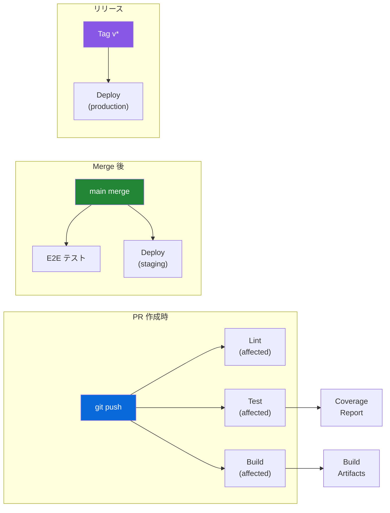
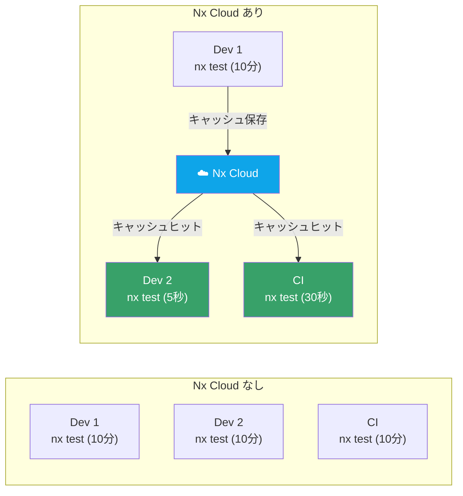

## 概要

CI/CD パイプラインは **コードがリポジトリにプッシュされた瞬間から自動的に品質を保証** する仕組みです。



## GitHub Actions ワークフロー

### PR チェック

```yaml
# .github/workflows/ci.yml
name: CI

on:
  pull_request:
    branches: [main, develop]
  push:
    branches: [main]

concurrency:
  group: ${{ github.workflow }}-${{ github.ref }}
  cancel-in-progress: true

env:
  NX_CLOUD_ACCESS_TOKEN: ${{ secrets.NX_CLOUD_ACCESS_TOKEN }}
  NODE_VERSION: '22'
  PNPM_VERSION: '9'

jobs:
  # ── 依存関係のインストール ──
  setup:
    runs-on: ubuntu-latest
    steps:
      - uses: actions/checkout@v4
        with:
          fetch-depth: 0

      - uses: pnpm/action-setup@v4
        with:
          version: ${{ env.PNPM_VERSION }}

      - uses: actions/setup-node@v4
        with:
          node-version: ${{ env.NODE_VERSION }}
          cache: 'pnpm'

      - name: Install dependencies
        run: pnpm install --frozen-lockfile

      - name: Derive Nx SHAs
        uses: nrwl/nx-set-shas@v4

      - name: Cache Nx
        uses: actions/cache@v4
        with:
          path: .nx/cache
          key: nx-${{ runner.os }}-${{ hashFiles('pnpm-lock.yaml') }}

    outputs:
      nx-base: ${{ steps.nx-set-shas.outputs.base }}
      nx-head: ${{ steps.nx-set-shas.outputs.head }}

  # ── Lint チェック ──
  lint:
    needs: setup
    runs-on: ubuntu-latest
    steps:
      - uses: actions/checkout@v4
        with:
          fetch-depth: 0
      - uses: pnpm/action-setup@v4
        with:
          version: ${{ env.PNPM_VERSION }}
      - uses: actions/setup-node@v4
        with:
          node-version: ${{ env.NODE_VERSION }}
          cache: 'pnpm'
      - run: pnpm install --frozen-lockfile
      - name: Lint affected
        run: npx nx affected -t lint --base=origin/main

  # ── ユニットテスト + カバレッジ ──
  test:
    needs: setup
    runs-on: ubuntu-latest
    steps:
      - uses: actions/checkout@v4
        with:
          fetch-depth: 0
      - uses: pnpm/action-setup@v4
        with:
          version: ${{ env.PNPM_VERSION }}
      - uses: actions/setup-node@v4
        with:
          node-version: ${{ env.NODE_VERSION }}
          cache: 'pnpm'
      - run: pnpm install --frozen-lockfile

      - name: Generate Prisma Client
        run: npx nx run prisma-db:prisma-generate

      - name: Run affected tests with coverage
        run: npx nx affected -t test --base=origin/main --coverage

      - name: Upload coverage
        uses: actions/upload-artifact@v4
        with:
          name: coverage-report
          path: coverage/
          retention-days: 7

      - name: Coverage threshold check
        run: |
          # カバレッジしきい値チェック
          npx vitest run --coverage --reporter=json \
            --outputFile=coverage/summary.json || true
          node scripts/check-coverage.js

  # ── ビルドチェック ──
  build:
    needs: setup
    runs-on: ubuntu-latest
    steps:
      - uses: actions/checkout@v4
        with:
          fetch-depth: 0
      - uses: pnpm/action-setup@v4
        with:
          version: ${{ env.PNPM_VERSION }}
      - uses: actions/setup-node@v4
        with:
          node-version: ${{ env.NODE_VERSION }}
          cache: 'pnpm'
      - run: pnpm install --frozen-lockfile

      - name: Generate Prisma Client
        run: npx nx run prisma-db:prisma-generate

      - name: Build affected
        run: npx nx affected -t build --base=origin/main

      - name: Upload build artifacts
        uses: actions/upload-artifact@v4
        with:
          name: build-output
          path: dist/
          retention-days: 3

  # ── E2E テスト (main merge 時のみ) ──
  e2e:
    needs: [lint, test, build]
    if: github.ref == 'refs/heads/main'
    runs-on: ubuntu-latest
    steps:
      - uses: actions/checkout@v4
      - uses: pnpm/action-setup@v4
        with:
          version: ${{ env.PNPM_VERSION }}
      - uses: actions/setup-node@v4
        with:
          node-version: ${{ env.NODE_VERSION }}
          cache: 'pnpm'
      - run: pnpm install --frozen-lockfile

      - name: Install Playwright
        run: npx playwright install --with-deps chromium

      - name: Generate Prisma Client
        run: npx nx run prisma-db:prisma-generate

      - name: Setup test database
        run: |
          DATABASE_URL="file:./test.db" npx prisma migrate deploy \
            --schema=libs/prisma-db/prisma/schema.prisma
          DATABASE_URL="file:./test.db" npx tsx \
            libs/prisma-db/prisma/seed.ts

      - name: Run E2E tests
        run: npx playwright test
        env:
          DATABASE_URL: 'file:./test.db'

      - name: Upload E2E results
        if: always()
        uses: actions/upload-artifact@v4
        with:
          name: playwright-report
          path: playwright-report/
          retention-days: 7
```

## Nx Cloud (リモートキャッシュ)

### メリット



### 設定

```json
// nx.json
{
  "nxCloudAccessToken": "YOUR_NX_CLOUD_TOKEN",
  "parallel": 3,
  "cacheDirectory": ".nx/cache"
}
```

## カバレッジしきい値スクリプト

```javascript
// scripts/check-coverage.js
import { readFileSync } from 'fs';

const MIN_COVERAGE = {
  lines: 80,
  branches: 75,
  functions: 85,
};

try {
  const summary = JSON.parse(
    readFileSync('coverage/summary.json', 'utf-8'),
  );

  const total = summary.total;
  let failed = false;

  for (const [metric, threshold] of Object.entries(MIN_COVERAGE)) {
    const actual = total[metric]?.pct ?? 0;
    if (actual < threshold) {
      console.error(
        `❌ ${metric} coverage ${actual}% < ${threshold}% threshold`,
      );
      failed = true;
    } else {
      console.log(`✅ ${metric} coverage ${actual}% >= ${threshold}%`);
    }
  }

  if (failed) {
    process.exit(1);
  }
} catch {
  console.warn('⚠️ Coverage summary not found, skipping check');
}
```

## パイプライン実行時間の最適化

| 施策 | 効果 | 設定 |
|---|---|---|
| **Nx Affected** | 変更影響のみ実行 | `nx affected -t test` |
| **Nx Cloud キャッシュ** | 過去の結果を再利用 | `nxCloudAccessToken` |
| **並列実行** | ジョブを同時実行 | `parallel: 3` |
| **pnpm cache** | 依存関係インストール高速化 | `actions/setup-node` の `cache` |
| **Docker Layer Cache** | ビルドイメージの再利用 | `actions/cache` |
| **concurrency** | 古いPR実行をキャンセル | `cancel-in-progress: true` |

## ブランチ保護ルール

```
main ブランチ:
  ✅ Require status checks: lint, test, build
  ✅ Require branches to be up to date
  ✅ Require PR reviews (≥ 1)
  ✅ Do not allow bypassing above settings

develop ブランチ:
  ✅ Require status checks: lint, test
```
