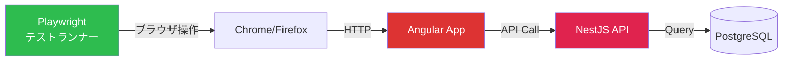

## 概要

E2E テストは **ユーザーの視点からアプリケーション全体を検証** します。ブラウザを操作し、実際のユーザーフローが正しく動作することを確認します。



## Playwright 設定

### インストール

```bash
pnpm add -D @playwright/test@1.58
npx playwright install chromium
```

### 設定ファイル

```typescript
// playwright.config.ts
import { defineConfig, devices } from '@playwright/test';

export default defineConfig({
  testDir: './e2e',
  fullyParallel: true,
  forbidOnly: !!process.env['CI'],
  retries: process.env['CI'] ? 2 : 0,
  workers: process.env['CI'] ? 1 : undefined,
  reporter: [
    ['html', { open: 'never' }],
    ['json', { outputFile: 'test-results/results.json' }],
  ],
  use: {
    baseURL: 'http://localhost:4200',
    trace: 'on-first-retry',
    screenshot: 'only-on-failure',
    video: 'retain-on-failure',
  },
  projects: [
    {
      name: 'chromium',
      use: { ...devices['Desktop Chrome'] },
    },
    {
      name: 'firefox',
      use: { ...devices['Desktop Firefox'] },
    },
    {
      name: 'mobile',
      use: { ...devices['Pixel 5'] },
    },
  ],
  webServer: [
    {
      command: 'nx serve api',
      port: 3000,
      reuseExistingServer: !process.env['CI'],
    },
    {
      command: 'nx serve web',
      port: 4200,
      reuseExistingServer: !process.env['CI'],
    },
  ],
});
```

## Page Object Model (POM)

### なぜ POM を使うか

- **保守性**: UI 変更時に POM のみ修正
- **可読性**: テストコードがユーザーアクションとして読める
- **再利用性**: 複数テストで同じオブジェクトを共有

### 実装例

```typescript
// e2e/page-objects/login.page.ts
import { Page, Locator, expect } from '@playwright/test';

export class LoginPage {
  readonly page: Page;
  readonly emailInput: Locator;
  readonly passwordInput: Locator;
  readonly loginButton: Locator;
  readonly errorMessage: Locator;

  constructor(page: Page) {
    this.page = page;
    this.emailInput = page.getByTestId('login-email');
    this.passwordInput = page.getByTestId('login-password');
    this.loginButton = page.getByTestId('login-submit');
    this.errorMessage = page.getByTestId('login-error');
  }

  async goto(): Promise<void> {
    await this.page.goto('/login');
  }

  async login(email: string, password: string): Promise<void> {
    await this.emailInput.fill(email);
    await this.passwordInput.fill(password);
    await this.loginButton.click();
  }

  async expectError(message: string): Promise<void> {
    await expect(this.errorMessage).toBeVisible();
    await expect(this.errorMessage).toContainText(message);
  }
}
```

```typescript
// e2e/page-objects/dashboard.page.ts
import { Page, Locator, expect } from '@playwright/test';

export class DashboardPage {
  readonly page: Page;
  readonly heading: Locator;
  readonly projectList: Locator;
  readonly createProjectButton: Locator;
  readonly searchInput: Locator;
  readonly userMenu: Locator;

  constructor(page: Page) {
    this.page = page;
    this.heading = page.getByRole('heading', { name: 'ダッシュボード' });
    this.projectList = page.getByTestId('project-list');
    this.createProjectButton = page.getByTestId('create-project');
    this.searchInput = page.getByTestId('search-input');
    this.userMenu = page.getByTestId('user-menu');
  }

  async expectLoaded(): Promise<void> {
    await expect(this.heading).toBeVisible();
  }

  async getProjectCount(): Promise<number> {
    return this.projectList.locator('[data-testid="project-card"]').count();
  }

  async createProject(): Promise<void> {
    await this.createProjectButton.click();
  }

  async search(query: string): Promise<void> {
    await this.searchInput.fill(query);
    await this.page.keyboard.press('Enter');
  }
}
```

```typescript
// e2e/page-objects/project-form.page.ts
import { Page, Locator, expect } from '@playwright/test';

export class ProjectFormPage {
  readonly page: Page;
  readonly nameInput: Locator;
  readonly codeInput: Locator;
  readonly descriptionInput: Locator;
  readonly submitButton: Locator;
  readonly cancelButton: Locator;

  constructor(page: Page) {
    this.page = page;
    this.nameInput = page.getByTestId('project-name');
    this.codeInput = page.getByTestId('project-code');
    this.descriptionInput = page.getByTestId('project-description');
    this.submitButton = page.getByTestId('project-submit');
    this.cancelButton = page.getByTestId('project-cancel');
  }

  async fill(data: {
    name: string;
    code: string;
    description?: string;
  }): Promise<void> {
    await this.nameInput.fill(data.name);
    await this.codeInput.fill(data.code);
    if (data.description) {
      await this.descriptionInput.fill(data.description);
    }
  }

  async submit(): Promise<void> {
    await this.submitButton.click();
  }
}
```

## テストシナリオ例

```typescript
// e2e/specs/projects.e2e.ts
import { test, expect } from '@playwright/test';
import { LoginPage } from '../page-objects/login.page';
import { DashboardPage } from '../page-objects/dashboard.page';
import { ProjectFormPage } from '../page-objects/project-form.page';

test.describe('プロジェクト管理', () => {
  let loginPage: LoginPage;
  let dashboardPage: DashboardPage;

  test.beforeEach(async ({ page }) => {
    loginPage = new LoginPage(page);
    dashboardPage = new DashboardPage(page);

    // ログイン
    await loginPage.goto();
    await loginPage.login('admin@example.com', 'password123');
    await dashboardPage.expectLoaded();
  });

  test('プロジェクト一覧が表示される', async () => {
    const count = await dashboardPage.getProjectCount();
    expect(count).toBeGreaterThan(0);
  });

  test('新規プロジェクトを作成できる', async ({ page }) => {
    await dashboardPage.createProject();

    const formPage = new ProjectFormPage(page);
    await formPage.fill({
      name: 'E2E テストプロジェクト',
      code: 'E2E-001',
      description: 'Playwright による自動テスト',
    });
    await formPage.submit();

    // ダッシュボードに戻り、新プロジェクトが表示されること
    await dashboardPage.expectLoaded();
    await expect(
      page.getByText('E2E テストプロジェクト'),
    ).toBeVisible();
  });

  test('プロジェクト検索ができる', async ({ page }) => {
    await dashboardPage.search('サンプル');

    await expect(
      page.getByText('サンプルプロジェクト'),
    ).toBeVisible();
  });
});

test.describe('認証', () => {
  test('不正な認証情報でログインに失敗する', async ({ page }) => {
    const loginPage = new LoginPage(page);
    await loginPage.goto();
    await loginPage.login('wrong@example.com', 'wrongpassword');
    await loginPage.expectError('メールアドレスまたはパスワードが正しくありません');
  });

  test('未認証でダッシュボードにアクセスするとログインにリダイレクト', async ({
    page,
  }) => {
    await page.goto('/dashboard');
    await expect(page).toHaveURL(/\/login/);
  });
});
```

## テストデータ管理

### API ベースのシードリセット

```typescript
// e2e/helpers/test-data.ts
import { APIRequestContext } from '@playwright/test';

export class TestDataHelper {
  constructor(private readonly request: APIRequestContext) {}

  async resetDatabase(): Promise<void> {
    await this.request.post('http://localhost:3000/api/test/reset', {
      headers: { 'X-Test-Key': process.env['TEST_API_KEY'] ?? '' },
    });
  }

  async seedProjects(count: number): Promise<void> {
    await this.request.post('http://localhost:3000/api/test/seed/projects', {
      data: { count },
      headers: { 'X-Test-Key': process.env['TEST_API_KEY'] ?? '' },
    });
  }
}
```

### テスト用エンドポイント (開発環境のみ)

```typescript
// apps/api/src/modules/test/test.controller.ts
import { Controller, Post, Body, UseGuards } from '@nestjs/common';
import { TestGuard } from './test.guard';
import { PrismaService } from '@myapp/prisma-db';

@Controller('test')
@UseGuards(TestGuard) // NODE_ENV === 'test' のみ有効
export class TestController {
  constructor(private readonly prisma: PrismaService) {}

  @Post('reset')
  async resetDatabase(): Promise<{ ok: boolean }> {
    // テーブルの逆順でデータ削除（外部キー制約考慮）
    await this.prisma.auditLog.deleteMany();
    await this.prisma.expense.deleteMany();
    await this.prisma.task.deleteMany();
    await this.prisma.projectMember.deleteMany();
    await this.prisma.project.deleteMany();
    await this.prisma.user.deleteMany();
    return { ok: true };
  }
}
```

## テスト実行

```bash
# 全 E2E テスト実行
npx playwright test

# ヘッドありで実行 (デバッグ)
npx playwright test --headed

# 特定テストファイル
npx playwright test e2e/specs/projects.e2e.ts

# UI モード
npx playwright test --ui

# レポート表示
npx playwright show-report

# トレース表示 (失敗テスト)
npx playwright show-trace test-results/trace.zip
```

## data-testid 規約

| 要素 | パターン | 例 |
|---|---|---|
| フォーム入力 | `{feature}-{field}` | `login-email`, `project-name` |
| ボタン | `{feature}-{action}` | `login-submit`, `project-create` |
| リスト | `{feature}-list` | `project-list`, `task-list` |
| リストアイテム | `{feature}-card` / `{feature}-row` | `project-card`, `task-row` |
| エラー表示 | `{feature}-error` | `login-error`, `form-error` |
| ローディング | `loading` / `{feature}-loading` | `loading`, `projects-loading` |
