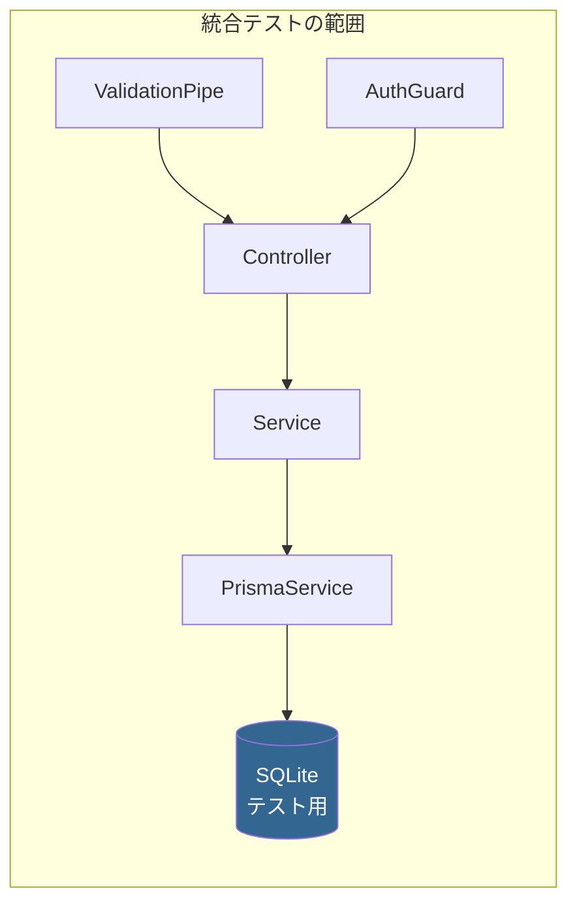

## 概要

統合テストは **複数のモジュールが正しく連携するか** を検証します。モックを最小限にし、実際の依存関係を使ってテストします。



## NestJS TestingModule

### 基本セットアップ

```typescript
// apps/api/src/modules/projects/projects.integration.spec.ts
import { Test, TestingModule } from '@nestjs/testing';
import { INestApplication, ValidationPipe } from '@nestjs/common';
import { describe, it, expect, beforeAll, afterAll, beforeEach } from 'vitest';
import * as request from 'supertest';
import { AppModule } from '../../app.module';
import { PrismaService } from '@myapp/prisma-db';

describe('Projects Integration', () => {
  let app: INestApplication;
  let prisma: PrismaService;

  beforeAll(async () => {
    const moduleFixture: TestingModule = await Test.createTestingModule({
      imports: [AppModule],
    }).compile();

    app = moduleFixture.createNestApplication();
    app.useGlobalPipes(
      new ValidationPipe({
        whitelist: true,
        forbidNonWhitelisted: true,
        transform: true,
      }),
    );
    await app.init();

    prisma = app.get<PrismaService>(PrismaService);
  });

  afterAll(async () => {
    await app.close();
  });

  beforeEach(async () => {
    // テストデータのクリーンアップ
    await prisma.expense.deleteMany();
    await prisma.task.deleteMany();
    await prisma.projectMember.deleteMany();
    await prisma.project.deleteMany();
    await prisma.user.deleteMany();

    // 基本テストデータの投入
    await prisma.user.create({
      data: {
        id: 'test-user-1',
        email: 'test@example.com',
        name: 'Test User',
        role: 'ADMIN',
      },
    });
  });

  describe('POST /api/projects', () => {
    it('should create a project with valid data', async () => {
      const response = await request(app.getHttpServer())
        .post('/api/projects')
        .send({
          name: 'Test Project',
          code: 'TST-001',
          description: 'Integration test project',
        })
        .expect(201);

      expect(response.body).toMatchObject({
        name: 'Test Project',
        code: 'TST-001',
        status: 'ACTIVE',
      });
      expect(response.body.id).toBeDefined();

      // DBに実際に保存されたことを確認
      const saved = await prisma.project.findUnique({
        where: { code: 'TST-001' },
      });
      expect(saved).not.toBeNull();
      expect(saved?.name).toBe('Test Project');
    });

    it('should return 400 for invalid data', async () => {
      await request(app.getHttpServer())
        .post('/api/projects')
        .send({ name: '' }) // code が欠落
        .expect(400);
    });

    it('should return 409 for duplicate code', async () => {
      // 先にプロジェクトを作成
      await prisma.project.create({
        data: { name: 'Existing', code: 'DUP-001' },
      });

      await request(app.getHttpServer())
        .post('/api/projects')
        .send({ name: 'Duplicate', code: 'DUP-001' })
        .expect(409);
    });
  });

  describe('GET /api/projects', () => {
    it('should return paginated projects', async () => {
      // テストデータ投入
      await prisma.project.createMany({
        data: [
          { name: 'Project A', code: 'A-001' },
          { name: 'Project B', code: 'B-001' },
          { name: 'Project C', code: 'C-001' },
        ],
      });

      const response = await request(app.getHttpServer())
        .get('/api/projects')
        .query({ page: 1, limit: 2 })
        .expect(200);

      expect(response.body.data).toHaveLength(2);
      expect(response.body.total).toBe(3);
      expect(response.body.hasNext).toBe(true);
    });

    it('should filter by status', async () => {
      await prisma.project.createMany({
        data: [
          { name: 'Active', code: 'ACT-001', status: 'ACTIVE' },
          { name: 'Archived', code: 'ARC-001', status: 'ARCHIVED' },
        ],
      });

      const response = await request(app.getHttpServer())
        .get('/api/projects')
        .query({ status: 'ACTIVE' })
        .expect(200);

      expect(response.body.data).toHaveLength(1);
      expect(response.body.data[0].name).toBe('Active');
    });
  });

  describe('PUT /api/projects/:id', () => {
    it('should update project', async () => {
      const project = await prisma.project.create({
        data: { name: 'Original', code: 'UPD-001' },
      });

      const response = await request(app.getHttpServer())
        .put(`/api/projects/${project.id}`)
        .send({ name: 'Updated' })
        .expect(200);

      expect(response.body.name).toBe('Updated');
    });

    it('should return 404 for non-existent project', async () => {
      await request(app.getHttpServer())
        .put('/api/projects/non-existent-id')
        .send({ name: 'Updated' })
        .expect(404);
    });
  });
});
```

## Prisma + SQLite テストDB

### テスト専用の環境変数

```bash
# .env.test
DATABASE_URL="file:./test.db"
NODE_ENV=test
```

### テスト用 PrismaService

```typescript
// libs/prisma-db/src/lib/prisma-test.service.ts
import { Injectable, OnModuleDestroy, OnModuleInit } from '@nestjs/common';
import { PrismaClient } from '@prisma/client';
import { execSync } from 'child_process';

@Injectable()
export class PrismaTestService
  extends PrismaClient
  implements OnModuleInit, OnModuleDestroy
{
  async onModuleInit(): Promise<void> {
    // テスト用DBにマイグレーション適用
    execSync('npx prisma migrate deploy', {
      env: {
        ...process.env,
        DATABASE_URL: 'file:./test.db',
      },
    });
    await this.$connect();
  }

  async onModuleDestroy(): Promise<void> {
    await this.$disconnect();
  }

  /**
   * 全テーブルのデータを削除（外部キー考慮）
   */
  async cleanDatabase(): Promise<void> {
    const tablenames = await this.$queryRaw<
      Array<{ name: string }>
    >`SELECT name FROM sqlite_master WHERE type='table' AND name NOT LIKE '_prisma%' AND name != 'sqlite_sequence'`;

    for (const { name } of tablenames) {
      await this.$executeRawUnsafe(`DELETE FROM "${name}"`);
    }
  }
}
```

## Angular HttpTestingController

### HTTP 統合テスト

```typescript
// apps/web/src/app/features/projects/project.service.integration.spec.ts
import { TestBed } from '@angular/core/testing';
import {
  HttpTestingController,
  provideHttpClientTesting,
} from '@angular/common/http/testing';
import { provideHttpClient, withInterceptors } from '@angular/common/http';
import { describe, it, expect, beforeEach, afterEach } from 'vitest';
import { ProjectService } from './project.service';
import { authInterceptor } from '../../core/interceptors/auth.interceptor';
import { errorInterceptor } from '../../core/interceptors/error.interceptor';

describe('ProjectService (Integration)', () => {
  let service: ProjectService;
  let httpMock: HttpTestingController;

  beforeEach(() => {
    TestBed.configureTestingModule({
      providers: [
        ProjectService,
        provideHttpClient(
          withInterceptors([authInterceptor, errorInterceptor]),
        ),
        provideHttpClientTesting(),
      ],
    });

    service = TestBed.inject(ProjectService);
    httpMock = TestBed.inject(HttpTestingController);
  });

  afterEach(() => {
    httpMock.verify();
  });

  it('should add Authorization header via interceptor', () => {
    service.loadProjects();

    const req = httpMock.expectOne('/api/projects');
    expect(req.request.headers.has('Authorization')).toBe(true);
    req.flush([]);
  });

  it('should handle 401 error and redirect to login', () => {
    service.loadProjects();

    const req = httpMock.expectOne('/api/projects');
    req.flush('Unauthorized', { status: 401, statusText: 'Unauthorized' });

    // errorInterceptor がリダイレクトを処理
    expect(service.error()).toContain('認証エラー');
  });

  it('should retry on 500 error', () => {
    service.loadProjects();

    // 最初のリクエストが500
    const req1 = httpMock.expectOne('/api/projects');
    req1.flush('Server Error', { status: 500, statusText: 'Internal Server Error' });

    // リトライが発生
    const req2 = httpMock.expectOne('/api/projects');
    req2.flush([{ id: '1', name: 'Project' }]);

    expect(service.projects()).toHaveLength(1);
  });
});
```

## テストデータファクトリ

```typescript
// libs/shared/util/src/lib/test-factories.ts
import { Role, ProjectStatus, TaskStatus } from '@myapp/shared/types';

let counter = 0;

export function createTestUser(overrides: Partial<{
  id: string;
  email: string;
  name: string;
  role: Role;
}> = {}) {
  counter++;
  return {
    id: `user-${counter}`,
    email: `user${counter}@test.com`,
    name: `Test User ${counter}`,
    role: 'MEMBER' as Role,
    isActive: true,
    createdAt: new Date(),
    updatedAt: new Date(),
    ...overrides,
  };
}

export function createTestProject(overrides: Partial<{
  id: string;
  name: string;
  code: string;
  status: ProjectStatus;
}> = {}) {
  counter++;
  return {
    id: `project-${counter}`,
    name: `Test Project ${counter}`,
    code: `PRJ-${String(counter).padStart(3, '0')}`,
    description: null,
    status: 'ACTIVE' as ProjectStatus,
    startDate: null,
    endDate: null,
    createdAt: new Date(),
    updatedAt: new Date(),
    ...overrides,
  };
}
```

## 統合テスト実行

```bash
# API 統合テスト
nx test api --testPathPattern=integration

# テスト用DB作成 + テスト実行
DATABASE_URL="file:./test.db" nx test api

# ウォッチモード
nx test api --watch --testPathPattern=integration
```
