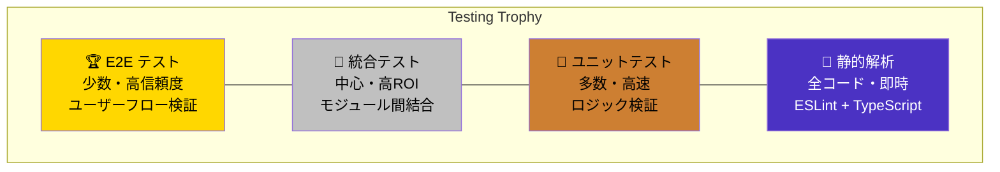
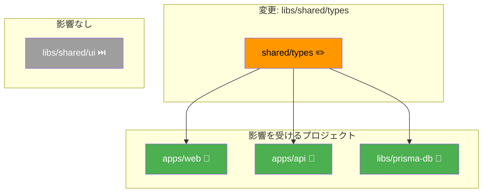
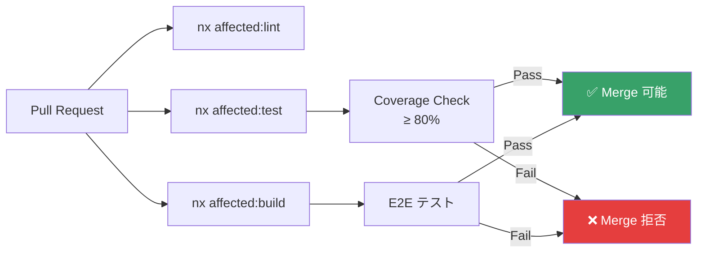

## 概要

**「テストは品質を証明する手段ではなく、品質を設計に組み込む手段」** です。

本プロジェクトでは **Testing Trophy** モデルを採用し、コスト対効果の高いテストポートフォリオを構築します。

## Testing Trophy



| レベル | ツール | 対象 | 実行速度 | ROI |
|---|---|---|---|---|
| **静的解析** | ESLint + TypeScript | 全コード | ⚡ 即時 | ★★★★★ |
| **ユニットテスト** | Jest + @swc/jest (API) / Vitest (Web) | 関数・サービス | 🚀 高速 | ★★★★ |
| **統合テスト** | Jest + TestingModule (API) / Vitest (Web) | モジュール結合 | 🏃 中速 | ★★★★★ |
| **E2E テスト** | Playwright | ユーザーフロー | 🐢 低速 | ★★★ |

## カバレッジ目標

| メトリクス | 目標値 | 計測ツール |
|---|---|---|
| **Line Coverage** | ≥ 80% | Vitest `--coverage` (Web) / Jest `--coverage` (API) |
| **Branch Coverage** | ≥ 75% | Vitest `--coverage` (Web) / Jest `--coverage` (API) |
| **Function Coverage** | ≥ 85% | Vitest `--coverage` (Web) / Jest `--coverage` (API) |
| **E2E Scenario Coverage** | 主要フロー 100% | Playwright Report |

### カバレッジ除外対象

```typescript
// vitest.workspace.ts
export default defineWorkspace([
  {
    test: {
      coverage: {
        exclude: [
          '**/*.spec.ts',
          '**/*.test.ts',
          '**/index.ts',           // バレルファイル
          '**/main.ts',            // エントリポイント
          '**/*.module.ts',        // NestJS モジュール定義
          '**/*.config.ts',        // 設定ファイル
          '**/environments/**',    // 環境設定
          '**/*.d.ts',             // 型定義
        ],
      },
    },
  },
]);
```

## テスト命名規約

### ファイル命名

```
*.spec.ts    → ユニットテスト / 統合テスト
*.e2e.ts     → E2E テスト
*.test.ts    → (spec の別名として許容)
```

### テスト記述パターン

```typescript
describe('ProjectsService', () => {
  // Arrange: テスト対象のセットアップ (beforeEach)

  describe('findAll', () => {
    it('should return all active projects', async () => {
      // Arrange → Act → Assert
    });

    it('should filter by status when provided', async () => {
      // ...
    });

    it('should throw NotFoundException when project not found', async () => {
      // ...
    });
  });

  describe('create', () => {
    it('should create a project with valid data', async () => {
      // ...
    });

    it('should throw ConflictException for duplicate code', async () => {
      // ...
    });
  });
});
```

### 命名ルール

| パターン | 例 |
|---|---|
| 正常系 | `should return all active projects` |
| 異常系 | `should throw NotFoundException when project not found` |
| 条件付き | `should filter by status when provided` |
| 境界値 | `should reject amount exceeding 1,000,000` |
| 権限チェック | `should deny access for non-admin users` |

## Nx Affected テスト

### 変更影響のみテスト実行

```bash
# ローカル開発
nx affected -t test

# CI/CD (PRベース)
nx affected -t test --base=origin/main --head=HEAD

# 全テスト
nx run-many -t test --all
```

### プロジェクトグラフに基づく影響範囲



## テストピラミッドの配分ガイド

```
┌─────────────────────────────────────┐
│        E2E テスト (10-15%)          │  ← 主要ユーザーフローのみ
│   Playwright: 10-20 シナリオ        │
├─────────────────────────────────────┤
│       統合テスト (35-45%)           │  ← 最も重要
│   API統合 + DB + モジュール結合     │
├─────────────────────────────────────┤
│     ユニットテスト (40-50%)         │  ← ロジック中心
│   Services + Pipes + Utils          │
├─────────────────────────────────────┤
│  静的解析 (常時、100%)              │  ← コスト0
│  ESLint + TypeScript strict         │
└─────────────────────────────────────┘
```

## CI/CD 統合サマリ


