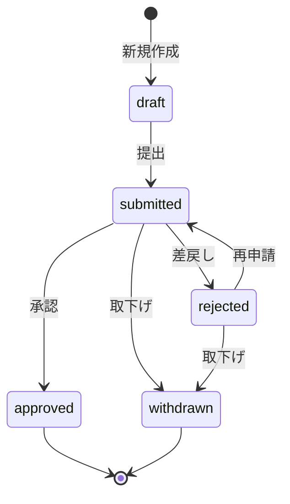

## 実装概要

ワークフロー（申請）の CRUD と状態遷移（draft → submitted → approved / rejected / withdrawn）を NestJS バックエンド + Angular フロントエンドで実装した。

### 状態遷移図



---

## NestJS Backend

### ファイル構成

```
apps/api/src/modules/workflows/
├── dto/
│   ├── create-workflow.dto.ts       # type, title, description?, amount?, approverId, action
│   ├── update-workflow.dto.ts       # 部分更新 (draft のみ)
│   ├── query-workflow.dto.ts        # status?, type?, mode?, page?, limit?
│   └── reject-workflow.dto.ts       # reason (必須)
├── workflows.module.ts              # imports: [NotificationsModule]
├── workflows.controller.ts          # 9 エンドポイント
├── workflows.service.ts             # CRUD + 状態遷移 + 通知 + WF採番
├── workflows.service.spec.ts        # 20+ テストケース
└── workflows.controller.spec.ts     # 9 エンドポイント委譲テスト
```

### API エンドポイント

| メソッド | パス | 操作 | ロール制限 |
|---|---|---|---|
| `GET` | `/workflows` | 一覧 (フィルタ/ページネーション) | — |
| `GET` | `/workflows/pending` | 承認待ち一覧 | approver, tenant_admin |
| `GET` | `/workflows/:id` | 詳細 | — |
| `POST` | `/workflows` | 新規作成 (draft/submit) | member, pm, etc. |
| `PATCH` | `/workflows/:id` | 更新 (draft のみ) | — |
| `POST` | `/workflows/:id/submit` | 提出 | — |
| `POST` | `/workflows/:id/approve` | 承認 | approver, tenant_admin |
| `POST` | `/workflows/:id/reject` | 差戻し | approver, tenant_admin |
| `POST` | `/workflows/:id/withdraw` | 取下げ | — |

### 主要な設計判断

- **状態遷移検証**: `@shared/types` の `WORKFLOW_TRANSITIONS` + `canTransition()` で遷移可否を判定。不正遷移は `ConflictException` (`ERR-WF-001`)
- **自己承認禁止**: `createdBy === approverId` の場合 `ForbiddenException` (`ERR-WF-003`)
- **WF 採番**: `$transaction` でテナントの `workflowSeq` をアトミックにインクリメントし `WF-NNN` 形式の番号を生成
- **通知連携**: 提出→承認者へ、承認/差戻し→申請者へ `NotificationsService.create()` 経由で通知

### 依存: NotificationsModule スタブ

```
apps/api/src/modules/notifications/
├── notifications.module.ts    # exports: [NotificationsService]
└── notifications.service.ts   # create() のみ (ログ出力スタブ)
```

> [!NOTE]
> TI-5（通知モジュール）で本実装に置換する想定。

---

## Angular Frontend

### ファイル構成

```
apps/web/src/app/features/workflows/
├── workflow.service.ts              # Signal ベース + HttpClient
├── workflows.routes.ts              # WORKFLOW_ROUTES (5 ルート)
├── workflow-list.component.ts       # mat-table + フィルタ + ページネーション
├── workflow-detail.component.ts     # 詳細 + 承認/差戻し/取下げボタン
├── workflow-form.component.ts       # Reactive Forms (新規/編集)
├── workflow-pending.component.ts    # 承認待ち一覧 (クイック承認)
├── workflow.service.spec.ts         # HTTP テスト (11 ケース)
└── workflow-list.component.spec.ts  # Component テスト (6 ケース)
```

### ルーティング

| パス | コンポーネント |
|---|---|
| `/workflows` | `WorkflowListComponent` |
| `/workflows/new` | `WorkflowFormComponent` |
| `/workflows/pending` | `WorkflowPendingComponent` (roleGuard) |
| `/workflows/:id` | `WorkflowDetailComponent` |
| `/workflows/:id/edit` | `WorkflowFormComponent` |

### WorkflowService (Signal ベース)

```typescript
// 公開 Signal
readonly workflows: Signal<Workflow[]>;
readonly pendingWorkflows: Signal<Workflow[]>;
readonly currentWorkflow: Signal<Workflow | null>;
readonly isLoading: Signal<boolean>;
readonly totalCount: Signal<number>;

// ロード系 (内部で subscribe して Signal 更新)
loadAll(query?): void;
loadPending(): void;
loadOne(id): void;

// Observable 系 (コンポーネントで subscribe)
getAll(query?): Observable<any>;
create(dto): Observable<any>;
approve(id): Observable<any>;
// ... etc
```

---

## 修正ファイル

| ファイル | 変更 |
|---|---|
| `apps/api/src/app/app.module.ts` | `WorkflowsModule`, `NotificationsModule` を imports に追加 |
| `apps/web/src/app/app.routes.ts` | workflows パスを `loadChildren` → `WORKFLOW_ROUTES` に変更 |

---

## テスト結果

| テスト | 結果 |
|---|---|
| `workflows.service.spec.ts` (Jest) | ✅ PASS |
| `workflows.controller.spec.ts` (Jest) | ✅ PASS |
| `npx nx build api` | ✅ SUCCESS |
| Web build (workflow files only) | ✅ コンパイル成功 |

> [!WARNING]
> Web ビルド全体は `projects` モジュールの既存エラー（`DatePipe` 未インポート等）で失敗するが、ワークフローモジュールのコードに問題はない。

---

## エラーコード一覧

| コード | 例外 | 意味 |
|---|---|---|
| `ERR-WF-001` | `ConflictException` | 不正な状態遷移 / 重複 |
| `ERR-WF-002` | `NotFoundException` | 申請が見つからない |
| `ERR-WF-003` | `ForbiddenException` | 権限不足 / 自己承認 |
